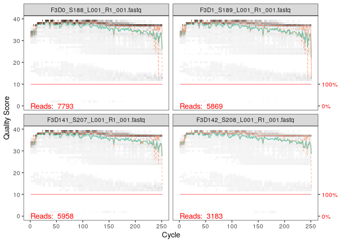
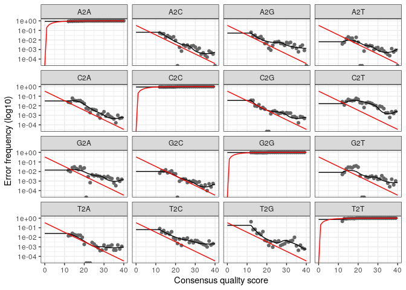

Dada2 tutorial
================

  - [Préparation de l’environnement](#préparation-de-lenvironnement)
      - [Chargement des librairies Phyloseq et Dada2 afin de pouvoir
        utiliser ses
        packages](#chargement-des-librairies-phyloseq-et-dada2-afin-de-pouvoir-utiliser-ses-packages)
      - [Création d’une variable ‘path’ dans laquelle on met l’objet
        “Miseq\_SOP”. Ensuite on les
        liste](#création-dune-variable-path-dans-laquelle-on-met-lobjet-miseq_sop.-ensuite-on-les-liste)
      - [Création de deux listes. Une avec les Forwards et une avec les
        Reverses qui correspondent respectivement au Read1 et Read2. La
        commande avec ‘sample.names’ permet de mettre toutes les
        séquences sous un même format pour harmoniser leurs
        noms.](#création-de-deux-listes.-une-avec-les-forwards-et-une-avec-les-reverses-qui-correspondent-respectivement-au-read1-et-read2.-la-commande-avec-sample.names-permet-de-mettre-toutes-les-séquences-sous-un-même-format-pour-harmoniser-leurs-noms.)
  - [Nous allons indiquer à la machine quels paramètres nous allons
    utiliser pour filtrer les séquences avant de les ranger. On indique
    ainsi dans la première fonction les deux fichiers d’où les séquences
    viendront (fnFs et fnRs), puis le fichier où elles seront rangées
    (filtFs et filtRs crées juste au dessus). Enuite nous allons
    indiquer où couper pour les deux sortes de
    séquences.](#nous-allons-indiquer-à-la-machine-quels-paramètres-nous-allons-utiliser-pour-filtrer-les-séquences-avant-de-les-ranger.-on-indique-ainsi-dans-la-première-fonction-les-deux-fichiers-doù-les-séquences-viendront-fnfs-et-fnrs-puis-le-fichier-où-elles-seront-rangées-filtfs-et-filtrs-crées-juste-au-dessus.-enuite-nous-allons-indiquer-où-couper-pour-les-deux-sortes-de-séquences.)
      - [Cette ligne nous permet de visualiser les erreurs qu’on a fait
        apprendre à la
        machine](#cette-ligne-nous-permet-de-visualiser-les-erreurs-quon-a-fait-apprendre-à-la-machine)
      - [Cette commande nous permet de visualiser le résultat global
        qu’on retrouve classé dans la liste dadaFs. Ils nous indiquent
        que sur les séquences on retrouve 128 séquences qui
        correspondent aux vrais variants, par rapport aux 1979
        séquences. Ils nous indiquent aussi les diagnostiques de
        qualité.](#cette-commande-nous-permet-de-visualiser-le-résultat-global-quon-retrouve-classé-dans-la-liste-dadafs.-ils-nous-indiquent-que-sur-les-séquences-on-retrouve-128-séquences-qui-correspondent-aux-vrais-variants-par-rapport-aux-1979-séquences.-ils-nous-indiquent-aussi-les-diagnostiques-de-qualité.)
      - [Ici on peut voir qu’on à 3% de séquences chimériques dans notre
        jeu de
        donnée.](#ici-on-peut-voir-quon-à-3-de-séquences-chimériques-dans-notre-jeu-de-donnée.)
      - [Ici nous créons une variable qui va recevoir les espèces
        obtenues grâce à
        Silva](#ici-nous-créons-une-variable-qui-va-recevoir-les-espèces-obtenues-grâce-à-silva)
      - [Ici on remarque donc après avoir affiché la table qu’on a créée
        on obtient une majorité de Bacteroidetes ce qui est normal dans
        des échantillons fécaux. D’autres espèces n’ont pas pu être
        assignées car on a peu de données sur les bactéries des
        intestins des
        souris.](#ici-on-remarque-donc-après-avoir-affiché-la-table-quon-a-créée-on-obtient-une-majorité-de-bacteroidetes-ce-qui-est-normal-dans-des-échantillons-fécaux.-dautres-espèces-nont-pas-pu-être-assignées-car-on-a-peu-de-données-sur-les-bactéries-des-intestins-des-souris.)
      - [Dada2 a indentifié 20 ASVs. Cela correspond précisement à ce à
        quoi on s’attendait, donc le taux d’erreur résiduel par dada2
        est de
        0%](#dada2-a-indentifié-20-asvs.-cela-correspond-précisement-à-ce-à-quoi-on-sattendait-donc-le-taux-derreur-résiduel-par-dada2-est-de-0)

# Préparation de l’environnement

## Chargement des librairies Phyloseq et Dada2 afin de pouvoir utiliser ses packages

``` r
library ("phyloseq")
library("dada2")
```

    ## Loading required package: Rcpp

## Création d’une variable ‘path’ dans laquelle on met l’objet “Miseq\_SOP”. Ensuite on les liste

``` r
path <- "~/MiSeq_SOP" # CHANGE ME to the directory containing the fastq files after unzipping.
list.files(path)
```

    ##  [1] "F3D0_S188_L001_R1_001.fastq"   "F3D0_S188_L001_R2_001.fastq"  
    ##  [3] "F3D1_S189_L001_R1_001.fastq"   "F3D1_S189_L001_R2_001.fastq"  
    ##  [5] "F3D141_S207_L001_R1_001.fastq" "F3D141_S207_L001_R2_001.fastq"
    ##  [7] "F3D142_S208_L001_R1_001.fastq" "F3D142_S208_L001_R2_001.fastq"
    ##  [9] "F3D143_S209_L001_R1_001.fastq" "F3D143_S209_L001_R2_001.fastq"
    ## [11] "F3D144_S210_L001_R1_001.fastq" "F3D144_S210_L001_R2_001.fastq"
    ## [13] "F3D145_S211_L001_R1_001.fastq" "F3D145_S211_L001_R2_001.fastq"
    ## [15] "F3D146_S212_L001_R1_001.fastq" "F3D146_S212_L001_R2_001.fastq"
    ## [17] "F3D147_S213_L001_R1_001.fastq" "F3D147_S213_L001_R2_001.fastq"
    ## [19] "F3D148_S214_L001_R1_001.fastq" "F3D148_S214_L001_R2_001.fastq"
    ## [21] "F3D149_S215_L001_R1_001.fastq" "F3D149_S215_L001_R2_001.fastq"
    ## [23] "F3D150_S216_L001_R1_001.fastq" "F3D150_S216_L001_R2_001.fastq"
    ## [25] "F3D2_S190_L001_R1_001.fastq"   "F3D2_S190_L001_R2_001.fastq"  
    ## [27] "F3D3_S191_L001_R1_001.fastq"   "F3D3_S191_L001_R2_001.fastq"  
    ## [29] "F3D5_S193_L001_R1_001.fastq"   "F3D5_S193_L001_R2_001.fastq"  
    ## [31] "F3D6_S194_L001_R1_001.fastq"   "F3D6_S194_L001_R2_001.fastq"  
    ## [33] "F3D7_S195_L001_R1_001.fastq"   "F3D7_S195_L001_R2_001.fastq"  
    ## [35] "F3D8_S196_L001_R1_001.fastq"   "F3D8_S196_L001_R2_001.fastq"  
    ## [37] "F3D9_S197_L001_R1_001.fastq"   "F3D9_S197_L001_R2_001.fastq"  
    ## [39] "filtered"                      "HMP_MOCK.v35.fasta"           
    ## [41] "Mock_S280_L001_R1_001.fastq"   "Mock_S280_L001_R2_001.fastq"  
    ## [43] "mouse.dpw.metadata"            "mouse.time.design"            
    ## [45] "stability.batch"               "stability.files"

## Création de deux listes. Une avec les Forwards et une avec les Reverses qui correspondent respectivement au Read1 et Read2. La commande avec ‘sample.names’ permet de mettre toutes les séquences sous un même format pour harmoniser leurs noms.

``` r
# Forward and reverse fastq filenames have format: SAMPLENAME_R1_001.fastq and SAMPLENAME_R2_001.fastq
fnFs <- sort(list.files(path, pattern="_R1_001.fastq", full.names = TRUE))
fnRs <- sort(list.files(path, pattern="_R2_001.fastq", full.names = TRUE))
# Extract sample names, assuming filenames have format: SAMPLENAME_XXX.fastq
sample.names <- sapply(strsplit(basename(fnFs), "_"), `[`, 1)
```

\#Inspect read quality profiles \#\# Permet d’inspecter la qualité des
différents reads et nous permet de voir à partir de quel nucléotide nous
allons avoir une baisse du score de qualité pour pouvoir par la suite
retirer les nucléotides de mauvaise qualité. Sur les forwards nous
allons retirer les 10 derniers nucléotides avec une commande retrouvée
plus bas dans le script.

``` r
plotQualityProfile(fnRs[1:4])
```

<!-- -->
\#\# Ici nous faisons la même manipulation mais avec les Reverses qui
sont d’un peu moins bonne qualité que les Forwards, dû au sequençage
avec Illumina.Ici, nous retirerons tous les nucléotides à partir du 160e

``` r
plotQualityProfile(fnRs[1:4])
```

<!-- -->
\#Filter and trim \#\# Ici nous créeons une nouvelle variable qui
recevra tous les fichiers filtrés, que ce soit pour les Forwards ou les
Reverses. Nous allons en même temps indiquer à la machine que les noms
utilisés pour ranger les séquences dans les dossiers seront les mêmes
que nous avons standardisé plus haut.

``` r
# Place filtered files in filtered/ subdirectory
filtFs <- file.path(path, "filtered", paste0(sample.names, "_F_filt.fastq.gz"))
filtRs <- file.path(path, "filtered", paste0(sample.names, "_R_filt.fastq.gz"))
names(filtFs) <- sample.names
names(filtRs) <- sample.names
```

# Nous allons indiquer à la machine quels paramètres nous allons utiliser pour filtrer les séquences avant de les ranger. On indique ainsi dans la première fonction les deux fichiers d’où les séquences viendront (fnFs et fnRs), puis le fichier où elles seront rangées (filtFs et filtRs crées juste au dessus). Enuite nous allons indiquer où couper pour les deux sortes de séquences.

``` r
out <- filterAndTrim(fnFs, filtFs, fnRs, filtRs, truncLen=c(240,160),
              maxN=0, maxEE=c(2,2), truncQ=2, rm.phix=TRUE,
              compress=TRUE, multithread=TRUE) # On Windows set multithread=FALSE
head(out)
```

    ##                               reads.in reads.out
    ## F3D0_S188_L001_R1_001.fastq       7793      7113
    ## F3D1_S189_L001_R1_001.fastq       5869      5299
    ## F3D141_S207_L001_R1_001.fastq     5958      5463
    ## F3D142_S208_L001_R1_001.fastq     3183      2914
    ## F3D143_S209_L001_R1_001.fastq     3178      2941
    ## F3D144_S210_L001_R1_001.fastq     4827      4312

\#Learn the Error Rates \#\# Nous allons ici utiliser des lignes de
commandes qui vont permettre d’apprendre à la machine les différents
profils d’erreurs générées lors du séquençage. L’opération est faite sur
les deux types de séquence.

``` r
errF <- learnErrors(filtFs, multithread=TRUE)
```

    ## 33514080 total bases in 139642 reads from 20 samples will be used for learning the error rates.

``` r
errR <- learnErrors(filtRs, multithread=TRUE)
```

    ## 22342720 total bases in 139642 reads from 20 samples will be used for learning the error rates.

## Cette ligne nous permet de visualiser les erreurs qu’on a fait apprendre à la machine

``` r
plotErrors(errF, nominalQ=TRUE)
```

    ## Warning: Transformation introduced infinite values in continuous y-axis
    
    ## Warning: Transformation introduced infinite values in continuous y-axis

<!-- -->

\#Sample Inference \#\# Ici nous créons une autre variable “dadaFs” dans
laquelle nous mettons les fichiers obtenus après avoir filtré et
appliqué le profil d’erreur à nos séquences. Nous allons faire la même
chose avec dadaRS.

``` r
dadaFs <- dada(filtFs, err=errF, multithread=TRUE)
```

    ## Sample 1 - 7113 reads in 1979 unique sequences.
    ## Sample 2 - 5299 reads in 1639 unique sequences.
    ## Sample 3 - 5463 reads in 1477 unique sequences.
    ## Sample 4 - 2914 reads in 904 unique sequences.
    ## Sample 5 - 2941 reads in 939 unique sequences.
    ## Sample 6 - 4312 reads in 1267 unique sequences.
    ## Sample 7 - 6741 reads in 1756 unique sequences.
    ## Sample 8 - 4560 reads in 1438 unique sequences.
    ## Sample 9 - 15637 reads in 3590 unique sequences.
    ## Sample 10 - 11413 reads in 2762 unique sequences.
    ## Sample 11 - 12017 reads in 3021 unique sequences.
    ## Sample 12 - 5032 reads in 1566 unique sequences.
    ## Sample 13 - 18075 reads in 3707 unique sequences.
    ## Sample 14 - 6250 reads in 1479 unique sequences.
    ## Sample 15 - 4052 reads in 1195 unique sequences.
    ## Sample 16 - 7369 reads in 1832 unique sequences.
    ## Sample 17 - 4765 reads in 1183 unique sequences.
    ## Sample 18 - 4871 reads in 1382 unique sequences.
    ## Sample 19 - 6504 reads in 1709 unique sequences.
    ## Sample 20 - 4314 reads in 897 unique sequences.

``` r
dadaRs <- dada(filtRs, err=errR, multithread=TRUE)
```

    ## Sample 1 - 7113 reads in 1660 unique sequences.
    ## Sample 2 - 5299 reads in 1349 unique sequences.
    ## Sample 3 - 5463 reads in 1335 unique sequences.
    ## Sample 4 - 2914 reads in 853 unique sequences.
    ## Sample 5 - 2941 reads in 880 unique sequences.
    ## Sample 6 - 4312 reads in 1286 unique sequences.
    ## Sample 7 - 6741 reads in 1803 unique sequences.
    ## Sample 8 - 4560 reads in 1265 unique sequences.
    ## Sample 9 - 15637 reads in 3414 unique sequences.
    ## Sample 10 - 11413 reads in 2522 unique sequences.
    ## Sample 11 - 12017 reads in 2771 unique sequences.
    ## Sample 12 - 5032 reads in 1415 unique sequences.
    ## Sample 13 - 18075 reads in 3290 unique sequences.
    ## Sample 14 - 6250 reads in 1390 unique sequences.
    ## Sample 15 - 4052 reads in 1134 unique sequences.
    ## Sample 16 - 7369 reads in 1635 unique sequences.
    ## Sample 17 - 4765 reads in 1084 unique sequences.
    ## Sample 18 - 4871 reads in 1161 unique sequences.
    ## Sample 19 - 6504 reads in 1502 unique sequences.
    ## Sample 20 - 4314 reads in 732 unique sequences.

## Cette commande nous permet de visualiser le résultat global qu’on retrouve classé dans la liste dadaFs. Ils nous indiquent que sur les séquences on retrouve 128 séquences qui correspondent aux vrais variants, par rapport aux 1979 séquences. Ils nous indiquent aussi les diagnostiques de qualité.

``` r
dadaFs[[1]]
```

    ## dada-class: object describing DADA2 denoising results
    ## 128 sequence variants were inferred from 1979 input unique sequences.
    ## Key parameters: OMEGA_A = 1e-40, OMEGA_C = 1e-40, BAND_SIZE = 16

\#Merge paired reads \#\# Ici nous voulons mettre en une seule séquence
les Forwards et les Reverses.Nous pouvons faire cette opération grâce
aux overlaps de 12 paires de base. Cela se fait grâce à un alignement
entre les forwards et les reverses qui vont permettre de contruire les
contigs.

``` r
mergers <- mergePairs(dadaFs, filtFs, dadaRs, filtRs, verbose=TRUE)
```

    ## 6540 paired-reads (in 107 unique pairings) successfully merged out of 6891 (in 197 pairings) input.

    ## 5028 paired-reads (in 101 unique pairings) successfully merged out of 5190 (in 157 pairings) input.

    ## 4986 paired-reads (in 81 unique pairings) successfully merged out of 5267 (in 166 pairings) input.

    ## 2595 paired-reads (in 52 unique pairings) successfully merged out of 2754 (in 108 pairings) input.

    ## 2553 paired-reads (in 60 unique pairings) successfully merged out of 2785 (in 119 pairings) input.

    ## 3646 paired-reads (in 55 unique pairings) successfully merged out of 4109 (in 157 pairings) input.

    ## 6079 paired-reads (in 81 unique pairings) successfully merged out of 6514 (in 198 pairings) input.

    ## 3968 paired-reads (in 91 unique pairings) successfully merged out of 4388 (in 187 pairings) input.

    ## 14233 paired-reads (in 143 unique pairings) successfully merged out of 15355 (in 352 pairings) input.

    ## 10528 paired-reads (in 120 unique pairings) successfully merged out of 11165 (in 278 pairings) input.

    ## 11154 paired-reads (in 137 unique pairings) successfully merged out of 11797 (in 298 pairings) input.

    ## 4349 paired-reads (in 85 unique pairings) successfully merged out of 4802 (in 179 pairings) input.

    ## 17431 paired-reads (in 153 unique pairings) successfully merged out of 17812 (in 272 pairings) input.

    ## 5850 paired-reads (in 81 unique pairings) successfully merged out of 6095 (in 159 pairings) input.

    ## 3716 paired-reads (in 86 unique pairings) successfully merged out of 3894 (in 147 pairings) input.

    ## 6865 paired-reads (in 99 unique pairings) successfully merged out of 7191 (in 187 pairings) input.

    ## 4426 paired-reads (in 67 unique pairings) successfully merged out of 4603 (in 127 pairings) input.

    ## 4576 paired-reads (in 101 unique pairings) successfully merged out of 4739 (in 174 pairings) input.

    ## 6092 paired-reads (in 109 unique pairings) successfully merged out of 6315 (in 173 pairings) input.

    ## 4269 paired-reads (in 20 unique pairings) successfully merged out of 4281 (in 28 pairings) input.

``` r
# Inspect the merger data.frame from the first sample
head(mergers[[1]])
```

    ##                                                                                                                                                                                                                                                       sequence
    ## 1 TACGGAGGATGCGAGCGTTATCCGGATTTATTGGGTTTAAAGGGTGCGCAGGCGGAAGATCAAGTCAGCGGTAAAATTGAGAGGCTCAACCTCTTCGAGCCGTTGAAACTGGTTTTCTTGAGTGAGCGAGAAGTATGCGGAATGCGTGGTGTAGCGGTGAAATGCATAGATATCACGCAGAACTCCGATTGCGAAGGCAGCATACCGGCGCTCAACTGACGCTCATGCACGAAAGTGTGGGTATCGAACAGG
    ## 2 TACGGAGGATGCGAGCGTTATCCGGATTTATTGGGTTTAAAGGGTGCGTAGGCGGCCTGCCAAGTCAGCGGTAAAATTGCGGGGCTCAACCCCGTACAGCCGTTGAAACTGCCGGGCTCGAGTGGGCGAGAAGTATGCGGAATGCGTGGTGTAGCGGTGAAATGCATAGATATCACGCAGAACCCCGATTGCGAAGGCAGCATACCGGCGCCCTACTGACGCTGAGGCACGAAAGTGCGGGGATCAAACAGG
    ## 3 TACGGAGGATGCGAGCGTTATCCGGATTTATTGGGTTTAAAGGGTGCGTAGGCGGGCTGTTAAGTCAGCGGTCAAATGTCGGGGCTCAACCCCGGCCTGCCGTTGAAACTGGCGGCCTCGAGTGGGCGAGAAGTATGCGGAATGCGTGGTGTAGCGGTGAAATGCATAGATATCACGCAGAACTCCGATTGCGAAGGCAGCATACCGGCGCCCGACTGACGCTGAGGCACGAAAGCGTGGGTATCGAACAGG
    ## 4 TACGGAGGATGCGAGCGTTATCCGGATTTATTGGGTTTAAAGGGTGCGTAGGCGGGCTTTTAAGTCAGCGGTAAAAATTCGGGGCTCAACCCCGTCCGGCCGTTGAAACTGGGGGCCTTGAGTGGGCGAGAAGAAGGCGGAATGCGTGGTGTAGCGGTGAAATGCATAGATATCACGCAGAACCCCGATTGCGAAGGCAGCCTTCCGGCGCCCTACTGACGCTGAGGCACGAAAGTGCGGGGATCGAACAGG
    ## 5 TACGGAGGATGCGAGCGTTATCCGGATTTATTGGGTTTAAAGGGTGCGCAGGCGGACTCTCAAGTCAGCGGTCAAATCGCGGGGCTCAACCCCGTTCCGCCGTTGAAACTGGGAGCCTTGAGTGCGCGAGAAGTAGGCGGAATGCGTGGTGTAGCGGTGAAATGCATAGATATCACGCAGAACTCCGATTGCGAAGGCAGCCTACCGGCGCGCAACTGACGCTCATGCACGAAAGCGTGGGTATCGAACAGG
    ## 6 TACGGAGGATGCGAGCGTTATCCGGATTTATTGGGTTTAAAGGGTGCGTAGGCGGGATGCCAAGTCAGCGGTAAAAAAGCGGTGCTCAACGCCGTCGAGCCGTTGAAACTGGCGTTCTTGAGTGGGCGAGAAGTATGCGGAATGCGTGGTGTAGCGGTGAAATGCATAGATATCACGCAGAACTCCGATTGCGAAGGCAGCATACCGGCGCCCTACTGACGCTGAGGCACGAAAGCGTGGGTATCGAACAGG
    ##   abundance forward reverse nmatch nmismatch nindel prefer accept
    ## 1       579       1       1    148         0      0      1   TRUE
    ## 2       470       2       2    148         0      0      2   TRUE
    ## 3       449       3       4    148         0      0      1   TRUE
    ## 4       430       4       3    148         0      0      2   TRUE
    ## 5       345       5       6    148         0      0      1   TRUE
    ## 6       282       6       5    148         0      0      2   TRUE

\#Construct sequence table \#\# Ici nous allons construire une table des
variations de séquence dans les amplicons (ASV) qui permet une meilleure
résolution que les tables OTUs 97%

``` r
seqtab <- makeSequenceTable(mergers)
dim(seqtab)
```

    ## [1]  20 293

``` r
# Inspect distribution of sequence lengths
table(nchar(getSequences(seqtab)))
```

    ## 
    ## 251 252 253 254 255 
    ##   1  88 196   6   2

\#Remove chimeras \#\# Malgré qu’on ait pu appliquer les modèles
d’erreurs aux séquences, il reste des chimères. Ces chimères sont
facilement reconnaissables par la machine et peuvent etre réparées en y
rajoutant les parties droites et gauche des 2 séquences les plus
abondantes.

``` r
seqtab.nochim <- removeBimeraDenovo(seqtab, method="consensus", multithread=TRUE, verbose=TRUE)
```

    ## Identified 61 bimeras out of 293 input sequences.

``` r
dim(seqtab.nochim)
```

    ## [1]  20 232

## Ici on peut voir qu’on à 3% de séquences chimériques dans notre jeu de donnée.

``` r
1-sum(seqtab.nochim)/sum(seqtab)
```

    ## [1] 0.03596257

\#Track reads through the pipeline \#\# Ce code nous permet de
visualiser le nombre de séquences obtenues à la suite de toutes nos
manipulations de filtrage. Ici nous pouvons voir qu’on a pu récupérer la
plupart de nos séquences brutes, ce qui est signe d’une bonne qualité de
séquençage.

``` r
getN <- function(x) sum(getUniques(x))
track <- cbind(out, sapply(dadaFs, getN), sapply(dadaRs, getN), sapply(mergers, getN), rowSums(seqtab.nochim))
# If processing a single sample, remove the sapply calls: e.g. replace sapply(dadaFs, getN) with getN(dadaFs)
colnames(track) <- c("input", "filtered", "denoisedF", "denoisedR", "merged", "nonchim")
rownames(track) <- sample.names
head(track)
```

    ##        input filtered denoisedF denoisedR merged nonchim
    ## F3D0    7793     7113      6976      6979   6540    6528
    ## F3D1    5869     5299      5227      5239   5028    5017
    ## F3D141  5958     5463      5331      5357   4986    4863
    ## F3D142  3183     2914      2799      2830   2595    2521
    ## F3D143  3178     2941      2822      2868   2553    2519
    ## F3D144  4827     4312      4151      4228   3646    3507

\#Assign taxonomy \#\# Ici nous avons du récupérer silva afin d’analyser
et d’assigner les taxonomies.

``` bash
wget https://zenodo.org/record/3986799/files/silva_species_assignment_v138.fa.gz
```

    ## --2020-11-26 20:07:50--  https://zenodo.org/record/3986799/files/silva_species_assignment_v138.fa.gz
    ## Resolving zenodo.org (zenodo.org)... 137.138.76.77
    ## Connecting to zenodo.org (zenodo.org)|137.138.76.77|:443... connected.
    ## HTTP request sent, awaiting response... 200 OK
    ## Length: 81840166 (78M) [application/octet-stream]
    ## Saving to: ‘silva_species_assignment_v138.fa.gz.2’
    ## 
    ##      0K .......... .......... .......... .......... ..........  0% 14.0M 6s
    ##     50K .......... .......... .......... .......... ..........  0% 13.5M 6s
    ##    100K .......... .......... .......... .......... ..........  0% 10.6M 6s
    ##    150K .......... .......... .......... .......... ..........  0% 32.9M 5s
    ##    200K .......... .......... .......... .......... ..........  0% 14.6M 5s
    ##    250K .......... .......... .......... .......... ..........  0% 54.2M 5s
    ##    300K .......... .......... .......... .......... ..........  0% 14.3M 5s
    ##    350K .......... .......... .......... .......... ..........  0% 68.1M 4s
    ##    400K .......... .......... .......... .......... ..........  0% 91.8M 4s
    ##    450K .......... .......... .......... .......... ..........  0% 14.9M 4s
    ##    500K .......... .......... .......... .......... ..........  0% 61.0M 4s
    ##    550K .......... .......... .......... .......... ..........  0%  103M 4s
    ##    600K .......... .......... .......... .......... ..........  0% 11.7M 4s
    ##    650K .......... .......... .......... .......... ..........  0% 99.3M 4s
    ##    700K .......... .......... .......... .......... ..........  0% 41.3M 3s
    ##    750K .......... .......... .......... .......... ..........  1% 19.3M 3s
    ##    800K .......... .......... .......... .......... ..........  1% 84.4M 3s
    ##    850K .......... .......... .......... .......... ..........  1%  118M 3s
    ##    900K .......... .......... .......... .......... ..........  1% 14.0M 3s
    ##    950K .......... .......... .......... .......... ..........  1% 56.5M 3s
    ##   1000K .......... .......... .......... .......... ..........  1% 30.6M 3s
    ##   1050K .......... .......... .......... .......... ..........  1% 20.3M 3s
    ##   1100K .......... .......... .......... .......... ..........  1% 69.7M 3s
    ##   1150K .......... .......... .......... .......... ..........  1% 30.0M 3s
    ##   1200K .......... .......... .......... .......... ..........  1% 60.2M 3s
    ##   1250K .......... .......... .......... .......... ..........  1% 25.2M 3s
    ##   1300K .......... .......... .......... .......... ..........  1% 23.0M 3s
    ##   1350K .......... .......... .......... .......... ..........  1% 96.4M 3s
    ##   1400K .......... .......... .......... .......... ..........  1% 52.0M 3s
    ##   1450K .......... .......... .......... .......... ..........  1% 22.7M 3s
    ##   1500K .......... .......... .......... .......... ..........  1% 41.7M 3s
    ##   1550K .......... .......... .......... .......... ..........  2% 77.1M 3s
    ##   1600K .......... .......... .......... .......... ..........  2% 20.3M 3s
    ##   1650K .......... .......... .......... .......... ..........  2% 32.6M 3s
    ##   1700K .......... .......... .......... .......... ..........  2% 76.6M 3s
    ##   1750K .......... .......... .......... .......... ..........  2% 14.6M 3s
    ##   1800K .......... .......... .......... .......... ..........  2% 62.2M 3s
    ##   1850K .......... .......... .......... .......... ..........  2% 63.1M 3s
    ##   1900K .......... .......... .......... .......... ..........  2% 67.0M 3s
    ##   1950K .......... .......... .......... .......... ..........  2% 19.5M 3s
    ##   2000K .......... .......... .......... .......... ..........  2% 49.6M 3s
    ##   2050K .......... .......... .......... .......... ..........  2% 88.7M 3s
    ##   2100K .......... .......... .......... .......... ..........  2% 30.2M 3s
    ##   2150K .......... .......... .......... .......... ..........  2% 41.7M 3s
    ##   2200K .......... .......... .......... .......... ..........  2% 48.4M 3s
    ##   2250K .......... .......... .......... .......... ..........  2% 70.9M 3s
    ##   2300K .......... .......... .......... .......... ..........  2% 32.8M 3s
    ##   2350K .......... .......... .......... .......... ..........  3% 35.7M 3s
    ##   2400K .......... .......... .......... .......... ..........  3% 20.9M 3s
    ##   2450K .......... .......... .......... .......... ..........  3% 64.0M 3s
    ##   2500K .......... .......... .......... .......... ..........  3% 58.1M 3s
    ##   2550K .......... .......... .......... .......... ..........  3% 81.9M 2s
    ##   2600K .......... .......... .......... .......... ..........  3% 26.3M 2s
    ##   2650K .......... .......... .......... .......... ..........  3% 56.8M 2s
    ##   2700K .......... .......... .......... .......... ..........  3% 60.3M 2s
    ##   2750K .......... .......... .......... .......... ..........  3% 85.3M 2s
    ##   2800K .......... .......... .......... .......... ..........  3% 16.8M 2s
    ##   2850K .......... .......... .......... .......... ..........  3% 60.3M 2s
    ##   2900K .......... .......... .......... .......... ..........  3% 60.0M 2s
    ##   2950K .......... .......... .......... .......... ..........  3% 98.2M 2s
    ##   3000K .......... .......... .......... .......... ..........  3% 63.9M 2s
    ##   3050K .......... .......... .......... .......... ..........  3% 47.3M 2s
    ##   3100K .......... .......... .......... .......... ..........  3% 70.7M 2s
    ##   3150K .......... .......... .......... .......... ..........  4% 85.2M 2s
    ##   3200K .......... .......... .......... .......... ..........  4% 19.2M 2s
    ##   3250K .......... .......... .......... .......... ..........  4% 66.6M 2s
    ##   3300K .......... .......... .......... .......... ..........  4% 58.0M 2s
    ##   3350K .......... .......... .......... .......... ..........  4% 28.0M 2s
    ##   3400K .......... .......... .......... .......... ..........  4% 54.1M 2s
    ##   3450K .......... .......... .......... .......... ..........  4% 70.2M 2s
    ##   3500K .......... .......... .......... .......... ..........  4% 70.9M 2s
    ##   3550K .......... .......... .......... .......... ..........  4% 37.3M 2s
    ##   3600K .......... .......... .......... .......... ..........  4% 8.85M 2s
    ##   3650K .......... .......... .......... .......... ..........  4% 66.3M 2s
    ##   3700K .......... .......... .......... .......... ..........  4% 85.7M 2s
    ##   3750K .......... .......... .......... .......... ..........  4% 68.0M 2s
    ##   3800K .......... .......... .......... .......... ..........  4% 79.4M 2s
    ##   3850K .......... .......... .......... .......... ..........  4% 82.6M 2s
    ##   3900K .......... .......... .......... .......... ..........  4% 73.4M 2s
    ##   3950K .......... .......... .......... .......... ..........  5% 68.6M 2s
    ##   4000K .......... .......... .......... .......... ..........  5% 56.8M 2s
    ##   4050K .......... .......... .......... .......... ..........  5% 82.0M 2s
    ##   4100K .......... .......... .......... .......... ..........  5% 88.3M 2s
    ##   4150K .......... .......... .......... .......... ..........  5% 90.9M 2s
    ##   4200K .......... .......... .......... .......... ..........  5% 67.4M 2s
    ##   4250K .......... .......... .......... .......... ..........  5% 59.6M 2s
    ##   4300K .......... .......... .......... .......... ..........  5% 59.0M 2s
    ##   4350K .......... .......... .......... .......... ..........  5% 56.8M 2s
    ##   4400K .......... .......... .......... .......... ..........  5% 73.2M 2s
    ##   4450K .......... .......... .......... .......... ..........  5% 34.4M 2s
    ##   4500K .......... .......... .......... .......... ..........  5% 54.7M 2s
    ##   4550K .......... .......... .......... .......... ..........  5% 71.0M 2s
    ##   4600K .......... .......... .......... .......... ..........  5% 61.5M 2s
    ##   4650K .......... .......... .......... .......... ..........  5% 50.9M 2s
    ##   4700K .......... .......... .......... .......... ..........  5% 23.8M 2s
    ##   4750K .......... .......... .......... .......... ..........  6% 68.3M 2s
    ##   4800K .......... .......... .......... .......... ..........  6% 34.8M 2s
    ##   4850K .......... .......... .......... .......... ..........  6% 60.2M 2s
    ##   4900K .......... .......... .......... .......... ..........  6% 60.9M 2s
    ##   4950K .......... .......... .......... .......... ..........  6% 31.2M 2s
    ##   5000K .......... .......... .......... .......... ..........  6% 71.0M 2s
    ##   5050K .......... .......... .......... .......... ..........  6% 42.6M 2s
    ##   5100K .......... .......... .......... .......... ..........  6% 26.6M 2s
    ##   5150K .......... .......... .......... .......... ..........  6% 78.0M 2s
    ##   5200K .......... .......... .......... .......... ..........  6% 77.7M 2s
    ##   5250K .......... .......... .......... .......... ..........  6% 29.3M 2s
    ##   5300K .......... .......... .......... .......... ..........  6% 59.7M 2s
    ##   5350K .......... .......... .......... .......... ..........  6% 79.0M 2s
    ##   5400K .......... .......... .......... .......... ..........  6% 21.3M 2s
    ##   5450K .......... .......... .......... .......... ..........  6% 95.9M 2s
    ##   5500K .......... .......... .......... .......... ..........  6% 70.0M 2s
    ##   5550K .......... .......... .......... .......... ..........  7% 13.8M 2s
    ##   5600K .......... .......... .......... .......... ..........  7% 37.1M 2s
    ##   5650K .......... .......... .......... .......... ..........  7% 60.4M 2s
    ##   5700K .......... .......... .......... .......... ..........  7% 66.7M 2s
    ##   5750K .......... .......... .......... .......... ..........  7% 53.7M 2s
    ##   5800K .......... .......... .......... .......... ..........  7% 29.0M 2s
    ##   5850K .......... .......... .......... .......... ..........  7% 37.7M 2s
    ##   5900K .......... .......... .......... .......... ..........  7% 41.8M 2s
    ##   5950K .......... .......... .......... .......... ..........  7% 44.1M 2s
    ##   6000K .......... .......... .......... .......... ..........  7% 40.1M 2s
    ##   6050K .......... .......... .......... .......... ..........  7% 42.6M 2s
    ##   6100K .......... .......... .......... .......... ..........  7% 40.9M 2s
    ##   6150K .......... .......... .......... .......... ..........  7% 44.2M 2s
    ##   6200K .......... .......... .......... .......... ..........  7% 46.2M 2s
    ##   6250K .......... .......... .......... .......... ..........  7% 37.8M 2s
    ##   6300K .......... .......... .......... .......... ..........  7% 44.5M 2s
    ##   6350K .......... .......... .......... .......... ..........  8% 25.5M 2s
    ##   6400K .......... .......... .......... .......... ..........  8% 63.0M 2s
    ##   6450K .......... .......... .......... .......... ..........  8% 79.0M 2s
    ##   6500K .......... .......... .......... .......... ..........  8% 88.2M 2s
    ##   6550K .......... .......... .......... .......... ..........  8% 70.9M 2s
    ##   6600K .......... .......... .......... .......... ..........  8% 18.3M 2s
    ##   6650K .......... .......... .......... .......... ..........  8% 43.6M 2s
    ##   6700K .......... .......... .......... .......... ..........  8% 68.7M 2s
    ##   6750K .......... .......... .......... .......... ..........  8% 82.4M 2s
    ##   6800K .......... .......... .......... .......... ..........  8% 30.0M 2s
    ##   6850K .......... .......... .......... .......... ..........  8% 27.6M 2s
    ##   6900K .......... .......... .......... .......... ..........  8% 67.9M 2s
    ##   6950K .......... .......... .......... .......... ..........  8% 73.2M 2s
    ##   7000K .......... .......... .......... .......... ..........  8% 20.1M 2s
    ##   7050K .......... .......... .......... .......... ..........  8% 70.2M 2s
    ##   7100K .......... .......... .......... .......... ..........  8% 63.7M 2s
    ##   7150K .......... .......... .......... .......... ..........  9% 77.7M 2s
    ##   7200K .......... .......... .......... .......... ..........  9% 79.3M 2s
    ##   7250K .......... .......... .......... .......... ..........  9% 28.6M 2s
    ##   7300K .......... .......... .......... .......... ..........  9% 52.7M 2s
    ##   7350K .......... .......... .......... .......... ..........  9% 64.1M 2s
    ##   7400K .......... .......... .......... .......... ..........  9% 71.9M 2s
    ##   7450K .......... .......... .......... .......... ..........  9% 54.0M 2s
    ##   7500K .......... .......... .......... .......... ..........  9% 35.2M 2s
    ##   7550K .......... .......... .......... .......... ..........  9% 42.5M 2s
    ##   7600K .......... .......... .......... .......... ..........  9% 39.7M 2s
    ##   7650K .......... .......... .......... .......... ..........  9% 73.4M 2s
    ##   7700K .......... .......... .......... .......... ..........  9% 23.0M 2s
    ##   7750K .......... .......... .......... .......... ..........  9% 59.4M 2s
    ##   7800K .......... .......... .......... .......... ..........  9% 55.3M 2s
    ##   7850K .......... .......... .......... .......... ..........  9% 68.5M 2s
    ##   7900K .......... .......... .......... .......... ..........  9% 62.9M 2s
    ##   7950K .......... .......... .......... .......... .......... 10% 84.4M 2s
    ##   8000K .......... .......... .......... .......... .......... 10% 51.5M 2s
    ##   8050K .......... .......... .......... .......... .......... 10% 27.2M 2s
    ##   8100K .......... .......... .......... .......... .......... 10% 56.4M 2s
    ##   8150K .......... .......... .......... .......... .......... 10% 76.3M 2s
    ##   8200K .......... .......... .......... .......... .......... 10% 49.4M 2s
    ##   8250K .......... .......... .......... .......... .......... 10% 42.2M 2s
    ##   8300K .......... .......... .......... .......... .......... 10% 43.5M 2s
    ##   8350K .......... .......... .......... .......... .......... 10% 79.2M 2s
    ##   8400K .......... .......... .......... .......... .......... 10% 59.2M 2s
    ##   8450K .......... .......... .......... .......... .......... 10% 34.6M 2s
    ##   8500K .......... .......... .......... .......... .......... 10% 40.1M 2s
    ##   8550K .......... .......... .......... .......... .......... 10% 60.6M 2s
    ##   8600K .......... .......... .......... .......... .......... 10% 4.98M 2s
    ##   8650K .......... .......... .......... .......... .......... 10% 52.4M 2s
    ##   8700K .......... .......... .......... .......... .......... 10% 78.5M 2s
    ##   8750K .......... .......... .......... .......... .......... 11% 78.1M 2s
    ##   8800K .......... .......... .......... .......... .......... 11% 19.3M 2s
    ##   8850K .......... .......... .......... .......... .......... 11% 64.6M 2s
    ##   8900K .......... .......... .......... .......... .......... 11% 11.3M 2s
    ##   8950K .......... .......... .......... .......... .......... 11% 62.6M 2s
    ##   9000K .......... .......... .......... .......... .......... 11% 71.3M 2s
    ##   9050K .......... .......... .......... .......... .......... 11% 77.2M 2s
    ##   9100K .......... .......... .......... .......... .......... 11% 8.74M 2s
    ##   9150K .......... .......... .......... .......... .......... 11% 65.6M 2s
    ##   9200K .......... .......... .......... .......... .......... 11% 78.4M 2s
    ##   9250K .......... .......... .......... .......... .......... 11% 51.6M 2s
    ##   9300K .......... .......... .......... .......... .......... 11% 83.3M 2s
    ##   9350K .......... .......... .......... .......... .......... 11% 83.0M 2s
    ##   9400K .......... .......... .......... .......... .......... 11% 20.9M 2s
    ##   9450K .......... .......... .......... .......... .......... 11% 43.7M 2s
    ##   9500K .......... .......... .......... .......... .......... 11% 65.5M 2s
    ##   9550K .......... .......... .......... .......... .......... 12% 62.1M 2s
    ##   9600K .......... .......... .......... .......... .......... 12% 74.4M 2s
    ##   9650K .......... .......... .......... .......... .......... 12% 29.6M 2s
    ##   9700K .......... .......... .......... .......... .......... 12% 57.8M 2s
    ##   9750K .......... .......... .......... .......... .......... 12% 63.6M 2s
    ##   9800K .......... .......... .......... .......... .......... 12% 79.1M 2s
    ##   9850K .......... .......... .......... .......... .......... 12% 22.3M 2s
    ##   9900K .......... .......... .......... .......... .......... 12% 62.6M 2s
    ##   9950K .......... .......... .......... .......... .......... 12% 61.9M 2s
    ##  10000K .......... .......... .......... .......... .......... 12% 47.9M 2s
    ##  10050K .......... .......... .......... .......... .......... 12% 73.1M 2s
    ##  10100K .......... .......... .......... .......... .......... 12% 25.7M 2s
    ##  10150K .......... .......... .......... .......... .......... 12% 79.4M 2s
    ##  10200K .......... .......... .......... .......... .......... 12% 59.6M 2s
    ##  10250K .......... .......... .......... .......... .......... 12% 31.2M 2s
    ##  10300K .......... .......... .......... .......... .......... 12% 18.0M 2s
    ##  10350K .......... .......... .......... .......... .......... 13% 88.3M 2s
    ##  10400K .......... .......... .......... .......... .......... 13% 77.9M 2s
    ##  10450K .......... .......... .......... .......... .......... 13% 14.4M 2s
    ##  10500K .......... .......... .......... .......... .......... 13% 50.6M 2s
    ##  10550K .......... .......... .......... .......... .......... 13% 47.1M 2s
    ##  10600K .......... .......... .......... .......... .......... 13% 91.8M 2s
    ##  10650K .......... .......... .......... .......... .......... 13% 95.1M 2s
    ##  10700K .......... .......... .......... .......... .......... 13% 39.2M 2s
    ##  10750K .......... .......... .......... .......... .......... 13% 79.7M 2s
    ##  10800K .......... .......... .......... .......... .......... 13% 59.9M 2s
    ##  10850K .......... .......... .......... .......... .......... 13% 57.9M 2s
    ##  10900K .......... .......... .......... .......... .......... 13% 49.2M 2s
    ##  10950K .......... .......... .......... .......... .......... 13% 55.5M 2s
    ##  11000K .......... .......... .......... .......... .......... 13% 59.0M 2s
    ##  11050K .......... .......... .......... .......... .......... 13% 62.5M 2s
    ##  11100K .......... .......... .......... .......... .......... 13% 58.6M 2s
    ##  11150K .......... .......... .......... .......... .......... 14% 71.5M 2s
    ##  11200K .......... .......... .......... .......... .......... 14% 35.1M 2s
    ##  11250K .......... .......... .......... .......... .......... 14% 57.9M 2s
    ##  11300K .......... .......... .......... .......... .......... 14% 56.9M 2s
    ##  11350K .......... .......... .......... .......... .......... 14% 30.6M 2s
    ##  11400K .......... .......... .......... .......... .......... 14% 62.6M 2s
    ##  11450K .......... .......... .......... .......... .......... 14% 81.7M 2s
    ##  11500K .......... .......... .......... .......... .......... 14% 52.9M 2s
    ##  11550K .......... .......... .......... .......... .......... 14% 23.4M 2s
    ##  11600K .......... .......... .......... .......... .......... 14% 49.2M 2s
    ##  11650K .......... .......... .......... .......... .......... 14% 62.7M 2s
    ##  11700K .......... .......... .......... .......... .......... 14% 87.7M 2s
    ##  11750K .......... .......... .......... .......... .......... 14% 30.3M 2s
    ##  11800K .......... .......... .......... .......... .......... 14% 47.4M 2s
    ##  11850K .......... .......... .......... .......... .......... 14% 45.2M 2s
    ##  11900K .......... .......... .......... .......... .......... 14% 41.7M 2s
    ##  11950K .......... .......... .......... .......... .......... 15% 70.8M 2s
    ##  12000K .......... .......... .......... .......... .......... 15% 47.8M 2s
    ##  12050K .......... .......... .......... .......... .......... 15% 29.0M 2s
    ##  12100K .......... .......... .......... .......... .......... 15% 51.8M 2s
    ##  12150K .......... .......... .......... .......... .......... 15% 82.9M 2s
    ##  12200K .......... .......... .......... .......... .......... 15% 71.1M 2s
    ##  12250K .......... .......... .......... .......... .......... 15% 14.6M 2s
    ##  12300K .......... .......... .......... .......... .......... 15% 79.0M 2s
    ##  12350K .......... .......... .......... .......... .......... 15% 72.5M 2s
    ##  12400K .......... .......... .......... .......... .......... 15% 68.7M 2s
    ##  12450K .......... .......... .......... .......... .......... 15% 21.0M 2s
    ##  12500K .......... .......... .......... .......... .......... 15% 73.8M 2s
    ##  12550K .......... .......... .......... .......... .......... 15% 77.6M 2s
    ##  12600K .......... .......... .......... .......... .......... 15% 5.15M 2s
    ##  12650K .......... .......... .......... .......... .......... 15% 80.4M 2s
    ##  12700K .......... .......... .......... .......... .......... 15% 89.5M 2s
    ##  12750K .......... .......... .......... .......... .......... 16% 77.1M 2s
    ##  12800K .......... .......... .......... .......... .......... 16% 83.6M 2s
    ##  12850K .......... .......... .......... .......... .......... 16% 83.9M 2s
    ##  12900K .......... .......... .......... .......... .......... 16% 24.8M 2s
    ##  12950K .......... .......... .......... .......... .......... 16% 52.4M 2s
    ##  13000K .......... .......... .......... .......... .......... 16% 53.0M 2s
    ##  13050K .......... .......... .......... .......... .......... 16% 78.4M 2s
    ##  13100K .......... .......... .......... .......... .......... 16% 34.0M 2s
    ##  13150K .......... .......... .......... .......... .......... 16% 73.9M 2s
    ##  13200K .......... .......... .......... .......... .......... 16% 57.3M 2s
    ##  13250K .......... .......... .......... .......... .......... 16% 66.6M 2s
    ##  13300K .......... .......... .......... .......... .......... 16% 81.9M 2s
    ##  13350K .......... .......... .......... .......... .......... 16% 23.9M 2s
    ##  13400K .......... .......... .......... .......... .......... 16% 75.5M 2s
    ##  13450K .......... .......... .......... .......... .......... 16% 77.1M 2s
    ##  13500K .......... .......... .......... .......... .......... 16% 68.0M 2s
    ##  13550K .......... .......... .......... .......... .......... 17% 70.3M 2s
    ##  13600K .......... .......... .......... .......... .......... 17% 50.8M 2s
    ##  13650K .......... .......... .......... .......... .......... 17% 31.7M 2s
    ##  13700K .......... .......... .......... .......... .......... 17% 50.2M 2s
    ##  13750K .......... .......... .......... .......... .......... 17% 82.5M 2s
    ##  13800K .......... .......... .......... .......... .......... 17% 98.0M 2s
    ##  13850K .......... .......... .......... .......... .......... 17% 44.7M 2s
    ##  13900K .......... .......... .......... .......... .......... 17% 34.6M 2s
    ##  13950K .......... .......... .......... .......... .......... 17% 38.6M 2s
    ##  14000K .......... .......... .......... .......... .......... 17% 46.5M 2s
    ##  14050K .......... .......... .......... .......... .......... 17% 88.5M 2s
    ##  14100K .......... .......... .......... .......... .......... 17% 62.9M 2s
    ##  14150K .......... .......... .......... .......... .......... 17% 43.9M 2s
    ##  14200K .......... .......... .......... .......... .......... 17% 30.1M 2s
    ##  14250K .......... .......... .......... .......... .......... 17% 83.1M 2s
    ##  14300K .......... .......... .......... .......... .......... 17% 81.5M 2s
    ##  14350K .......... .......... .......... .......... .......... 18% 66.4M 2s
    ##  14400K .......... .......... .......... .......... .......... 18% 34.2M 2s
    ##  14450K .......... .......... .......... .......... .......... 18% 34.5M 2s
    ##  14500K .......... .......... .......... .......... .......... 18% 65.5M 2s
    ##  14550K .......... .......... .......... .......... .......... 18% 76.6M 2s
    ##  14600K .......... .......... .......... .......... .......... 18% 34.2M 2s
    ##  14650K .......... .......... .......... .......... .......... 18% 43.2M 2s
    ##  14700K .......... .......... .......... .......... .......... 18% 71.3M 2s
    ##  14750K .......... .......... .......... .......... .......... 18% 47.2M 2s
    ##  14800K .......... .......... .......... .......... .......... 18% 72.9M 2s
    ##  14850K .......... .......... .......... .......... .......... 18% 33.1M 2s
    ##  14900K .......... .......... .......... .......... .......... 18% 54.6M 2s
    ##  14950K .......... .......... .......... .......... .......... 18% 84.2M 2s
    ##  15000K .......... .......... .......... .......... .......... 18% 75.3M 2s
    ##  15050K .......... .......... .......... .......... .......... 18% 41.1M 2s
    ##  15100K .......... .......... .......... .......... .......... 18% 46.4M 2s
    ##  15150K .......... .......... .......... .......... .......... 19% 43.0M 2s
    ##  15200K .......... .......... .......... .......... .......... 19% 29.8M 2s
    ##  15250K .......... .......... .......... .......... .......... 19% 78.2M 2s
    ##  15300K .......... .......... .......... .......... .......... 19% 54.2M 2s
    ##  15350K .......... .......... .......... .......... .......... 19% 80.0M 2s
    ##  15400K .......... .......... .......... .......... .......... 19% 38.9M 2s
    ##  15450K .......... .......... .......... .......... .......... 19% 26.9M 2s
    ##  15500K .......... .......... .......... .......... .......... 19% 55.3M 2s
    ##  15550K .......... .......... .......... .......... .......... 19% 87.0M 2s
    ##  15600K .......... .......... .......... .......... .......... 19% 60.6M 2s
    ##  15650K .......... .......... .......... .......... .......... 19% 23.8M 2s
    ##  15700K .......... .......... .......... .......... .......... 19% 53.9M 2s
    ##  15750K .......... .......... .......... .......... .......... 19% 91.6M 2s
    ##  15800K .......... .......... .......... .......... .......... 19% 74.4M 2s
    ##  15850K .......... .......... .......... .......... .......... 19% 68.7M 2s
    ##  15900K .......... .......... .......... .......... .......... 19% 50.5M 2s
    ##  15950K .......... .......... .......... .......... .......... 20% 76.7M 2s
    ##  16000K .......... .......... .......... .......... .......... 20% 36.2M 2s
    ##  16050K .......... .......... .......... .......... .......... 20% 59.2M 2s
    ##  16100K .......... .......... .......... .......... .......... 20% 83.7M 2s
    ##  16150K .......... .......... .......... .......... .......... 20% 27.7M 2s
    ##  16200K .......... .......... .......... .......... .......... 20% 72.0M 2s
    ##  16250K .......... .......... .......... .......... .......... 20% 49.1M 2s
    ##  16300K .......... .......... .......... .......... .......... 20% 78.3M 2s
    ##  16350K .......... .......... .......... .......... .......... 20% 34.6M 2s
    ##  16400K .......... .......... .......... .......... .......... 20% 83.6M 2s
    ##  16450K .......... .......... .......... .......... .......... 20% 69.5M 2s
    ##  16500K .......... .......... .......... .......... .......... 20% 53.1M 2s
    ##  16550K .......... .......... .......... .......... .......... 20% 12.9M 2s
    ##  16600K .......... .......... .......... .......... .......... 20% 46.9M 2s
    ##  16650K .......... .......... .......... .......... .......... 20% 93.9M 2s
    ##  16700K .......... .......... .......... .......... .......... 20% 85.4M 2s
    ##  16750K .......... .......... .......... .......... .......... 21% 89.1M 2s
    ##  16800K .......... .......... .......... .......... .......... 21% 46.8M 2s
    ##  16850K .......... .......... .......... .......... .......... 21% 36.3M 2s
    ##  16900K .......... .......... .......... .......... .......... 21% 48.7M 2s
    ##  16950K .......... .......... .......... .......... .......... 21% 42.9M 2s
    ##  17000K .......... .......... .......... .......... .......... 21% 50.5M 2s
    ##  17050K .......... .......... .......... .......... .......... 21%  100M 2s
    ##  17100K .......... .......... .......... .......... .......... 21% 31.7M 2s
    ##  17150K .......... .......... .......... .......... .......... 21% 73.9M 1s
    ##  17200K .......... .......... .......... .......... .......... 21% 27.3M 2s
    ##  17250K .......... .......... .......... .......... .......... 21% 50.0M 1s
    ##  17300K .......... .......... .......... .......... .......... 21% 46.5M 1s
    ##  17350K .......... .......... .......... .......... .......... 21% 93.3M 1s
    ##  17400K .......... .......... .......... .......... .......... 21% 73.0M 1s
    ##  17450K .......... .......... .......... .......... .......... 21% 38.0M 1s
    ##  17500K .......... .......... .......... .......... .......... 21% 39.9M 1s
    ##  17550K .......... .......... .......... .......... .......... 22% 37.8M 1s
    ##  17600K .......... .......... .......... .......... .......... 22% 91.7M 1s
    ##  17650K .......... .......... .......... .......... .......... 22% 52.8M 1s
    ##  17700K .......... .......... .......... .......... .......... 22%  101M 1s
    ##  17750K .......... .......... .......... .......... .......... 22% 22.7M 1s
    ##  17800K .......... .......... .......... .......... .......... 22% 34.6M 1s
    ##  17850K .......... .......... .......... .......... .......... 22% 51.6M 1s
    ##  17900K .......... .......... .......... .......... .......... 22% 91.2M 1s
    ##  17950K .......... .......... .......... .......... .......... 22% 92.1M 1s
    ##  18000K .......... .......... .......... .......... .......... 22% 33.4M 1s
    ##  18050K .......... .......... .......... .......... .......... 22% 61.7M 1s
    ##  18100K .......... .......... .......... .......... .......... 22% 43.0M 1s
    ##  18150K .......... .......... .......... .......... .......... 22% 57.4M 1s
    ##  18200K .......... .......... .......... .......... .......... 22% 86.9M 1s
    ##  18250K .......... .......... .......... .......... .......... 22% 68.0M 1s
    ##  18300K .......... .......... .......... .......... .......... 22% 51.2M 1s
    ##  18350K .......... .......... .......... .......... .......... 23% 84.2M 1s
    ##  18400K .......... .......... .......... .......... .......... 23% 35.7M 1s
    ##  18450K .......... .......... .......... .......... .......... 23% 89.5M 1s
    ##  18500K .......... .......... .......... .......... .......... 23% 59.2M 1s
    ##  18550K .......... .......... .......... .......... .......... 23% 68.8M 1s
    ##  18600K .......... .......... .......... .......... .......... 23% 77.8M 1s
    ##  18650K .......... .......... .......... .......... .......... 23% 23.8M 1s
    ##  18700K .......... .......... .......... .......... .......... 23% 17.4M 1s
    ##  18750K .......... .......... .......... .......... .......... 23% 90.4M 1s
    ##  18800K .......... .......... .......... .......... .......... 23% 98.4M 1s
    ##  18850K .......... .......... .......... .......... .......... 23%  102M 1s
    ##  18900K .......... .......... .......... .......... .......... 23% 33.7M 1s
    ##  18950K .......... .......... .......... .......... .......... 23% 69.3M 1s
    ##  19000K .......... .......... .......... .......... .......... 23% 27.4M 1s
    ##  19050K .......... .......... .......... .......... .......... 23% 28.9M 1s
    ##  19100K .......... .......... .......... .......... .......... 23% 71.6M 1s
    ##  19150K .......... .......... .......... .......... .......... 24%  105M 1s
    ##  19200K .......... .......... .......... .......... .......... 24% 66.4M 1s
    ##  19250K .......... .......... .......... .......... .......... 24% 90.0M 1s
    ##  19300K .......... .......... .......... .......... .......... 24% 15.4M 1s
    ##  19350K .......... .......... .......... .......... .......... 24% 39.5M 1s
    ##  19400K .......... .......... .......... .......... .......... 24% 91.0M 1s
    ##  19450K .......... .......... .......... .......... .......... 24% 97.8M 1s
    ##  19500K .......... .......... .......... .......... .......... 24% 85.4M 1s
    ##  19550K .......... .......... .......... .......... .......... 24% 23.6M 1s
    ##  19600K .......... .......... .......... .......... .......... 24% 30.6M 1s
    ##  19650K .......... .......... .......... .......... .......... 24% 82.9M 1s
    ##  19700K .......... .......... .......... .......... .......... 24% 80.2M 1s
    ##  19750K .......... .......... .......... .......... .......... 24%  106M 1s
    ##  19800K .......... .......... .......... .......... .......... 24% 43.7M 1s
    ##  19850K .......... .......... .......... .......... .......... 24% 98.7M 1s
    ##  19900K .......... .......... .......... .......... .......... 24% 39.0M 1s
    ##  19950K .......... .......... .......... .......... .......... 25% 78.9M 1s
    ##  20000K .......... .......... .......... .......... .......... 25% 99.2M 1s
    ##  20050K .......... .......... .......... .......... .......... 25% 29.0M 1s
    ##  20100K .......... .......... .......... .......... .......... 25% 43.5M 1s
    ##  20150K .......... .......... .......... .......... .......... 25% 73.9M 1s
    ##  20200K .......... .......... .......... .......... .......... 25% 43.0M 1s
    ##  20250K .......... .......... .......... .......... .......... 25% 47.4M 1s
    ##  20300K .......... .......... .......... .......... .......... 25% 45.3M 1s
    ##  20350K .......... .......... .......... .......... .......... 25%  107M 1s
    ##  20400K .......... .......... .......... .......... .......... 25% 30.2M 1s
    ##  20450K .......... .......... .......... .......... .......... 25% 45.3M 1s
    ##  20500K .......... .......... .......... .......... .......... 25% 33.2M 1s
    ##  20550K .......... .......... .......... .......... .......... 25% 43.4M 1s
    ##  20600K .......... .......... .......... .......... .......... 25% 82.6M 1s
    ##  20650K .......... .......... .......... .......... .......... 25% 70.7M 1s
    ##  20700K .......... .......... .......... .......... .......... 25% 92.5M 1s
    ##  20750K .......... .......... .......... .......... .......... 26% 74.6M 1s
    ##  20800K .......... .......... .......... .......... .......... 26% 54.4M 1s
    ##  20850K .......... .......... .......... .......... .......... 26% 44.1M 1s
    ##  20900K .......... .......... .......... .......... .......... 26% 49.4M 1s
    ##  20950K .......... .......... .......... .......... .......... 26% 59.2M 1s
    ##  21000K .......... .......... .......... .......... .......... 26% 56.1M 1s
    ##  21050K .......... .......... .......... .......... .......... 26% 74.7M 1s
    ##  21100K .......... .......... .......... .......... .......... 26% 97.4M 1s
    ##  21150K .......... .......... .......... .......... .......... 26% 43.4M 1s
    ##  21200K .......... .......... .......... .......... .......... 26% 72.1M 1s
    ##  21250K .......... .......... .......... .......... .......... 26% 61.2M 1s
    ##  21300K .......... .......... .......... .......... .......... 26% 60.8M 1s
    ##  21350K .......... .......... .......... .......... .......... 26% 48.3M 1s
    ##  21400K .......... .......... .......... .......... .......... 26% 57.5M 1s
    ##  21450K .......... .......... .......... .......... .......... 26% 83.5M 1s
    ##  21500K .......... .......... .......... .......... .......... 26% 58.9M 1s
    ##  21550K .......... .......... .......... .......... .......... 27% 65.8M 1s
    ##  21600K .......... .......... .......... .......... .......... 27% 62.4M 1s
    ##  21650K .......... .......... .......... .......... .......... 27% 59.9M 1s
    ##  21700K .......... .......... .......... .......... .......... 27% 61.3M 1s
    ##  21750K .......... .......... .......... .......... .......... 27% 61.6M 1s
    ##  21800K .......... .......... .......... .......... .......... 27% 63.1M 1s
    ##  21850K .......... .......... .......... .......... .......... 27% 75.9M 1s
    ##  21900K .......... .......... .......... .......... .......... 27% 66.9M 1s
    ##  21950K .......... .......... .......... .......... .......... 27% 48.3M 1s
    ##  22000K .......... .......... .......... .......... .......... 27% 63.6M 1s
    ##  22050K .......... .......... .......... .......... .......... 27% 99.4M 1s
    ##  22100K .......... .......... .......... .......... .......... 27% 32.9M 1s
    ##  22150K .......... .......... .......... .......... .......... 27% 66.5M 1s
    ##  22200K .......... .......... .......... .......... .......... 27% 91.7M 1s
    ##  22250K .......... .......... .......... .......... .......... 27% 63.3M 1s
    ##  22300K .......... .......... .......... .......... .......... 27%  125M 1s
    ##  22350K .......... .......... .......... .......... .......... 28% 43.8M 1s
    ##  22400K .......... .......... .......... .......... .......... 28% 42.4M 1s
    ##  22450K .......... .......... .......... .......... .......... 28% 61.8M 1s
    ##  22500K .......... .......... .......... .......... .......... 28% 54.6M 1s
    ##  22550K .......... .......... .......... .......... .......... 28%  114M 1s
    ##  22600K .......... .......... .......... .......... .......... 28% 84.8M 1s
    ##  22650K .......... .......... .......... .......... .......... 28% 38.6M 1s
    ##  22700K .......... .......... .......... .......... .......... 28% 43.2M 1s
    ##  22750K .......... .......... .......... .......... .......... 28% 55.0M 1s
    ##  22800K .......... .......... .......... .......... .......... 28% 78.4M 1s
    ##  22850K .......... .......... .......... .......... .......... 28% 55.6M 1s
    ##  22900K .......... .......... .......... .......... .......... 28% 63.4M 1s
    ##  22950K .......... .......... .......... .......... .......... 28% 78.9M 1s
    ##  23000K .......... .......... .......... .......... .......... 28% 37.2M 1s
    ##  23050K .......... .......... .......... .......... .......... 28% 86.4M 1s
    ##  23100K .......... .......... .......... .......... .......... 28% 40.3M 1s
    ##  23150K .......... .......... .......... .......... .......... 29% 62.1M 1s
    ##  23200K .......... .......... .......... .......... .......... 29% 76.5M 1s
    ##  23250K .......... .......... .......... .......... .......... 29% 80.5M 1s
    ##  23300K .......... .......... .......... .......... .......... 29% 36.3M 1s
    ##  23350K .......... .......... .......... .......... .......... 29% 40.6M 1s
    ##  23400K .......... .......... .......... .......... .......... 29% 58.0M 1s
    ##  23450K .......... .......... .......... .......... .......... 29%  100M 1s
    ##  23500K .......... .......... .......... .......... .......... 29%  127M 1s
    ##  23550K .......... .......... .......... .......... .......... 29% 36.1M 1s
    ##  23600K .......... .......... .......... .......... .......... 29% 44.2M 1s
    ##  23650K .......... .......... .......... .......... .......... 29% 28.7M 1s
    ##  23700K .......... .......... .......... .......... .......... 29% 67.1M 1s
    ##  23750K .......... .......... .......... .......... .......... 29% 36.1M 1s
    ##  23800K .......... .......... .......... .......... .......... 29% 69.5M 1s
    ##  23850K .......... .......... .......... .......... .......... 29% 94.1M 1s
    ##  23900K .......... .......... .......... .......... .......... 29% 73.3M 1s
    ##  23950K .......... .......... .......... .......... .......... 30% 30.8M 1s
    ##  24000K .......... .......... .......... .......... .......... 30% 68.8M 1s
    ##  24050K .......... .......... .......... .......... .......... 30% 69.1M 1s
    ##  24100K .......... .......... .......... .......... .......... 30% 52.0M 1s
    ##  24150K .......... .......... .......... .......... .......... 30% 47.2M 1s
    ##  24200K .......... .......... .......... .......... .......... 30% 52.6M 1s
    ##  24250K .......... .......... .......... .......... .......... 30%  126M 1s
    ##  24300K .......... .......... .......... .......... .......... 30% 63.1M 1s
    ##  24350K .......... .......... .......... .......... .......... 30% 37.5M 1s
    ##  24400K .......... .......... .......... .......... .......... 30% 45.1M 1s
    ##  24450K .......... .......... .......... .......... .......... 30% 83.8M 1s
    ##  24500K .......... .......... .......... .......... .......... 30% 44.4M 1s
    ##  24550K .......... .......... .......... .......... .......... 30% 63.5M 1s
    ##  24600K .......... .......... .......... .......... .......... 30% 81.5M 1s
    ##  24650K .......... .......... .......... .......... .......... 30% 94.4M 1s
    ##  24700K .......... .......... .......... .......... .......... 30% 77.4M 1s
    ##  24750K .......... .......... .......... .......... .......... 31% 31.5M 1s
    ##  24800K .......... .......... .......... .......... .......... 31% 68.6M 1s
    ##  24850K .......... .......... .......... .......... .......... 31% 49.5M 1s
    ##  24900K .......... .......... .......... .......... .......... 31% 81.8M 1s
    ##  24950K .......... .......... .......... .......... .......... 31% 72.9M 1s
    ##  25000K .......... .......... .......... .......... .......... 31% 43.0M 1s
    ##  25050K .......... .......... .......... .......... .......... 31% 46.8M 1s
    ##  25100K .......... .......... .......... .......... .......... 31% 43.3M 1s
    ##  25150K .......... .......... .......... .......... .......... 31% 68.6M 1s
    ##  25200K .......... .......... .......... .......... .......... 31%  125M 1s
    ##  25250K .......... .......... .......... .......... .......... 31% 16.7M 1s
    ##  25300K .......... .......... .......... .......... .......... 31%  114M 1s
    ##  25350K .......... .......... .......... .......... .......... 31% 86.0M 1s
    ##  25400K .......... .......... .......... .......... .......... 31%  122M 1s
    ##  25450K .......... .......... .......... .......... .......... 31%  113M 1s
    ##  25500K .......... .......... .......... .......... .......... 31% 26.0M 1s
    ##  25550K .......... .......... .......... .......... .......... 32% 60.0M 1s
    ##  25600K .......... .......... .......... .......... .......... 32% 50.5M 1s
    ##  25650K .......... .......... .......... .......... .......... 32% 59.3M 1s
    ##  25700K .......... .......... .......... .......... .......... 32% 53.5M 1s
    ##  25750K .......... .......... .......... .......... .......... 32%  159M 1s
    ##  25800K .......... .......... .......... .......... .......... 32% 40.5M 1s
    ##  25850K .......... .......... .......... .......... .......... 32%  136M 1s
    ##  25900K .......... .......... .......... .......... .......... 32% 66.6M 1s
    ##  25950K .......... .......... .......... .......... .......... 32% 54.7M 1s
    ##  26000K .......... .......... .......... .......... .......... 32% 51.3M 1s
    ##  26050K .......... .......... .......... .......... .......... 32% 59.2M 1s
    ##  26100K .......... .......... .......... .......... .......... 32% 81.1M 1s
    ##  26150K .......... .......... .......... .......... .......... 32% 13.7M 1s
    ##  26200K .......... .......... .......... .......... .......... 32% 83.7M 1s
    ##  26250K .......... .......... .......... .......... .......... 32%  120M 1s
    ##  26300K .......... .......... .......... .......... .......... 32%  143M 1s
    ##  26350K .......... .......... .......... .......... .......... 33% 81.1M 1s
    ##  26400K .......... .......... .......... .......... .......... 33% 19.4M 1s
    ##  26450K .......... .......... .......... .......... .......... 33% 62.5M 1s
    ##  26500K .......... .......... .......... .......... .......... 33% 68.3M 1s
    ##  26550K .......... .......... .......... .......... .......... 33% 36.4M 1s
    ##  26600K .......... .......... .......... .......... .......... 33% 94.1M 1s
    ##  26650K .......... .......... .......... .......... .......... 33% 48.2M 1s
    ##  26700K .......... .......... .......... .......... .......... 33% 70.2M 1s
    ##  26750K .......... .......... .......... .......... .......... 33% 43.9M 1s
    ##  26800K .......... .......... .......... .......... .......... 33% 28.2M 1s
    ##  26850K .......... .......... .......... .......... .......... 33% 37.1M 1s
    ##  26900K .......... .......... .......... .......... .......... 33% 34.1M 1s
    ##  26950K .......... .......... .......... .......... .......... 33% 75.4M 1s
    ##  27000K .......... .......... .......... .......... .......... 33% 35.9M 1s
    ##  27050K .......... .......... .......... .......... .......... 33% 51.8M 1s
    ##  27100K .......... .......... .......... .......... .......... 33% 35.5M 1s
    ##  27150K .......... .......... .......... .......... .......... 34% 35.9M 1s
    ##  27200K .......... .......... .......... .......... .......... 34% 25.3M 1s
    ##  27250K .......... .......... .......... .......... .......... 34% 65.0M 1s
    ##  27300K .......... .......... .......... .......... .......... 34% 34.4M 1s
    ##  27350K .......... .......... .......... .......... .......... 34% 28.9M 1s
    ##  27400K .......... .......... .......... .......... .......... 34% 71.8M 1s
    ##  27450K .......... .......... .......... .......... .......... 34% 23.3M 1s
    ##  27500K .......... .......... .......... .......... .......... 34% 32.7M 1s
    ##  27550K .......... .......... .......... .......... .......... 34% 67.3M 1s
    ##  27600K .......... .......... .......... .......... .......... 34% 40.8M 1s
    ##  27650K .......... .......... .......... .......... .......... 34% 33.2M 1s
    ##  27700K .......... .......... .......... .......... .......... 34% 38.4M 1s
    ##  27750K .......... .......... .......... .......... .......... 34% 76.4M 1s
    ##  27800K .......... .......... .......... .......... .......... 34% 24.8M 1s
    ##  27850K .......... .......... .......... .......... .......... 34% 49.9M 1s
    ##  27900K .......... .......... .......... .......... .......... 34% 89.3M 1s
    ##  27950K .......... .......... .......... .......... .......... 35% 41.6M 1s
    ##  28000K .......... .......... .......... .......... .......... 35% 33.5M 1s
    ##  28050K .......... .......... .......... .......... .......... 35% 36.1M 1s
    ##  28100K .......... .......... .......... .......... .......... 35% 36.7M 1s
    ##  28150K .......... .......... .......... .......... .......... 35% 27.3M 1s
    ##  28200K .......... .......... .......... .......... .......... 35% 32.8M 1s
    ##  28250K .......... .......... .......... .......... .......... 35% 48.6M 1s
    ##  28300K .......... .......... .......... .......... .......... 35% 67.7M 1s
    ##  28350K .......... .......... .......... .......... .......... 35% 19.5M 1s
    ##  28400K .......... .......... .......... .......... .......... 35% 23.7M 1s
    ##  28450K .......... .......... .......... .......... .......... 35% 60.6M 1s
    ##  28500K .......... .......... .......... .......... .......... 35% 46.7M 1s
    ##  28550K .......... .......... .......... .......... .......... 35% 27.2M 1s
    ##  28600K .......... .......... .......... .......... .......... 35% 20.4M 1s
    ##  28650K .......... .......... .......... .......... .......... 35% 31.7M 1s
    ##  28700K .......... .......... .......... .......... .......... 35% 31.2M 1s
    ##  28750K .......... .......... .......... .......... .......... 36% 56.9M 1s
    ##  28800K .......... .......... .......... .......... .......... 36% 29.1M 1s
    ##  28850K .......... .......... .......... .......... .......... 36% 40.1M 1s
    ##  28900K .......... .......... .......... .......... .......... 36% 14.2M 1s
    ##  28950K .......... .......... .......... .......... .......... 36% 25.9M 1s
    ##  29000K .......... .......... .......... .......... .......... 36% 23.3M 1s
    ##  29050K .......... .......... .......... .......... .......... 36% 28.8M 1s
    ##  29100K .......... .......... .......... .......... .......... 36% 42.0M 1s
    ##  29150K .......... .......... .......... .......... .......... 36% 24.8M 1s
    ##  29200K .......... .......... .......... .......... .......... 36% 31.3M 1s
    ##  29250K .......... .......... .......... .......... .......... 36% 22.8M 1s
    ##  29300K .......... .......... .......... .......... .......... 36% 28.6M 1s
    ##  29350K .......... .......... .......... .......... .......... 36% 51.0M 1s
    ##  29400K .......... .......... .......... .......... .......... 36% 30.6M 1s
    ##  29450K .......... .......... .......... .......... .......... 36% 36.0M 1s
    ##  29500K .......... .......... .......... .......... .......... 36% 27.6M 1s
    ##  29550K .......... .......... .......... .......... .......... 37% 54.9M 1s
    ##  29600K .......... .......... .......... .......... .......... 37% 26.7M 1s
    ##  29650K .......... .......... .......... .......... .......... 37% 25.9M 1s
    ##  29700K .......... .......... .......... .......... .......... 37% 68.5M 1s
    ##  29750K .......... .......... .......... .......... .......... 37% 82.8M 1s
    ##  29800K .......... .......... .......... .......... .......... 37% 30.1M 1s
    ##  29850K .......... .......... .......... .......... .......... 37% 57.6M 1s
    ##  29900K .......... .......... .......... .......... .......... 37% 27.3M 1s
    ##  29950K .......... .......... .......... .......... .......... 37% 43.2M 1s
    ##  30000K .......... .......... .......... .......... .......... 37% 60.1M 1s
    ##  30050K .......... .......... .......... .......... .......... 37% 54.5M 1s
    ##  30100K .......... .......... .......... .......... .......... 37% 25.1M 1s
    ##  30150K .......... .......... .......... .......... .......... 37% 25.7M 1s
    ##  30200K .......... .......... .......... .......... .......... 37% 94.7M 1s
    ##  30250K .......... .......... .......... .......... .......... 37% 96.6M 1s
    ##  30300K .......... .......... .......... .......... .......... 37% 34.5M 1s
    ##  30350K .......... .......... .......... .......... .......... 38% 30.9M 1s
    ##  30400K .......... .......... .......... .......... .......... 38% 69.1M 1s
    ##  30450K .......... .......... .......... .......... .......... 38% 59.4M 1s
    ##  30500K .......... .......... .......... .......... .......... 38% 39.6M 1s
    ##  30550K .......... .......... .......... .......... .......... 38% 32.4M 1s
    ##  30600K .......... .......... .......... .......... .......... 38% 63.4M 1s
    ##  30650K .......... .......... .......... .......... .......... 38% 47.7M 1s
    ##  30700K .......... .......... .......... .......... .......... 38% 84.7M 1s
    ##  30750K .......... .......... .......... .......... .......... 38% 67.8M 1s
    ##  30800K .......... .......... .......... .......... .......... 38% 42.6M 1s
    ##  30850K .......... .......... .......... .......... .......... 38% 29.1M 1s
    ##  30900K .......... .......... .......... .......... .......... 38% 60.8M 1s
    ##  30950K .......... .......... .......... .......... .......... 38% 66.0M 1s
    ##  31000K .......... .......... .......... .......... .......... 38% 39.8M 1s
    ##  31050K .......... .......... .......... .......... .......... 38% 27.5M 1s
    ##  31100K .......... .......... .......... .......... .......... 38% 26.1M 1s
    ##  31150K .......... .......... .......... .......... .......... 39% 40.9M 1s
    ##  31200K .......... .......... .......... .......... .......... 39%  104M 1s
    ##  31250K .......... .......... .......... .......... .......... 39% 37.8M 1s
    ##  31300K .......... .......... .......... .......... .......... 39% 7.54M 1s
    ##  31350K .......... .......... .......... .......... .......... 39% 37.0M 1s
    ##  31400K .......... .......... .......... .......... .......... 39% 29.2M 1s
    ##  31450K .......... .......... .......... .......... .......... 39% 50.7M 1s
    ##  31500K .......... .......... .......... .......... .......... 39%  120M 1s
    ##  31550K .......... .......... .......... .......... .......... 39%  139M 1s
    ##  31600K .......... .......... .......... .......... .......... 39% 18.4M 1s
    ##  31650K .......... .......... .......... .......... .......... 39% 22.9M 1s
    ##  31700K .......... .......... .......... .......... .......... 39% 35.4M 1s
    ##  31750K .......... .......... .......... .......... .......... 39%  133M 1s
    ##  31800K .......... .......... .......... .......... .......... 39% 50.9M 1s
    ##  31850K .......... .......... .......... .......... .......... 39% 89.4M 1s
    ##  31900K .......... .......... .......... .......... .......... 39%  111M 1s
    ##  31950K .......... .......... .......... .......... .......... 40% 27.8M 1s
    ##  32000K .......... .......... .......... .......... .......... 40% 39.5M 1s
    ##  32050K .......... .......... .......... .......... .......... 40% 67.4M 1s
    ##  32100K .......... .......... .......... .......... .......... 40% 48.0M 1s
    ##  32150K .......... .......... .......... .......... .......... 40%  112M 1s
    ##  32200K .......... .......... .......... .......... .......... 40% 64.5M 1s
    ##  32250K .......... .......... .......... .......... .......... 40% 96.9M 1s
    ##  32300K .......... .......... .......... .......... .......... 40% 42.5M 1s
    ##  32350K .......... .......... .......... .......... .......... 40% 41.6M 1s
    ##  32400K .......... .......... .......... .......... .......... 40% 38.1M 1s
    ##  32450K .......... .......... .......... .......... .......... 40% 34.3M 1s
    ##  32500K .......... .......... .......... .......... .......... 40% 41.9M 1s
    ##  32550K .......... .......... .......... .......... .......... 40% 52.7M 1s
    ##  32600K .......... .......... .......... .......... .......... 40% 51.8M 1s
    ##  32650K .......... .......... .......... .......... .......... 40% 53.3M 1s
    ##  32700K .......... .......... .......... .......... .......... 40% 39.9M 1s
    ##  32750K .......... .......... .......... .......... .......... 41% 78.0M 1s
    ##  32800K .......... .......... .......... .......... .......... 41% 72.9M 1s
    ##  32850K .......... .......... .......... .......... .......... 41%  113M 1s
    ##  32900K .......... .......... .......... .......... .......... 41% 54.6M 1s
    ##  32950K .......... .......... .......... .......... .......... 41%  103M 1s
    ##  33000K .......... .......... .......... .......... .......... 41% 47.0M 1s
    ##  33050K .......... .......... .......... .......... .......... 41% 35.6M 1s
    ##  33100K .......... .......... .......... .......... .......... 41% 81.5M 1s
    ##  33150K .......... .......... .......... .......... .......... 41% 39.7M 1s
    ##  33200K .......... .......... .......... .......... .......... 41% 57.7M 1s
    ##  33250K .......... .......... .......... .......... .......... 41% 36.5M 1s
    ##  33300K .......... .......... .......... .......... .......... 41% 91.9M 1s
    ##  33350K .......... .......... .......... .......... .......... 41%  115M 1s
    ##  33400K .......... .......... .......... .......... .......... 41% 20.1M 1s
    ##  33450K .......... .......... .......... .......... .......... 41%  102M 1s
    ##  33500K .......... .......... .......... .......... .......... 41% 54.8M 1s
    ##  33550K .......... .......... .......... .......... .......... 42% 86.1M 1s
    ##  33600K .......... .......... .......... .......... .......... 42% 46.2M 1s
    ##  33650K .......... .......... .......... .......... .......... 42% 22.0M 1s
    ##  33700K .......... .......... .......... .......... .......... 42% 29.7M 1s
    ##  33750K .......... .......... .......... .......... .......... 42% 72.4M 1s
    ##  33800K .......... .......... .......... .......... .......... 42% 43.5M 1s
    ##  33850K .......... .......... .......... .......... .......... 42% 73.6M 1s
    ##  33900K .......... .......... .......... .......... .......... 42% 66.3M 1s
    ##  33950K .......... .......... .......... .......... .......... 42% 68.8M 1s
    ##  34000K .......... .......... .......... .......... .......... 42% 70.3M 1s
    ##  34050K .......... .......... .......... .......... .......... 42% 63.2M 1s
    ##  34100K .......... .......... .......... .......... .......... 42% 39.4M 1s
    ##  34150K .......... .......... .......... .......... .......... 42% 54.3M 1s
    ##  34200K .......... .......... .......... .......... .......... 42% 55.5M 1s
    ##  34250K .......... .......... .......... .......... .......... 42% 49.7M 1s
    ##  34300K .......... .......... .......... .......... .......... 42%  100M 1s
    ##  34350K .......... .......... .......... .......... .......... 43% 73.4M 1s
    ##  34400K .......... .......... .......... .......... .......... 43% 54.4M 1s
    ##  34450K .......... .......... .......... .......... .......... 43% 45.3M 1s
    ##  34500K .......... .......... .......... .......... .......... 43% 25.3M 1s
    ##  34550K .......... .......... .......... .......... .......... 43% 61.7M 1s
    ##  34600K .......... .......... .......... .......... .......... 43% 60.5M 1s
    ##  34650K .......... .......... .......... .......... .......... 43% 35.0M 1s
    ##  34700K .......... .......... .......... .......... .......... 43%  109M 1s
    ##  34750K .......... .......... .......... .......... .......... 43% 45.7M 1s
    ##  34800K .......... .......... .......... .......... .......... 43% 57.5M 1s
    ##  34850K .......... .......... .......... .......... .......... 43% 10.1M 1s
    ##  34900K .......... .......... .......... .......... .......... 43% 77.7M 1s
    ##  34950K .......... .......... .......... .......... .......... 43% 74.8M 1s
    ##  35000K .......... .......... .......... .......... .......... 43% 98.6M 1s
    ##  35050K .......... .......... .......... .......... .......... 43%  105M 1s
    ##  35100K .......... .......... .......... .......... .......... 43% 50.3M 1s
    ##  35150K .......... .......... .......... .......... .......... 44% 22.2M 1s
    ##  35200K .......... .......... .......... .......... .......... 44% 87.1M 1s
    ##  35250K .......... .......... .......... .......... .......... 44% 31.1M 1s
    ##  35300K .......... .......... .......... .......... .......... 44% 73.2M 1s
    ##  35350K .......... .......... .......... .......... .......... 44% 41.6M 1s
    ##  35400K .......... .......... .......... .......... .......... 44% 57.1M 1s
    ##  35450K .......... .......... .......... .......... .......... 44% 40.7M 1s
    ##  35500K .......... .......... .......... .......... .......... 44% 61.5M 1s
    ##  35550K .......... .......... .......... .......... .......... 44% 42.1M 1s
    ##  35600K .......... .......... .......... .......... .......... 44% 37.4M 1s
    ##  35650K .......... .......... .......... .......... .......... 44% 75.8M 1s
    ##  35700K .......... .......... .......... .......... .......... 44% 78.0M 1s
    ##  35750K .......... .......... .......... .......... .......... 44% 69.0M 1s
    ##  35800K .......... .......... .......... .......... .......... 44% 47.5M 1s
    ##  35850K .......... .......... .......... .......... .......... 44% 64.6M 1s
    ##  35900K .......... .......... .......... .......... .......... 44% 30.5M 1s
    ##  35950K .......... .......... .......... .......... .......... 45% 75.3M 1s
    ##  36000K .......... .......... .......... .......... .......... 45% 75.2M 1s
    ##  36050K .......... .......... .......... .......... .......... 45% 60.7M 1s
    ##  36100K .......... .......... .......... .......... .......... 45% 84.9M 1s
    ##  36150K .......... .......... .......... .......... .......... 45% 53.0M 1s
    ##  36200K .......... .......... .......... .......... .......... 45% 60.9M 1s
    ##  36250K .......... .......... .......... .......... .......... 45% 64.2M 1s
    ##  36300K .......... .......... .......... .......... .......... 45% 50.6M 1s
    ##  36350K .......... .......... .......... .......... .......... 45% 49.5M 1s
    ##  36400K .......... .......... .......... .......... .......... 45% 68.2M 1s
    ##  36450K .......... .......... .......... .......... .......... 45% 45.7M 1s
    ##  36500K .......... .......... .......... .......... .......... 45% 59.9M 1s
    ##  36550K .......... .......... .......... .......... .......... 45% 79.6M 1s
    ##  36600K .......... .......... .......... .......... .......... 45%  100M 1s
    ##  36650K .......... .......... .......... .......... .......... 45% 24.6M 1s
    ##  36700K .......... .......... .......... .......... .......... 45% 72.0M 1s
    ##  36750K .......... .......... .......... .......... .......... 46% 56.2M 1s
    ##  36800K .......... .......... .......... .......... .......... 46% 66.9M 1s
    ##  36850K .......... .......... .......... .......... .......... 46% 52.9M 1s
    ##  36900K .......... .......... .......... .......... .......... 46% 46.1M 1s
    ##  36950K .......... .......... .......... .......... .......... 46% 27.7M 1s
    ##  37000K .......... .......... .......... .......... .......... 46% 68.7M 1s
    ##  37050K .......... .......... .......... .......... .......... 46% 38.0M 1s
    ##  37100K .......... .......... .......... .......... .......... 46% 69.6M 1s
    ##  37150K .......... .......... .......... .......... .......... 46% 25.1M 1s
    ##  37200K .......... .......... .......... .......... .......... 46% 36.7M 1s
    ##  37250K .......... .......... .......... .......... .......... 46% 91.1M 1s
    ##  37300K .......... .......... .......... .......... .......... 46% 58.9M 1s
    ##  37350K .......... .......... .......... .......... .......... 46% 54.0M 1s
    ##  37400K .......... .......... .......... .......... .......... 46% 46.5M 1s
    ##  37450K .......... .......... .......... .......... .......... 46% 42.3M 1s
    ##  37500K .......... .......... .......... .......... .......... 46% 76.1M 1s
    ##  37550K .......... .......... .......... .......... .......... 47% 55.5M 1s
    ##  37600K .......... .......... .......... .......... .......... 47% 52.3M 1s
    ##  37650K .......... .......... .......... .......... .......... 47%  100M 1s
    ##  37700K .......... .......... .......... .......... .......... 47% 84.8M 1s
    ##  37750K .......... .......... .......... .......... .......... 47% 88.2M 1s
    ##  37800K .......... .......... .......... .......... .......... 47% 43.1M 1s
    ##  37850K .......... .......... .......... .......... .......... 47% 77.0M 1s
    ##  37900K .......... .......... .......... .......... .......... 47% 83.3M 1s
    ##  37950K .......... .......... .......... .......... .......... 47%  118M 1s
    ##  38000K .......... .......... .......... .......... .......... 47% 52.0M 1s
    ##  38050K .......... .......... .......... .......... .......... 47% 32.4M 1s
    ##  38100K .......... .......... .......... .......... .......... 47% 35.1M 1s
    ##  38150K .......... .......... .......... .......... .......... 47% 43.3M 1s
    ##  38200K .......... .......... .......... .......... .......... 47% 63.2M 1s
    ##  38250K .......... .......... .......... .......... .......... 47% 53.9M 1s
    ##  38300K .......... .......... .......... .......... .......... 47% 33.8M 1s
    ##  38350K .......... .......... .......... .......... .......... 48% 76.1M 1s
    ##  38400K .......... .......... .......... .......... .......... 48% 73.5M 1s
    ##  38450K .......... .......... .......... .......... .......... 48% 75.6M 1s
    ##  38500K .......... .......... .......... .......... .......... 48% 90.6M 1s
    ##  38550K .......... .......... .......... .......... .......... 48% 81.0M 1s
    ##  38600K .......... .......... .......... .......... .......... 48% 79.8M 1s
    ##  38650K .......... .......... .......... .......... .......... 48% 58.2M 1s
    ##  38700K .......... .......... .......... .......... .......... 48% 83.6M 1s
    ##  38750K .......... .......... .......... .......... .......... 48% 83.3M 1s
    ##  38800K .......... .......... .......... .......... .......... 48% 91.9M 1s
    ##  38850K .......... .......... .......... .......... .......... 48% 27.7M 1s
    ##  38900K .......... .......... .......... .......... .......... 48% 64.7M 1s
    ##  38950K .......... .......... .......... .......... .......... 48% 45.5M 1s
    ##  39000K .......... .......... .......... .......... .......... 48% 36.9M 1s
    ##  39050K .......... .......... .......... .......... .......... 48% 85.7M 1s
    ##  39100K .......... .......... .......... .......... .......... 48%  108M 1s
    ##  39150K .......... .......... .......... .......... .......... 49% 75.4M 1s
    ##  39200K .......... .......... .......... .......... .......... 49% 60.2M 1s
    ##  39250K .......... .......... .......... .......... .......... 49% 72.0M 1s
    ##  39300K .......... .......... .......... .......... .......... 49% 46.2M 1s
    ##  39350K .......... .......... .......... .......... .......... 49% 82.7M 1s
    ##  39400K .......... .......... .......... .......... .......... 49% 68.0M 1s
    ##  39450K .......... .......... .......... .......... .......... 49% 96.6M 1s
    ##  39500K .......... .......... .......... .......... .......... 49% 42.2M 1s
    ##  39550K .......... .......... .......... .......... .......... 49% 43.5M 1s
    ##  39600K .......... .......... .......... .......... .......... 49% 46.0M 1s
    ##  39650K .......... .......... .......... .......... .......... 49% 54.7M 1s
    ##  39700K .......... .......... .......... .......... .......... 49% 48.5M 1s
    ##  39750K .......... .......... .......... .......... .......... 49% 45.6M 1s
    ##  39800K .......... .......... .......... .......... .......... 49% 43.5M 1s
    ##  39850K .......... .......... .......... .......... .......... 49% 44.5M 1s
    ##  39900K .......... .......... .......... .......... .......... 49% 50.7M 1s
    ##  39950K .......... .......... .......... .......... .......... 50% 81.5M 1s
    ##  40000K .......... .......... .......... .......... .......... 50% 83.2M 1s
    ##  40050K .......... .......... .......... .......... .......... 50% 52.6M 1s
    ##  40100K .......... .......... .......... .......... .......... 50% 52.2M 1s
    ##  40150K .......... .......... .......... .......... .......... 50% 95.1M 1s
    ##  40200K .......... .......... .......... .......... .......... 50% 76.0M 1s
    ##  40250K .......... .......... .......... .......... .......... 50% 25.8M 1s
    ##  40300K .......... .......... .......... .......... .......... 50% 26.3M 1s
    ##  40350K .......... .......... .......... .......... .......... 50% 49.6M 1s
    ##  40400K .......... .......... .......... .......... .......... 50% 79.7M 1s
    ##  40450K .......... .......... .......... .......... .......... 50% 65.7M 1s
    ##  40500K .......... .......... .......... .......... .......... 50% 75.3M 1s
    ##  40550K .......... .......... .......... .......... .......... 50%  103M 1s
    ##  40600K .......... .......... .......... .......... .......... 50% 26.2M 1s
    ##  40650K .......... .......... .......... .......... .......... 50% 46.9M 1s
    ##  40700K .......... .......... .......... .......... .......... 50% 65.5M 1s
    ##  40750K .......... .......... .......... .......... .......... 51% 45.3M 1s
    ##  40800K .......... .......... .......... .......... .......... 51% 34.1M 1s
    ##  40850K .......... .......... .......... .......... .......... 51% 34.4M 1s
    ##  40900K .......... .......... .......... .......... .......... 51% 49.9M 1s
    ##  40950K .......... .......... .......... .......... .......... 51% 52.0M 1s
    ##  41000K .......... .......... .......... .......... .......... 51% 38.9M 1s
    ##  41050K .......... .......... .......... .......... .......... 51% 43.4M 1s
    ##  41100K .......... .......... .......... .......... .......... 51% 65.2M 1s
    ##  41150K .......... .......... .......... .......... .......... 51% 65.8M 1s
    ##  41200K .......... .......... .......... .......... .......... 51% 38.3M 1s
    ##  41250K .......... .......... .......... .......... .......... 51% 50.3M 1s
    ##  41300K .......... .......... .......... .......... .......... 51% 83.6M 1s
    ##  41350K .......... .......... .......... .......... .......... 51% 35.0M 1s
    ##  41400K .......... .......... .......... .......... .......... 51% 78.2M 1s
    ##  41450K .......... .......... .......... .......... .......... 51% 43.6M 1s
    ##  41500K .......... .......... .......... .......... .......... 51% 48.2M 1s
    ##  41550K .......... .......... .......... .......... .......... 52% 50.2M 1s
    ##  41600K .......... .......... .......... .......... .......... 52% 41.7M 1s
    ##  41650K .......... .......... .......... .......... .......... 52% 79.4M 1s
    ##  41700K .......... .......... .......... .......... .......... 52% 42.2M 1s
    ##  41750K .......... .......... .......... .......... .......... 52% 51.7M 1s
    ##  41800K .......... .......... .......... .......... .......... 52% 73.5M 1s
    ##  41850K .......... .......... .......... .......... .......... 52% 73.5M 1s
    ##  41900K .......... .......... .......... .......... .......... 52% 61.3M 1s
    ##  41950K .......... .......... .......... .......... .......... 52% 59.9M 1s
    ##  42000K .......... .......... .......... .......... .......... 52% 48.4M 1s
    ##  42050K .......... .......... .......... .......... .......... 52% 47.9M 1s
    ##  42100K .......... .......... .......... .......... .......... 52% 66.4M 1s
    ##  42150K .......... .......... .......... .......... .......... 52% 58.6M 1s
    ##  42200K .......... .......... .......... .......... .......... 52% 57.1M 1s
    ##  42250K .......... .......... .......... .......... .......... 52% 82.6M 1s
    ##  42300K .......... .......... .......... .......... .......... 52% 49.3M 1s
    ##  42350K .......... .......... .......... .......... .......... 53% 59.3M 1s
    ##  42400K .......... .......... .......... .......... .......... 53% 56.3M 1s
    ##  42450K .......... .......... .......... .......... .......... 53% 84.2M 1s
    ##  42500K .......... .......... .......... .......... .......... 53% 58.2M 1s
    ##  42550K .......... .......... .......... .......... .......... 53% 47.4M 1s
    ##  42600K .......... .......... .......... .......... .......... 53% 90.9M 1s
    ##  42650K .......... .......... .......... .......... .......... 53% 68.5M 1s
    ##  42700K .......... .......... .......... .......... .......... 53% 81.8M 1s
    ##  42750K .......... .......... .......... .......... .......... 53% 49.4M 1s
    ##  42800K .......... .......... .......... .......... .......... 53% 52.8M 1s
    ##  42850K .......... .......... .......... .......... .......... 53% 94.8M 1s
    ##  42900K .......... .......... .......... .......... .......... 53% 62.2M 1s
    ##  42950K .......... .......... .......... .......... .......... 53% 92.0M 1s
    ##  43000K .......... .......... .......... .......... .......... 53% 89.7M 1s
    ##  43050K .......... .......... .......... .......... .......... 53% 86.1M 1s
    ##  43100K .......... .......... .......... .......... .......... 53% 65.5M 1s
    ##  43150K .......... .......... .......... .......... .......... 54% 77.2M 1s
    ##  43200K .......... .......... .......... .......... .......... 54% 64.0M 1s
    ##  43250K .......... .......... .......... .......... .......... 54% 64.8M 1s
    ##  43300K .......... .......... .......... .......... .......... 54% 46.6M 1s
    ##  43350K .......... .......... .......... .......... .......... 54% 58.6M 1s
    ##  43400K .......... .......... .......... .......... .......... 54% 86.1M 1s
    ##  43450K .......... .......... .......... .......... .......... 54%  112M 1s
    ##  43500K .......... .......... .......... .......... .......... 54% 19.9M 1s
    ##  43550K .......... .......... .......... .......... .......... 54% 90.0M 1s
    ##  43600K .......... .......... .......... .......... .......... 54% 26.8M 1s
    ##  43650K .......... .......... .......... .......... .......... 54% 71.9M 1s
    ##  43700K .......... .......... .......... .......... .......... 54% 66.9M 1s
    ##  43750K .......... .......... .......... .......... .......... 54% 77.4M 1s
    ##  43800K .......... .......... .......... .......... .......... 54% 31.4M 1s
    ##  43850K .......... .......... .......... .......... .......... 54% 30.6M 1s
    ##  43900K .......... .......... .......... .......... .......... 54% 50.7M 1s
    ##  43950K .......... .......... .......... .......... .......... 55% 53.5M 1s
    ##  44000K .......... .......... .......... .......... .......... 55% 64.8M 1s
    ##  44050K .......... .......... .......... .......... .......... 55% 75.4M 1s
    ##  44100K .......... .......... .......... .......... .......... 55% 63.6M 1s
    ##  44150K .......... .......... .......... .......... .......... 55% 55.4M 1s
    ##  44200K .......... .......... .......... .......... .......... 55% 73.1M 1s
    ##  44250K .......... .......... .......... .......... .......... 55% 75.3M 1s
    ##  44300K .......... .......... .......... .......... .......... 55% 54.9M 1s
    ##  44350K .......... .......... .......... .......... .......... 55% 68.6M 1s
    ##  44400K .......... .......... .......... .......... .......... 55% 68.4M 1s
    ##  44450K .......... .......... .......... .......... .......... 55% 52.6M 1s
    ##  44500K .......... .......... .......... .......... .......... 55% 67.1M 1s
    ##  44550K .......... .......... .......... .......... .......... 55% 82.1M 1s
    ##  44600K .......... .......... .......... .......... .......... 55% 41.5M 1s
    ##  44650K .......... .......... .......... .......... .......... 55% 84.3M 1s
    ##  44700K .......... .......... .......... .......... .......... 55% 48.4M 1s
    ##  44750K .......... .......... .......... .......... .......... 56% 59.6M 1s
    ##  44800K .......... .......... .......... .......... .......... 56% 73.8M 1s
    ##  44850K .......... .......... .......... .......... .......... 56% 56.2M 1s
    ##  44900K .......... .......... .......... .......... .......... 56% 59.9M 1s
    ##  44950K .......... .......... .......... .......... .......... 56% 75.2M 1s
    ##  45000K .......... .......... .......... .......... .......... 56% 67.2M 1s
    ##  45050K .......... .......... .......... .......... .......... 56% 66.0M 1s
    ##  45100K .......... .......... .......... .......... .......... 56% 61.6M 1s
    ##  45150K .......... .......... .......... .......... .......... 56% 41.9M 1s
    ##  45200K .......... .......... .......... .......... .......... 56% 61.8M 1s
    ##  45250K .......... .......... .......... .......... .......... 56% 65.8M 1s
    ##  45300K .......... .......... .......... .......... .......... 56% 93.2M 1s
    ##  45350K .......... .......... .......... .......... .......... 56% 30.0M 1s
    ##  45400K .......... .......... .......... .......... .......... 56% 41.5M 1s
    ##  45450K .......... .......... .......... .......... .......... 56% 46.9M 1s
    ##  45500K .......... .......... .......... .......... .......... 56% 56.9M 1s
    ##  45550K .......... .......... .......... .......... .......... 57% 79.0M 1s
    ##  45600K .......... .......... .......... .......... .......... 57% 74.9M 1s
    ##  45650K .......... .......... .......... .......... .......... 57% 75.7M 1s
    ##  45700K .......... .......... .......... .......... .......... 57% 89.5M 1s
    ##  45750K .......... .......... .......... .......... .......... 57% 84.1M 1s
    ##  45800K .......... .......... .......... .......... .......... 57% 49.9M 1s
    ##  45850K .......... .......... .......... .......... .......... 57% 40.4M 1s
    ##  45900K .......... .......... .......... .......... .......... 57% 93.7M 1s
    ##  45950K .......... .......... .......... .......... .......... 57% 60.1M 1s
    ##  46000K .......... .......... .......... .......... .......... 57% 86.6M 1s
    ##  46050K .......... .......... .......... .......... .......... 57% 60.2M 1s
    ##  46100K .......... .......... .......... .......... .......... 57% 60.4M 1s
    ##  46150K .......... .......... .......... .......... .......... 57% 67.5M 1s
    ##  46200K .......... .......... .......... .......... .......... 57% 83.8M 1s
    ##  46250K .......... .......... .......... .......... .......... 57% 6.83M 1s
    ##  46300K .......... .......... .......... .......... .......... 57% 53.5M 1s
    ##  46350K .......... .......... .......... .......... .......... 58% 71.6M 1s
    ##  46400K .......... .......... .......... .......... .......... 58% 80.2M 1s
    ##  46450K .......... .......... .......... .......... .......... 58% 79.9M 1s
    ##  46500K .......... .......... .......... .......... .......... 58% 76.2M 1s
    ##  46550K .......... .......... .......... .......... .......... 58% 51.0M 1s
    ##  46600K .......... .......... .......... .......... .......... 58% 68.6M 1s
    ##  46650K .......... .......... .......... .......... .......... 58% 55.2M 1s
    ##  46700K .......... .......... .......... .......... .......... 58% 67.4M 1s
    ##  46750K .......... .......... .......... .......... .......... 58% 42.2M 1s
    ##  46800K .......... .......... .......... .......... .......... 58% 47.1M 1s
    ##  46850K .......... .......... .......... .......... .......... 58% 84.8M 1s
    ##  46900K .......... .......... .......... .......... .......... 58% 73.6M 1s
    ##  46950K .......... .......... .......... .......... .......... 58% 99.1M 1s
    ##  47000K .......... .......... .......... .......... .......... 58% 82.4M 1s
    ##  47050K .......... .......... .......... .......... .......... 58% 25.4M 1s
    ##  47100K .......... .......... .......... .......... .......... 58% 93.3M 1s
    ##  47150K .......... .......... .......... .......... .......... 59% 95.7M 1s
    ##  47200K .......... .......... .......... .......... .......... 59% 89.9M 1s
    ##  47250K .......... .......... .......... .......... .......... 59% 80.5M 1s
    ##  47300K .......... .......... .......... .......... .......... 59% 75.2M 1s
    ##  47350K .......... .......... .......... .......... .......... 59% 9.67M 1s
    ##  47400K .......... .......... .......... .......... .......... 59% 79.6M 1s
    ##  47450K .......... .......... .......... .......... .......... 59% 30.6M 1s
    ##  47500K .......... .......... .......... .......... .......... 59% 92.5M 1s
    ##  47550K .......... .......... .......... .......... .......... 59% 84.7M 1s
    ##  47600K .......... .......... .......... .......... .......... 59% 84.8M 1s
    ##  47650K .......... .......... .......... .......... .......... 59%  100M 1s
    ##  47700K .......... .......... .......... .......... .......... 59% 52.9M 1s
    ##  47750K .......... .......... .......... .......... .......... 59% 80.7M 1s
    ##  47800K .......... .......... .......... .......... .......... 59% 27.4M 1s
    ##  47850K .......... .......... .......... .......... .......... 59% 64.7M 1s
    ##  47900K .......... .......... .......... .......... .......... 59% 86.0M 1s
    ##  47950K .......... .......... .......... .......... .......... 60% 21.9M 1s
    ##  48000K .......... .......... .......... .......... .......... 60% 27.6M 1s
    ##  48050K .......... .......... .......... .......... .......... 60% 56.5M 1s
    ##  48100K .......... .......... .......... .......... .......... 60% 67.7M 1s
    ##  48150K .......... .......... .......... .......... .......... 60% 47.1M 1s
    ##  48200K .......... .......... .......... .......... .......... 60% 84.0M 1s
    ##  48250K .......... .......... .......... .......... .......... 60%  118M 1s
    ##  48300K .......... .......... .......... .......... .......... 60% 71.6M 1s
    ##  48350K .......... .......... .......... .......... .......... 60%  101M 1s
    ##  48400K .......... .......... .......... .......... .......... 60% 75.6M 1s
    ##  48450K .......... .......... .......... .......... .......... 60% 24.3M 1s
    ##  48500K .......... .......... .......... .......... .......... 60% 46.2M 1s
    ##  48550K .......... .......... .......... .......... .......... 60% 25.7M 1s
    ##  48600K .......... .......... .......... .......... .......... 60% 98.0M 1s
    ##  48650K .......... .......... .......... .......... .......... 60%  110M 1s
    ##  48700K .......... .......... .......... .......... .......... 60% 76.8M 1s
    ##  48750K .......... .......... .......... .......... .......... 61%  100M 1s
    ##  48800K .......... .......... .......... .......... .......... 61% 80.4M 1s
    ##  48850K .......... .......... .......... .......... .......... 61%  114M 1s
    ##  48900K .......... .......... .......... .......... .......... 61% 22.6M 1s
    ##  48950K .......... .......... .......... .......... .......... 61% 81.9M 1s
    ##  49000K .......... .......... .......... .......... .......... 61% 86.0M 1s
    ##  49050K .......... .......... .......... .......... .......... 61% 69.8M 1s
    ##  49100K .......... .......... .......... .......... .......... 61% 80.5M 1s
    ##  49150K .......... .......... .......... .......... .......... 61%  105M 1s
    ##  49200K .......... .......... .......... .......... .......... 61% 23.8M 1s
    ##  49250K .......... .......... .......... .......... .......... 61% 77.8M 1s
    ##  49300K .......... .......... .......... .......... .......... 61% 42.9M 1s
    ##  49350K .......... .......... .......... .......... .......... 61% 76.7M 1s
    ##  49400K .......... .......... .......... .......... .......... 61% 69.7M 1s
    ##  49450K .......... .......... .......... .......... .......... 61%  104M 1s
    ##  49500K .......... .......... .......... .......... .......... 61% 85.0M 1s
    ##  49550K .......... .......... .......... .......... .......... 62% 88.2M 1s
    ##  49600K .......... .......... .......... .......... .......... 62% 39.8M 1s
    ##  49650K .......... .......... .......... .......... .......... 62% 65.1M 1s
    ##  49700K .......... .......... .......... .......... .......... 62% 38.2M 1s
    ##  49750K .......... .......... .......... .......... .......... 62% 79.2M 1s
    ##  49800K .......... .......... .......... .......... .......... 62% 62.9M 1s
    ##  49850K .......... .......... .......... .......... .......... 62% 88.3M 1s
    ##  49900K .......... .......... .......... .......... .......... 62% 37.7M 1s
    ##  49950K .......... .......... .......... .......... .......... 62% 83.3M 1s
    ##  50000K .......... .......... .......... .......... .......... 62% 41.8M 1s
    ##  50050K .......... .......... .......... .......... .......... 62% 73.1M 1s
    ##  50100K .......... .......... .......... .......... .......... 62% 68.6M 1s
    ##  50150K .......... .......... .......... .......... .......... 62% 84.4M 1s
    ##  50200K .......... .......... .......... .......... .......... 62% 85.5M 1s
    ##  50250K .......... .......... .......... .......... .......... 62% 27.1M 1s
    ##  50300K .......... .......... .......... .......... .......... 62% 49.2M 1s
    ##  50350K .......... .......... .......... .......... .......... 63% 53.0M 1s
    ##  50400K .......... .......... .......... .......... .......... 63% 58.7M 1s
    ##  50450K .......... .......... .......... .......... .......... 63% 65.8M 1s
    ##  50500K .......... .......... .......... .......... .......... 63% 65.9M 1s
    ##  50550K .......... .......... .......... .......... .......... 63% 85.9M 1s
    ##  50600K .......... .......... .......... .......... .......... 63% 12.8M 1s
    ##  50650K .......... .......... .......... .......... .......... 63% 64.1M 1s
    ##  50700K .......... .......... .......... .......... .......... 63% 72.9M 1s
    ##  50750K .......... .......... .......... .......... .......... 63% 90.2M 1s
    ##  50800K .......... .......... .......... .......... .......... 63% 82.9M 1s
    ##  50850K .......... .......... .......... .......... .......... 63% 95.8M 1s
    ##  50900K .......... .......... .......... .......... .......... 63% 89.2M 1s
    ##  50950K .......... .......... .......... .......... .......... 63% 16.5M 1s
    ##  51000K .......... .......... .......... .......... .......... 63% 53.5M 1s
    ##  51050K .......... .......... .......... .......... .......... 63% 61.5M 1s
    ##  51100K .......... .......... .......... .......... .......... 63% 84.6M 1s
    ##  51150K .......... .......... .......... .......... .......... 64% 76.3M 1s
    ##  51200K .......... .......... .......... .......... .......... 64% 67.9M 1s
    ##  51250K .......... .......... .......... .......... .......... 64% 72.8M 1s
    ##  51300K .......... .......... .......... .......... .......... 64% 84.1M 1s
    ##  51350K .......... .......... .......... .......... .......... 64% 95.3M 1s
    ##  51400K .......... .......... .......... .......... .......... 64% 71.7M 1s
    ##  51450K .......... .......... .......... .......... .......... 64% 59.9M 1s
    ##  51500K .......... .......... .......... .......... .......... 64% 65.6M 1s
    ##  51550K .......... .......... .......... .......... .......... 64% 89.5M 1s
    ##  51600K .......... .......... .......... .......... .......... 64% 38.5M 1s
    ##  51650K .......... .......... .......... .......... .......... 64% 93.7M 1s
    ##  51700K .......... .......... .......... .......... .......... 64% 84.1M 1s
    ##  51750K .......... .......... .......... .......... .......... 64% 67.7M 1s
    ##  51800K .......... .......... .......... .......... .......... 64% 66.7M 1s
    ##  51850K .......... .......... .......... .......... .......... 64% 46.7M 1s
    ##  51900K .......... .......... .......... .......... .......... 65% 52.4M 1s
    ##  51950K .......... .......... .......... .......... .......... 65% 78.9M 1s
    ##  52000K .......... .......... .......... .......... .......... 65% 26.3M 1s
    ##  52050K .......... .......... .......... .......... .......... 65% 73.7M 1s
    ##  52100K .......... .......... .......... .......... .......... 65% 60.0M 1s
    ##  52150K .......... .......... .......... .......... .......... 65% 75.9M 1s
    ##  52200K .......... .......... .......... .......... .......... 65% 78.9M 1s
    ##  52250K .......... .......... .......... .......... .......... 65% 80.3M 1s
    ##  52300K .......... .......... .......... .......... .......... 65% 61.3M 1s
    ##  52350K .......... .......... .......... .......... .......... 65% 44.8M 1s
    ##  52400K .......... .......... .......... .......... .......... 65% 67.1M 1s
    ##  52450K .......... .......... .......... .......... .......... 65% 42.4M 1s
    ##  52500K .......... .......... .......... .......... .......... 65% 70.7M 1s
    ##  52550K .......... .......... .......... .......... .......... 65% 85.1M 1s
    ##  52600K .......... .......... .......... .......... .......... 65% 58.7M 1s
    ##  52650K .......... .......... .......... .......... .......... 65% 80.2M 1s
    ##  52700K .......... .......... .......... .......... .......... 66% 72.7M 1s
    ##  52750K .......... .......... .......... .......... .......... 66% 61.2M 1s
    ##  52800K .......... .......... .......... .......... .......... 66% 57.8M 1s
    ##  52850K .......... .......... .......... .......... .......... 66% 81.1M 1s
    ##  52900K .......... .......... .......... .......... .......... 66% 55.6M 1s
    ##  52950K .......... .......... .......... .......... .......... 66% 66.0M 1s
    ##  53000K .......... .......... .......... .......... .......... 66% 52.5M 1s
    ##  53050K .......... .......... .......... .......... .......... 66% 52.4M 1s
    ##  53100K .......... .......... .......... .......... .......... 66% 69.9M 1s
    ##  53150K .......... .......... .......... .......... .......... 66% 72.9M 1s
    ##  53200K .......... .......... .......... .......... .......... 66% 63.8M 1s
    ##  53250K .......... .......... .......... .......... .......... 66% 67.6M 1s
    ##  53300K .......... .......... .......... .......... .......... 66% 37.9M 1s
    ##  53350K .......... .......... .......... .......... .......... 66% 63.4M 1s
    ##  53400K .......... .......... .......... .......... .......... 66% 65.1M 1s
    ##  53450K .......... .......... .......... .......... .......... 66% 77.3M 1s
    ##  53500K .......... .......... .......... .......... .......... 67%  106M 1s
    ##  53550K .......... .......... .......... .......... .......... 67% 63.6M 1s
    ##  53600K .......... .......... .......... .......... .......... 67% 64.4M 1s
    ##  53650K .......... .......... .......... .......... .......... 67% 63.8M 1s
    ##  53700K .......... .......... .......... .......... .......... 67% 48.5M 1s
    ##  53750K .......... .......... .......... .......... .......... 67% 97.3M 1s
    ##  53800K .......... .......... .......... .......... .......... 67% 80.9M 1s
    ##  53850K .......... .......... .......... .......... .......... 67% 41.9M 1s
    ##  53900K .......... .......... .......... .......... .......... 67% 65.7M 1s
    ##  53950K .......... .......... .......... .......... .......... 67%  124M 1s
    ##  54000K .......... .......... .......... .......... .......... 67% 67.5M 1s
    ##  54050K .......... .......... .......... .......... .......... 67% 76.1M 1s
    ##  54100K .......... .......... .......... .......... .......... 67% 60.6M 1s
    ##  54150K .......... .......... .......... .......... .......... 67% 54.3M 1s
    ##  54200K .......... .......... .......... .......... .......... 67% 72.6M 1s
    ##  54250K .......... .......... .......... .......... .......... 67% 64.8M 1s
    ##  54300K .......... .......... .......... .......... .......... 68% 74.2M 1s
    ##  54350K .......... .......... .......... .......... .......... 68% 62.4M 1s
    ##  54400K .......... .......... .......... .......... .......... 68% 75.3M 1s
    ##  54450K .......... .......... .......... .......... .......... 68% 67.0M 1s
    ##  54500K .......... .......... .......... .......... .......... 68% 89.3M 1s
    ##  54550K .......... .......... .......... .......... .......... 68% 57.6M 1s
    ##  54600K .......... .......... .......... .......... .......... 68% 44.6M 1s
    ##  54650K .......... .......... .......... .......... .......... 68% 68.8M 1s
    ##  54700K .......... .......... .......... .......... .......... 68%  107M 1s
    ##  54750K .......... .......... .......... .......... .......... 68% 39.1M 1s
    ##  54800K .......... .......... .......... .......... .......... 68% 93.9M 1s
    ##  54850K .......... .......... .......... .......... .......... 68% 81.2M 1s
    ##  54900K .......... .......... .......... .......... .......... 68% 68.8M 1s
    ##  54950K .......... .......... .......... .......... .......... 68% 85.3M 1s
    ##  55000K .......... .......... .......... .......... .......... 68% 26.5M 1s
    ##  55050K .......... .......... .......... .......... .......... 68% 25.3M 1s
    ##  55100K .......... .......... .......... .......... .......... 69% 85.5M 1s
    ##  55150K .......... .......... .......... .......... .......... 69% 32.1M 1s
    ##  55200K .......... .......... .......... .......... .......... 69% 66.7M 1s
    ##  55250K .......... .......... .......... .......... .......... 69% 68.7M 1s
    ##  55300K .......... .......... .......... .......... .......... 69% 80.7M 1s
    ##  55350K .......... .......... .......... .......... .......... 69% 99.3M 1s
    ##  55400K .......... .......... .......... .......... .......... 69% 92.6M 1s
    ##  55450K .......... .......... .......... .......... .......... 69% 33.3M 1s
    ##  55500K .......... .......... .......... .......... .......... 69% 63.1M 1s
    ##  55550K .......... .......... .......... .......... .......... 69% 76.0M 1s
    ##  55600K .......... .......... .......... .......... .......... 69% 49.5M 1s
    ##  55650K .......... .......... .......... .......... .......... 69% 96.3M 1s
    ##  55700K .......... .......... .......... .......... .......... 69% 39.3M 1s
    ##  55750K .......... .......... .......... .......... .......... 69%  102M 1s
    ##  55800K .......... .......... .......... .......... .......... 69% 6.75M 1s
    ##  55850K .......... .......... .......... .......... .......... 69% 80.1M 1s
    ##  55900K .......... .......... .......... .......... .......... 70% 73.1M 1s
    ##  55950K .......... .......... .......... .......... .......... 70% 73.5M 1s
    ##  56000K .......... .......... .......... .......... .......... 70% 82.3M 0s
    ##  56050K .......... .......... .......... .......... .......... 70%  116M 0s
    ##  56100K .......... .......... .......... .......... .......... 70% 88.0M 0s
    ##  56150K .......... .......... .......... .......... .......... 70% 67.5M 0s
    ##  56200K .......... .......... .......... .......... .......... 70% 81.1M 0s
    ##  56250K .......... .......... .......... .......... .......... 70% 85.5M 0s
    ##  56300K .......... .......... .......... .......... .......... 70% 69.0M 0s
    ##  56350K .......... .......... .......... .......... .......... 70% 72.6M 0s
    ##  56400K .......... .......... .......... .......... .......... 70% 90.1M 0s
    ##  56450K .......... .......... .......... .......... .......... 70% 41.1M 0s
    ##  56500K .......... .......... .......... .......... .......... 70% 72.9M 0s
    ##  56550K .......... .......... .......... .......... .......... 70% 83.8M 0s
    ##  56600K .......... .......... .......... .......... .......... 70% 39.0M 0s
    ##  56650K .......... .......... .......... .......... .......... 70% 42.6M 0s
    ##  56700K .......... .......... .......... .......... .......... 71% 43.3M 0s
    ##  56750K .......... .......... .......... .......... .......... 71% 72.9M 0s
    ##  56800K .......... .......... .......... .......... .......... 71% 64.4M 0s
    ##  56850K .......... .......... .......... .......... .......... 71% 63.4M 0s
    ##  56900K .......... .......... .......... .......... .......... 71% 68.8M 0s
    ##  56950K .......... .......... .......... .......... .......... 71% 84.3M 0s
    ##  57000K .......... .......... .......... .......... .......... 71% 71.8M 0s
    ##  57050K .......... .......... .......... .......... .......... 71% 67.7M 0s
    ##  57100K .......... .......... .......... .......... .......... 71% 53.7M 0s
    ##  57150K .......... .......... .......... .......... .......... 71% 23.9M 0s
    ##  57200K .......... .......... .......... .......... .......... 71% 55.0M 0s
    ##  57250K .......... .......... .......... .......... .......... 71% 72.9M 0s
    ##  57300K .......... .......... .......... .......... .......... 71% 43.7M 0s
    ##  57350K .......... .......... .......... .......... .......... 71% 80.6M 0s
    ##  57400K .......... .......... .......... .......... .......... 71% 70.6M 0s
    ##  57450K .......... .......... .......... .......... .......... 71% 79.4M 0s
    ##  57500K .......... .......... .......... .......... .......... 72% 69.1M 0s
    ##  57550K .......... .......... .......... .......... .......... 72% 66.1M 0s
    ##  57600K .......... .......... .......... .......... .......... 72% 83.8M 0s
    ##  57650K .......... .......... .......... .......... .......... 72% 81.9M 0s
    ##  57700K .......... .......... .......... .......... .......... 72% 28.1M 0s
    ##  57750K .......... .......... .......... .......... .......... 72% 83.4M 0s
    ##  57800K .......... .......... .......... .......... .......... 72% 68.3M 0s
    ##  57850K .......... .......... .......... .......... .......... 72% 73.4M 0s
    ##  57900K .......... .......... .......... .......... .......... 72% 80.9M 0s
    ##  57950K .......... .......... .......... .......... .......... 72% 86.3M 0s
    ##  58000K .......... .......... .......... .......... .......... 72% 53.3M 0s
    ##  58050K .......... .......... .......... .......... .......... 72% 70.4M 0s
    ##  58100K .......... .......... .......... .......... .......... 72% 54.8M 0s
    ##  58150K .......... .......... .......... .......... .......... 72% 77.5M 0s
    ##  58200K .......... .......... .......... .......... .......... 72% 63.7M 0s
    ##  58250K .......... .......... .......... .......... .......... 72% 82.2M 0s
    ##  58300K .......... .......... .......... .......... .......... 73% 77.8M 0s
    ##  58350K .......... .......... .......... .......... .......... 73% 15.5M 0s
    ##  58400K .......... .......... .......... .......... .......... 73% 55.6M 0s
    ##  58450K .......... .......... .......... .......... .......... 73% 23.8M 0s
    ##  58500K .......... .......... .......... .......... .......... 73% 53.1M 0s
    ##  58550K .......... .......... .......... .......... .......... 73%  111M 0s
    ##  58600K .......... .......... .......... .......... .......... 73% 87.1M 0s
    ##  58650K .......... .......... .......... .......... .......... 73% 84.7M 0s
    ##  58700K .......... .......... .......... .......... .......... 73% 82.2M 0s
    ##  58750K .......... .......... .......... .......... .......... 73%  107M 0s
    ##  58800K .......... .......... .......... .......... .......... 73% 32.3M 0s
    ##  58850K .......... .......... .......... .......... .......... 73% 71.0M 0s
    ##  58900K .......... .......... .......... .......... .......... 73% 44.9M 0s
    ##  58950K .......... .......... .......... .......... .......... 73% 65.7M 0s
    ##  59000K .......... .......... .......... .......... .......... 73% 64.8M 0s
    ##  59050K .......... .......... .......... .......... .......... 73% 78.3M 0s
    ##  59100K .......... .......... .......... .......... .......... 74% 98.5M 0s
    ##  59150K .......... .......... .......... .......... .......... 74% 64.1M 0s
    ##  59200K .......... .......... .......... .......... .......... 74% 90.3M 0s
    ##  59250K .......... .......... .......... .......... .......... 74% 40.0M 0s
    ##  59300K .......... .......... .......... .......... .......... 74% 40.5M 0s
    ##  59350K .......... .......... .......... .......... .......... 74% 76.9M 0s
    ##  59400K .......... .......... .......... .......... .......... 74% 10.6M 0s
    ##  59450K .......... .......... .......... .......... .......... 74% 10.2M 0s
    ##  59500K .......... .......... .......... .......... .......... 74%  121M 0s
    ##  59550K .......... .......... .......... .......... .......... 74%  105M 0s
    ##  59600K .......... .......... .......... .......... .......... 74%  100M 0s
    ##  59650K .......... .......... .......... .......... .......... 74% 96.8M 0s
    ##  59700K .......... .......... .......... .......... .......... 74% 93.8M 0s
    ##  59750K .......... .......... .......... .......... .......... 74% 28.5M 0s
    ##  59800K .......... .......... .......... .......... .......... 74% 34.9M 0s
    ##  59850K .......... .......... .......... .......... .......... 74% 49.1M 0s
    ##  59900K .......... .......... .......... .......... .......... 75% 70.5M 0s
    ##  59950K .......... .......... .......... .......... .......... 75%  103M 0s
    ##  60000K .......... .......... .......... .......... .......... 75% 79.7M 0s
    ##  60050K .......... .......... .......... .......... .......... 75% 92.1M 0s
    ##  60100K .......... .......... .......... .......... .......... 75% 6.29M 0s
    ##  60150K .......... .......... .......... .......... .......... 75% 96.5M 0s
    ##  60200K .......... .......... .......... .......... .......... 75% 31.9M 0s
    ##  60250K .......... .......... .......... .......... .......... 75% 97.3M 0s
    ##  60300K .......... .......... .......... .......... .......... 75% 28.8M 0s
    ##  60350K .......... .......... .......... .......... .......... 75% 94.0M 0s
    ##  60400K .......... .......... .......... .......... .......... 75% 84.7M 0s
    ##  60450K .......... .......... .......... .......... .......... 75% 8.65M 0s
    ##  60500K .......... .......... .......... .......... .......... 75% 67.1M 0s
    ##  60550K .......... .......... .......... .......... .......... 75% 39.6M 0s
    ##  60600K .......... .......... .......... .......... .......... 75% 77.0M 0s
    ##  60650K .......... .......... .......... .......... .......... 75% 5.36M 0s
    ##  60700K .......... .......... .......... .......... .......... 76% 84.6M 0s
    ##  60750K .......... .......... .......... .......... .......... 76%  111M 0s
    ##  60800K .......... .......... .......... .......... .......... 76% 88.3M 0s
    ##  60850K .......... .......... .......... .......... .......... 76%  129M 0s
    ##  60900K .......... .......... .......... .......... .......... 76% 89.3M 0s
    ##  60950K .......... .......... .......... .......... .......... 76% 99.8M 0s
    ##  61000K .......... .......... .......... .......... .......... 76% 93.4M 0s
    ##  61050K .......... .......... .......... .......... .......... 76% 71.0M 0s
    ##  61100K .......... .......... .......... .......... .......... 76% 75.8M 0s
    ##  61150K .......... .......... .......... .......... .......... 76%  124M 0s
    ##  61200K .......... .......... .......... .......... .......... 76% 81.9M 0s
    ##  61250K .......... .......... .......... .......... .......... 76%  108M 0s
    ##  61300K .......... .......... .......... .......... .......... 76% 96.7M 0s
    ##  61350K .......... .......... .......... .......... .......... 76%  106M 0s
    ##  61400K .......... .......... .......... .......... .......... 76% 89.0M 0s
    ##  61450K .......... .......... .......... .......... .......... 76%  115M 0s
    ##  61500K .......... .......... .......... .......... .......... 77% 73.6M 0s
    ##  61550K .......... .......... .......... .......... .......... 77%  121M 0s
    ##  61600K .......... .......... .......... .......... .......... 77% 85.2M 0s
    ##  61650K .......... .......... .......... .......... .......... 77%  112M 0s
    ##  61700K .......... .......... .......... .......... .......... 77% 77.1M 0s
    ##  61750K .......... .......... .......... .......... .......... 77%  109M 0s
    ##  61800K .......... .......... .......... .......... .......... 77%  106M 0s
    ##  61850K .......... .......... .......... .......... .......... 77% 41.5M 0s
    ##  61900K .......... .......... .......... .......... .......... 77% 41.9M 0s
    ##  61950K .......... .......... .......... .......... .......... 77% 99.7M 0s
    ##  62000K .......... .......... .......... .......... .......... 77% 79.4M 0s
    ##  62050K .......... .......... .......... .......... .......... 77%  100M 0s
    ##  62100K .......... .......... .......... .......... .......... 77% 50.3M 0s
    ##  62150K .......... .......... .......... .......... .......... 77% 27.3M 0s
    ##  62200K .......... .......... .......... .......... .......... 77% 56.4M 0s
    ##  62250K .......... .......... .......... .......... .......... 77% 61.7M 0s
    ##  62300K .......... .......... .......... .......... .......... 78% 75.9M 0s
    ##  62350K .......... .......... .......... .......... .......... 78% 21.7M 0s
    ##  62400K .......... .......... .......... .......... .......... 78% 63.4M 0s
    ##  62450K .......... .......... .......... .......... .......... 78% 77.2M 0s
    ##  62500K .......... .......... .......... .......... .......... 78% 25.7M 0s
    ##  62550K .......... .......... .......... .......... .......... 78% 59.9M 0s
    ##  62600K .......... .......... .......... .......... .......... 78% 56.7M 0s
    ##  62650K .......... .......... .......... .......... .......... 78% 46.0M 0s
    ##  62700K .......... .......... .......... .......... .......... 78% 67.6M 0s
    ##  62750K .......... .......... .......... .......... .......... 78% 67.6M 0s
    ##  62800K .......... .......... .......... .......... .......... 78% 42.0M 0s
    ##  62850K .......... .......... .......... .......... .......... 78% 38.5M 0s
    ##  62900K .......... .......... .......... .......... .......... 78% 56.0M 0s
    ##  62950K .......... .......... .......... .......... .......... 78% 44.9M 0s
    ##  63000K .......... .......... .......... .......... .......... 78% 58.9M 0s
    ##  63050K .......... .......... .......... .......... .......... 78% 48.9M 0s
    ##  63100K .......... .......... .......... .......... .......... 79% 49.7M 0s
    ##  63150K .......... .......... .......... .......... .......... 79% 60.2M 0s
    ##  63200K .......... .......... .......... .......... .......... 79% 48.8M 0s
    ##  63250K .......... .......... .......... .......... .......... 79% 83.3M 0s
    ##  63300K .......... .......... .......... .......... .......... 79% 23.4M 0s
    ##  63350K .......... .......... .......... .......... .......... 79% 65.7M 0s
    ##  63400K .......... .......... .......... .......... .......... 79% 56.2M 0s
    ##  63450K .......... .......... .......... .......... .......... 79% 63.8M 0s
    ##  63500K .......... .......... .......... .......... .......... 79% 85.3M 0s
    ##  63550K .......... .......... .......... .......... .......... 79% 73.7M 0s
    ##  63600K .......... .......... .......... .......... .......... 79% 27.2M 0s
    ##  63650K .......... .......... .......... .......... .......... 79% 52.5M 0s
    ##  63700K .......... .......... .......... .......... .......... 79% 53.0M 0s
    ##  63750K .......... .......... .......... .......... .......... 79% 83.2M 0s
    ##  63800K .......... .......... .......... .......... .......... 79% 70.5M 0s
    ##  63850K .......... .......... .......... .......... .......... 79% 38.3M 0s
    ##  63900K .......... .......... .......... .......... .......... 80% 40.0M 0s
    ##  63950K .......... .......... .......... .......... .......... 80% 78.0M 0s
    ##  64000K .......... .......... .......... .......... .......... 80% 54.7M 0s
    ##  64050K .......... .......... .......... .......... .......... 80% 29.1M 0s
    ##  64100K .......... .......... .......... .......... .......... 80% 49.7M 0s
    ##  64150K .......... .......... .......... .......... .......... 80%  104M 0s
    ##  64200K .......... .......... .......... .......... .......... 80% 49.0M 0s
    ##  64250K .......... .......... .......... .......... .......... 80% 51.7M 0s
    ##  64300K .......... .......... .......... .......... .......... 80% 19.0M 0s
    ##  64350K .......... .......... .......... .......... .......... 80% 77.0M 0s
    ##  64400K .......... .......... .......... .......... .......... 80% 71.6M 0s
    ##  64450K .......... .......... .......... .......... .......... 80%  121M 0s
    ##  64500K .......... .......... .......... .......... .......... 80% 71.5M 0s
    ##  64550K .......... .......... .......... .......... .......... 80% 43.7M 0s
    ##  64600K .......... .......... .......... .......... .......... 80% 40.1M 0s
    ##  64650K .......... .......... .......... .......... .......... 80% 73.6M 0s
    ##  64700K .......... .......... .......... .......... .......... 81% 48.8M 0s
    ##  64750K .......... .......... .......... .......... .......... 81% 40.9M 0s
    ##  64800K .......... .......... .......... .......... .......... 81% 47.5M 0s
    ##  64850K .......... .......... .......... .......... .......... 81% 87.6M 0s
    ##  64900K .......... .......... .......... .......... .......... 81% 40.8M 0s
    ##  64950K .......... .......... .......... .......... .......... 81% 61.3M 0s
    ##  65000K .......... .......... .......... .......... .......... 81% 51.5M 0s
    ##  65050K .......... .......... .......... .......... .......... 81% 27.6M 0s
    ##  65100K .......... .......... .......... .......... .......... 81% 61.9M 0s
    ##  65150K .......... .......... .......... .......... .......... 81% 74.0M 0s
    ##  65200K .......... .......... .......... .......... .......... 81% 73.3M 0s
    ##  65250K .......... .......... .......... .......... .......... 81% 37.8M 0s
    ##  65300K .......... .......... .......... .......... .......... 81% 29.8M 0s
    ##  65350K .......... .......... .......... .......... .......... 81% 75.2M 0s
    ##  65400K .......... .......... .......... .......... .......... 81% 70.0M 0s
    ##  65450K .......... .......... .......... .......... .......... 81% 90.3M 0s
    ##  65500K .......... .......... .......... .......... .......... 82% 65.8M 0s
    ##  65550K .......... .......... .......... .......... .......... 82% 43.0M 0s
    ##  65600K .......... .......... .......... .......... .......... 82% 57.9M 0s
    ##  65650K .......... .......... .......... .......... .......... 82% 31.8M 0s
    ##  65700K .......... .......... .......... .......... .......... 82% 68.6M 0s
    ##  65750K .......... .......... .......... .......... .......... 82% 90.2M 0s
    ##  65800K .......... .......... .......... .......... .......... 82% 56.9M 0s
    ##  65850K .......... .......... .......... .......... .......... 82% 75.3M 0s
    ##  65900K .......... .......... .......... .......... .......... 82% 36.1M 0s
    ##  65950K .......... .......... .......... .......... .......... 82% 48.7M 0s
    ##  66000K .......... .......... .......... .......... .......... 82% 55.6M 0s
    ##  66050K .......... .......... .......... .......... .......... 82% 64.9M 0s
    ##  66100K .......... .......... .......... .......... .......... 82% 68.1M 0s
    ##  66150K .......... .......... .......... .......... .......... 82% 42.3M 0s
    ##  66200K .......... .......... .......... .......... .......... 82% 22.6M 0s
    ##  66250K .......... .......... .......... .......... .......... 82% 88.9M 0s
    ##  66300K .......... .......... .......... .......... .......... 83% 50.1M 0s
    ##  66350K .......... .......... .......... .......... .......... 83% 62.7M 0s
    ##  66400K .......... .......... .......... .......... .......... 83% 44.5M 0s
    ##  66450K .......... .......... .......... .......... .......... 83% 63.3M 0s
    ##  66500K .......... .......... .......... .......... .......... 83% 31.1M 0s
    ##  66550K .......... .......... .......... .......... .......... 83% 59.3M 0s
    ##  66600K .......... .......... .......... .......... .......... 83% 89.7M 0s
    ##  66650K .......... .......... .......... .......... .......... 83% 57.5M 0s
    ##  66700K .......... .......... .......... .......... .......... 83% 51.7M 0s
    ##  66750K .......... .......... .......... .......... .......... 83% 92.5M 0s
    ##  66800K .......... .......... .......... .......... .......... 83% 27.6M 0s
    ##  66850K .......... .......... .......... .......... .......... 83% 69.3M 0s
    ##  66900K .......... .......... .......... .......... .......... 83% 35.0M 0s
    ##  66950K .......... .......... .......... .......... .......... 83% 61.1M 0s
    ##  67000K .......... .......... .......... .......... .......... 83% 74.6M 0s
    ##  67050K .......... .......... .......... .......... .......... 83% 83.3M 0s
    ##  67100K .......... .......... .......... .......... .......... 84% 45.1M 0s
    ##  67150K .......... .......... .......... .......... .......... 84% 34.4M 0s
    ##  67200K .......... .......... .......... .......... .......... 84% 68.3M 0s
    ##  67250K .......... .......... .......... .......... .......... 84% 63.5M 0s
    ##  67300K .......... .......... .......... .......... .......... 84% 61.4M 0s
    ##  67350K .......... .......... .......... .......... .......... 84% 76.9M 0s
    ##  67400K .......... .......... .......... .......... .......... 84% 50.6M 0s
    ##  67450K .......... .......... .......... .......... .......... 84% 89.6M 0s
    ##  67500K .......... .......... .......... .......... .......... 84% 73.7M 0s
    ##  67550K .......... .......... .......... .......... .......... 84% 27.0M 0s
    ##  67600K .......... .......... .......... .......... .......... 84% 73.0M 0s
    ##  67650K .......... .......... .......... .......... .......... 84% 96.1M 0s
    ##  67700K .......... .......... .......... .......... .......... 84% 73.8M 0s
    ##  67750K .......... .......... .......... .......... .......... 84% 89.7M 0s
    ##  67800K .......... .......... .......... .......... .......... 84% 49.1M 0s
    ##  67850K .......... .......... .......... .......... .......... 84% 65.0M 0s
    ##  67900K .......... .......... .......... .......... .......... 85% 23.4M 0s
    ##  67950K .......... .......... .......... .......... .......... 85% 83.0M 0s
    ##  68000K .......... .......... .......... .......... .......... 85% 78.1M 0s
    ##  68050K .......... .......... .......... .......... .......... 85% 38.0M 0s
    ##  68100K .......... .......... .......... .......... .......... 85% 74.3M 0s
    ##  68150K .......... .......... .......... .......... .......... 85% 83.8M 0s
    ##  68200K .......... .......... .......... .......... .......... 85% 55.8M 0s
    ##  68250K .......... .......... .......... .......... .......... 85% 72.2M 0s
    ##  68300K .......... .......... .......... .......... .......... 85% 44.5M 0s
    ##  68350K .......... .......... .......... .......... .......... 85% 75.9M 0s
    ##  68400K .......... .......... .......... .......... .......... 85%  104M 0s
    ##  68450K .......... .......... .......... .......... .......... 85% 46.4M 0s
    ##  68500K .......... .......... .......... .......... .......... 85% 44.9M 0s
    ##  68550K .......... .......... .......... .......... .......... 85% 64.7M 0s
    ##  68600K .......... .......... .......... .......... .......... 85% 73.0M 0s
    ##  68650K .......... .......... .......... .......... .......... 85% 34.7M 0s
    ##  68700K .......... .......... .......... .......... .......... 86% 52.4M 0s
    ##  68750K .......... .......... .......... .......... .......... 86% 56.0M 0s
    ##  68800K .......... .......... .......... .......... .......... 86% 42.6M 0s
    ##  68850K .......... .......... .......... .......... .......... 86% 87.4M 0s
    ##  68900K .......... .......... .......... .......... .......... 86%  104M 0s
    ##  68950K .......... .......... .......... .......... .......... 86% 66.1M 0s
    ##  69000K .......... .......... .......... .......... .......... 86% 34.4M 0s
    ##  69050K .......... .......... .......... .......... .......... 86% 70.3M 0s
    ##  69100K .......... .......... .......... .......... .......... 86% 39.2M 0s
    ##  69150K .......... .......... .......... .......... .......... 86% 74.1M 0s
    ##  69200K .......... .......... .......... .......... .......... 86% 87.5M 0s
    ##  69250K .......... .......... .......... .......... .......... 86% 73.4M 0s
    ##  69300K .......... .......... .......... .......... .......... 86% 52.3M 0s
    ##  69350K .......... .......... .......... .......... .......... 86% 40.6M 0s
    ##  69400K .......... .......... .......... .......... .......... 86% 70.8M 0s
    ##  69450K .......... .......... .......... .......... .......... 86%  102M 0s
    ##  69500K .......... .......... .......... .......... .......... 87% 95.6M 0s
    ##  69550K .......... .......... .......... .......... .......... 87% 46.3M 0s
    ##  69600K .......... .......... .......... .......... .......... 87% 62.8M 0s
    ##  69650K .......... .......... .......... .......... .......... 87% 40.7M 0s
    ##  69700K .......... .......... .......... .......... .......... 87% 89.0M 0s
    ##  69750K .......... .......... .......... .......... .......... 87% 58.3M 0s
    ##  69800K .......... .......... .......... .......... .......... 87% 78.6M 0s
    ##  69850K .......... .......... .......... .......... .......... 87%  101M 0s
    ##  69900K .......... .......... .......... .......... .......... 87% 41.7M 0s
    ##  69950K .......... .......... .......... .......... .......... 87% 17.3M 0s
    ##  70000K .......... .......... .......... .......... .......... 87% 92.2M 0s
    ##  70050K .......... .......... .......... .......... .......... 87%  110M 0s
    ##  70100K .......... .......... .......... .......... .......... 87% 84.8M 0s
    ##  70150K .......... .......... .......... .......... .......... 87% 75.9M 0s
    ##  70200K .......... .......... .......... .......... .......... 87% 14.4M 0s
    ##  70250K .......... .......... .......... .......... .......... 87% 67.4M 0s
    ##  70300K .......... .......... .......... .......... .......... 88% 85.7M 0s
    ##  70350K .......... .......... .......... .......... .......... 88%  113M 0s
    ##  70400K .......... .......... .......... .......... .......... 88%  103M 0s
    ##  70450K .......... .......... .......... .......... .......... 88% 36.7M 0s
    ##  70500K .......... .......... .......... .......... .......... 88% 49.7M 0s
    ##  70550K .......... .......... .......... .......... .......... 88% 30.8M 0s
    ##  70600K .......... .......... .......... .......... .......... 88%  100M 0s
    ##  70650K .......... .......... .......... .......... .......... 88% 88.9M 0s
    ##  70700K .......... .......... .......... .......... .......... 88%  109M 0s
    ##  70750K .......... .......... .......... .......... .......... 88% 29.8M 0s
    ##  70800K .......... .......... .......... .......... .......... 88% 47.0M 0s
    ##  70850K .......... .......... .......... .......... .......... 88% 41.0M 0s
    ##  70900K .......... .......... .......... .......... .......... 88%  101M 0s
    ##  70950K .......... .......... .......... .......... .......... 88%  111M 0s
    ##  71000K .......... .......... .......... .......... .......... 88% 87.9M 0s
    ##  71050K .......... .......... .......... .......... .......... 88% 37.4M 0s
    ##  71100K .......... .......... .......... .......... .......... 89% 37.9M 0s
    ##  71150K .......... .......... .......... .......... .......... 89% 64.0M 0s
    ##  71200K .......... .......... .......... .......... .......... 89% 62.3M 0s
    ##  71250K .......... .......... .......... .......... .......... 89% 38.1M 0s
    ##  71300K .......... .......... .......... .......... .......... 89%  110M 0s
    ##  71350K .......... .......... .......... .......... .......... 89% 33.4M 0s
    ##  71400K .......... .......... .......... .......... .......... 89% 68.9M 0s
    ##  71450K .......... .......... .......... .......... .......... 89%  112M 0s
    ##  71500K .......... .......... .......... .......... .......... 89% 78.3M 0s
    ##  71550K .......... .......... .......... .......... .......... 89%  101M 0s
    ##  71600K .......... .......... .......... .......... .......... 89% 27.9M 0s
    ##  71650K .......... .......... .......... .......... .......... 89% 70.3M 0s
    ##  71700K .......... .......... .......... .......... .......... 89% 42.1M 0s
    ##  71750K .......... .......... .......... .......... .......... 89% 48.3M 0s
    ##  71800K .......... .......... .......... .......... .......... 89% 83.8M 0s
    ##  71850K .......... .......... .......... .......... .......... 89% 76.5M 0s
    ##  71900K .......... .......... .......... .......... .......... 90% 33.5M 0s
    ##  71950K .......... .......... .......... .......... .......... 90% 83.3M 0s
    ##  72000K .......... .......... .......... .......... .......... 90% 16.1M 0s
    ##  72050K .......... .......... .......... .......... .......... 90%  102M 0s
    ##  72100K .......... .......... .......... .......... .......... 90%  101M 0s
    ##  72150K .......... .......... .......... .......... .......... 90% 37.7M 0s
    ##  72200K .......... .......... .......... .......... .......... 90% 32.5M 0s
    ##  72250K .......... .......... .......... .......... .......... 90% 46.1M 0s
    ##  72300K .......... .......... .......... .......... .......... 90%  111M 0s
    ##  72350K .......... .......... .......... .......... .......... 90% 56.2M 0s
    ##  72400K .......... .......... .......... .......... .......... 90% 80.5M 0s
    ##  72450K .......... .......... .......... .......... .......... 90% 90.6M 0s
    ##  72500K .......... .......... .......... .......... .......... 90% 33.5M 0s
    ##  72550K .......... .......... .......... .......... .......... 90% 53.8M 0s
    ##  72600K .......... .......... .......... .......... .......... 90% 83.6M 0s
    ##  72650K .......... .......... .......... .......... .......... 90% 79.2M 0s
    ##  72700K .......... .......... .......... .......... .......... 91% 51.0M 0s
    ##  72750K .......... .......... .......... .......... .......... 91% 48.4M 0s
    ##  72800K .......... .......... .......... .......... .......... 91% 23.4M 0s
    ##  72850K .......... .......... .......... .......... .......... 91%  122M 0s
    ##  72900K .......... .......... .......... .......... .......... 91% 97.7M 0s
    ##  72950K .......... .......... .......... .......... .......... 91%  111M 0s
    ##  73000K .......... .......... .......... .......... .......... 91% 22.3M 0s
    ##  73050K .......... .......... .......... .......... .......... 91% 62.5M 0s
    ##  73100K .......... .......... .......... .......... .......... 91% 87.0M 0s
    ##  73150K .......... .......... .......... .......... .......... 91%  101M 0s
    ##  73200K .......... .......... .......... .......... .......... 91% 74.0M 0s
    ##  73250K .......... .......... .......... .......... .......... 91% 35.4M 0s
    ##  73300K .......... .......... .......... .......... .......... 91% 59.4M 0s
    ##  73350K .......... .......... .......... .......... .......... 91% 46.0M 0s
    ##  73400K .......... .......... .......... .......... .......... 91% 45.2M 0s
    ##  73450K .......... .......... .......... .......... .......... 91% 72.4M 0s
    ##  73500K .......... .......... .......... .......... .......... 92% 67.6M 0s
    ##  73550K .......... .......... .......... .......... .......... 92% 43.7M 0s
    ##  73600K .......... .......... .......... .......... .......... 92% 62.9M 0s
    ##  73650K .......... .......... .......... .......... .......... 92% 19.5M 0s
    ##  73700K .......... .......... .......... .......... .......... 92% 76.6M 0s
    ##  73750K .......... .......... .......... .......... .......... 92% 89.1M 0s
    ##  73800K .......... .......... .......... .......... .......... 92% 13.5M 0s
    ##  73850K .......... .......... .......... .......... .......... 92% 60.2M 0s
    ##  73900K .......... .......... .......... .......... .......... 92% 42.8M 0s
    ##  73950K .......... .......... .......... .......... .......... 92% 59.3M 0s
    ##  74000K .......... .......... .......... .......... .......... 92% 74.7M 0s
    ##  74050K .......... .......... .......... .......... .......... 92% 69.8M 0s
    ##  74100K .......... .......... .......... .......... .......... 92% 86.2M 0s
    ##  74150K .......... .......... .......... .......... .......... 92% 16.2M 0s
    ##  74200K .......... .......... .......... .......... .......... 92% 70.6M 0s
    ##  74250K .......... .......... .......... .......... .......... 92% 44.5M 0s
    ##  74300K .......... .......... .......... .......... .......... 93% 69.1M 0s
    ##  74350K .......... .......... .......... .......... .......... 93% 82.6M 0s
    ##  74400K .......... .......... .......... .......... .......... 93% 20.5M 0s
    ##  74450K .......... .......... .......... .......... .......... 93% 67.3M 0s
    ##  74500K .......... .......... .......... .......... .......... 93% 32.3M 0s
    ##  74550K .......... .......... .......... .......... .......... 93% 64.7M 0s
    ##  74600K .......... .......... .......... .......... .......... 93% 72.0M 0s
    ##  74650K .......... .......... .......... .......... .......... 93% 88.7M 0s
    ##  74700K .......... .......... .......... .......... .......... 93% 54.1M 0s
    ##  74750K .......... .......... .......... .......... .......... 93% 22.9M 0s
    ##  74800K .......... .......... .......... .......... .......... 93% 63.0M 0s
    ##  74850K .......... .......... .......... .......... .......... 93% 85.4M 0s
    ##  74900K .......... .......... .......... .......... .......... 93% 56.5M 0s
    ##  74950K .......... .......... .......... .......... .......... 93% 82.7M 0s
    ##  75000K .......... .......... .......... .......... .......... 93% 71.6M 0s
    ##  75050K .......... .......... .......... .......... .......... 93% 76.3M 0s
    ##  75100K .......... .......... .......... .......... .......... 94% 39.8M 0s
    ##  75150K .......... .......... .......... .......... .......... 94% 43.4M 0s
    ##  75200K .......... .......... .......... .......... .......... 94% 68.9M 0s
    ##  75250K .......... .......... .......... .......... .......... 94% 77.3M 0s
    ##  75300K .......... .......... .......... .......... .......... 94% 58.1M 0s
    ##  75350K .......... .......... .......... .......... .......... 94% 62.9M 0s
    ##  75400K .......... .......... .......... .......... .......... 94% 49.4M 0s
    ##  75450K .......... .......... .......... .......... .......... 94% 59.2M 0s
    ##  75500K .......... .......... .......... .......... .......... 94% 65.6M 0s
    ##  75550K .......... .......... .......... .......... .......... 94% 71.8M 0s
    ##  75600K .......... .......... .......... .......... .......... 94% 41.4M 0s
    ##  75650K .......... .......... .......... .......... .......... 94% 59.3M 0s
    ##  75700K .......... .......... .......... .......... .......... 94% 59.2M 0s
    ##  75750K .......... .......... .......... .......... .......... 94% 75.6M 0s
    ##  75800K .......... .......... .......... .......... .......... 94% 63.0M 0s
    ##  75850K .......... .......... .......... .......... .......... 94% 58.2M 0s
    ##  75900K .......... .......... .......... .......... .......... 95% 66.2M 0s
    ##  75950K .......... .......... .......... .......... .......... 95% 52.1M 0s
    ##  76000K .......... .......... .......... .......... .......... 95% 61.7M 0s
    ##  76050K .......... .......... .......... .......... .......... 95% 77.7M 0s
    ##  76100K .......... .......... .......... .......... .......... 95% 55.0M 0s
    ##  76150K .......... .......... .......... .......... .......... 95% 62.4M 0s
    ##  76200K .......... .......... .......... .......... .......... 95% 72.9M 0s
    ##  76250K .......... .......... .......... .......... .......... 95% 62.2M 0s
    ##  76300K .......... .......... .......... .......... .......... 95% 58.1M 0s
    ##  76350K .......... .......... .......... .......... .......... 95% 82.3M 0s
    ##  76400K .......... .......... .......... .......... .......... 95% 48.6M 0s
    ##  76450K .......... .......... .......... .......... .......... 95% 72.8M 0s
    ##  76500K .......... .......... .......... .......... .......... 95% 69.6M 0s
    ##  76550K .......... .......... .......... .......... .......... 95% 62.4M 0s
    ##  76600K .......... .......... .......... .......... .......... 95% 67.5M 0s
    ##  76650K .......... .......... .......... .......... .......... 95% 57.9M 0s
    ##  76700K .......... .......... .......... .......... .......... 96% 72.9M 0s
    ##  76750K .......... .......... .......... .......... .......... 96% 12.9M 0s
    ##  76800K .......... .......... .......... .......... .......... 96% 95.4M 0s
    ##  76850K .......... .......... .......... .......... .......... 96%  107M 0s
    ##  76900K .......... .......... .......... .......... .......... 96% 89.9M 0s
    ##  76950K .......... .......... .......... .......... .......... 96% 92.6M 0s
    ##  77000K .......... .......... .......... .......... .......... 96% 18.4M 0s
    ##  77050K .......... .......... .......... .......... .......... 96% 82.7M 0s
    ##  77100K .......... .......... .......... .......... .......... 96% 72.6M 0s
    ##  77150K .......... .......... .......... .......... .......... 96% 96.6M 0s
    ##  77200K .......... .......... .......... .......... .......... 96% 94.1M 0s
    ##  77250K .......... .......... .......... .......... .......... 96% 34.7M 0s
    ##  77300K .......... .......... .......... .......... .......... 96% 26.5M 0s
    ##  77350K .......... .......... .......... .......... .......... 96% 28.9M 0s
    ##  77400K .......... .......... .......... .......... .......... 96% 73.8M 0s
    ##  77450K .......... .......... .......... .......... .......... 96%  113M 0s
    ##  77500K .......... .......... .......... .......... .......... 97% 75.3M 0s
    ##  77550K .......... .......... .......... .......... .......... 97% 16.6M 0s
    ##  77600K .......... .......... .......... .......... .......... 97% 68.8M 0s
    ##  77650K .......... .......... .......... .......... .......... 97% 27.8M 0s
    ##  77700K .......... .......... .......... .......... .......... 97% 69.6M 0s
    ##  77750K .......... .......... .......... .......... .......... 97% 81.0M 0s
    ##  77800K .......... .......... .......... .......... .......... 97% 78.8M 0s
    ##  77850K .......... .......... .......... .......... .......... 97% 99.5M 0s
    ##  77900K .......... .......... .......... .......... .......... 97% 15.3M 0s
    ##  77950K .......... .......... .......... .......... .......... 97% 67.0M 0s
    ##  78000K .......... .......... .......... .......... .......... 97% 93.4M 0s
    ##  78050K .......... .......... .......... .......... .......... 97%  115M 0s
    ##  78100K .......... .......... .......... .......... .......... 97% 92.5M 0s
    ##  78150K .......... .......... .......... .......... .......... 97% 24.9M 0s
    ##  78200K .......... .......... .......... .......... .......... 97% 57.2M 0s
    ##  78250K .......... .......... .......... .......... .......... 97% 62.7M 0s
    ##  78300K .......... .......... .......... .......... .......... 98% 72.0M 0s
    ##  78350K .......... .......... .......... .......... .......... 98% 55.8M 0s
    ##  78400K .......... .......... .......... .......... .......... 98% 76.4M 0s
    ##  78450K .......... .......... .......... .......... .......... 98% 63.1M 0s
    ##  78500K .......... .......... .......... .......... .......... 98% 48.2M 0s
    ##  78550K .......... .......... .......... .......... .......... 98% 68.3M 0s
    ##  78600K .......... .......... .......... .......... .......... 98% 63.8M 0s
    ##  78650K .......... .......... .......... .......... .......... 98% 55.4M 0s
    ##  78700K .......... .......... .......... .......... .......... 98% 65.7M 0s
    ##  78750K .......... .......... .......... .......... .......... 98% 58.1M 0s
    ##  78800K .......... .......... .......... .......... .......... 98% 89.8M 0s
    ##  78850K .......... .......... .......... .......... .......... 98% 47.4M 0s
    ##  78900K .......... .......... .......... .......... .......... 98% 57.9M 0s
    ##  78950K .......... .......... .......... .......... .......... 98% 43.6M 0s
    ##  79000K .......... .......... .......... .......... .......... 98% 90.1M 0s
    ##  79050K .......... .......... .......... .......... .......... 98% 38.5M 0s
    ##  79100K .......... .......... .......... .......... .......... 99% 17.3M 0s
    ##  79150K .......... .......... .......... .......... .......... 99%  114M 0s
    ##  79200K .......... .......... .......... .......... .......... 99% 71.7M 0s
    ##  79250K .......... .......... .......... .......... .......... 99%  118M 0s
    ##  79300K .......... .......... .......... .......... .......... 99% 90.0M 0s
    ##  79350K .......... .......... .......... .......... .......... 99% 21.2M 0s
    ##  79400K .......... .......... .......... .......... .......... 99% 33.9M 0s
    ##  79450K .......... .......... .......... .......... .......... 99% 82.7M 0s
    ##  79500K .......... .......... .......... .......... .......... 99% 59.2M 0s
    ##  79550K .......... .......... .......... .......... .......... 99%  117M 0s
    ##  79600K .......... .......... .......... .......... .......... 99% 82.8M 0s
    ##  79650K .......... .......... .......... .......... .......... 99% 61.4M 0s
    ##  79700K .......... .......... .......... .......... .......... 99% 19.0M 0s
    ##  79750K .......... .......... .......... .......... .......... 99% 66.3M 0s
    ##  79800K .......... .......... .......... .......... .......... 99% 69.7M 0s
    ##  79850K .......... .......... .......... .......... .......... 99% 88.6M 0s
    ##  79900K .......... .......... ..                              100% 73.6M=1.6s
    ## 
    ## 2020-11-26 20:07:52 (47.8 MB/s) - ‘silva_species_assignment_v138.fa.gz.2’ saved [81840166/81840166]

## Ici nous créons une variable qui va recevoir les espèces obtenues grâce à Silva

``` r
taxa <- assignTaxonomy(seqtab.nochim, "~/silva_nr99_v138_train_set.fa.gz", multithread=TRUE)
```

``` r
taxa <- addSpecies(taxa, "~/silva_species_assignment_v138.fa.gz")
```

## Ici on remarque donc après avoir affiché la table qu’on a créée on obtient une majorité de Bacteroidetes ce qui est normal dans des échantillons fécaux. D’autres espèces n’ont pas pu être assignées car on a peu de données sur les bactéries des intestins des souris.

``` r
taxa.print <- taxa # Removing sequence rownames for display only
rownames(taxa.print) <- NULL
head(taxa.print)
```

    ##      Kingdom    Phylum         Class         Order           Family          
    ## [1,] "Bacteria" "Bacteroidota" "Bacteroidia" "Bacteroidales" "Muribaculaceae"
    ## [2,] "Bacteria" "Bacteroidota" "Bacteroidia" "Bacteroidales" "Muribaculaceae"
    ## [3,] "Bacteria" "Bacteroidota" "Bacteroidia" "Bacteroidales" "Muribaculaceae"
    ## [4,] "Bacteria" "Bacteroidota" "Bacteroidia" "Bacteroidales" "Muribaculaceae"
    ## [5,] "Bacteria" "Bacteroidota" "Bacteroidia" "Bacteroidales" "Bacteroidaceae"
    ## [6,] "Bacteria" "Bacteroidota" "Bacteroidia" "Bacteroidales" "Muribaculaceae"
    ##      Genus         Species
    ## [1,] NA            NA     
    ## [2,] NA            NA     
    ## [3,] NA            NA     
    ## [4,] NA            NA     
    ## [5,] "Bacteroides" NA     
    ## [6,] NA            NA

\#Evaluate accuracy \#\# Ici on cherche à comparer les variants donnés
par la machine par rapport à la composition de communauté attendue. Le
premier code nous montre qu’on s’attendait à avoir 20 souches
différentes.

``` r
unqs.mock <- seqtab.nochim["Mock",]
unqs.mock <- sort(unqs.mock[unqs.mock>0], decreasing=TRUE) # Drop ASVs absent in the Mock
cat("DADA2 inferred", length(unqs.mock), "sample sequences present in the Mock community.\n")
```

    ## DADA2 inferred 20 sample sequences present in the Mock community.

## Dada2 a indentifié 20 ASVs. Cela correspond précisement à ce à quoi on s’attendait, donc le taux d’erreur résiduel par dada2 est de 0%

``` r
mock.ref <- getSequences(file.path(path, "HMP_MOCK.v35.fasta"))
match.ref <- sum(sapply(names(unqs.mock), function(x) any(grepl(x, mock.ref))))
cat("Of those,", sum(match.ref), "were exact matches to the expected reference sequences.\n")
```

    ## Of those, 20 were exact matches to the expected reference sequences.

\#Sauvegarde de l’environnement pour pouvoir jouer le code de phyloseq

``` r
save.image(file="03_DADA2_tutorial_FinalEnv")
```
