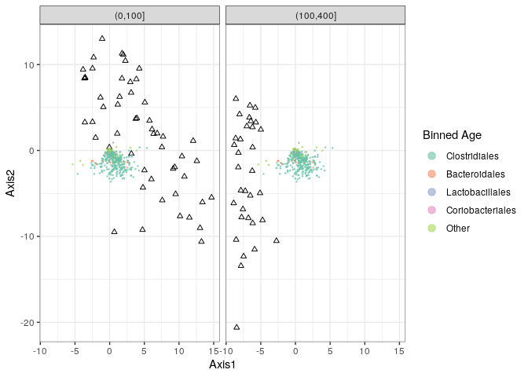

Philoseq
================

  - [Préparation du script](#préparation-du-script)
      - [Lecture de l’environnement de
        Dada2](#lecture-de-lenvironnement-de-dada2)
      - [Chargement des librairies](#chargement-des-librairies)
      - [récupération des données du
        tutoriel](#récupération-des-données-du-tutoriel)
  - [Taxonomic Filtering](#taxonomic-filtering)
  - [Agglomerate taxa](#agglomerate-taxa)
  - [Autres PcoA](#autres-pcoa)
      - [Linear modeling](#linear-modeling)
          - [Modèle mixte](#modèle-mixte)
  - [Multitable techniques](#multitable-techniques)

# Préparation du script

## Lecture de l’environnement de Dada2

``` r
load("03_DADA2_tutorial_FinalEnv")
```

## Chargement des librairies

``` r
library(phyloseq)
library(Biostrings)
```

    ## Loading required package: BiocGenerics

    ## Loading required package: parallel

    ## 
    ## Attaching package: 'BiocGenerics'

    ## The following objects are masked from 'package:parallel':
    ## 
    ##     clusterApply, clusterApplyLB, clusterCall, clusterEvalQ,
    ##     clusterExport, clusterMap, parApply, parCapply, parLapply,
    ##     parLapplyLB, parRapply, parSapply, parSapplyLB

    ## The following objects are masked from 'package:stats':
    ## 
    ##     IQR, mad, sd, var, xtabs

    ## The following objects are masked from 'package:base':
    ## 
    ##     anyDuplicated, append, as.data.frame, basename, cbind, colnames,
    ##     dirname, do.call, duplicated, eval, evalq, Filter, Find, get, grep,
    ##     grepl, intersect, is.unsorted, lapply, Map, mapply, match, mget,
    ##     order, paste, pmax, pmax.int, pmin, pmin.int, Position, rank,
    ##     rbind, Reduce, rownames, sapply, setdiff, sort, table, tapply,
    ##     union, unique, unsplit, which.max, which.min

    ## Loading required package: S4Vectors

    ## Loading required package: stats4

    ## 
    ## Attaching package: 'S4Vectors'

    ## The following object is masked from 'package:base':
    ## 
    ##     expand.grid

    ## Loading required package: IRanges

    ## 
    ## Attaching package: 'IRanges'

    ## The following object is masked from 'package:phyloseq':
    ## 
    ##     distance

    ## Loading required package: XVector

    ## 
    ## Attaching package: 'Biostrings'

    ## The following object is masked from 'package:base':
    ## 
    ##     strsplit

``` r
library(ggplot2)
theme_set(theme_bw())
```

## récupération des données du tutoriel

``` r
ps_connect <-url("https://raw.githubusercontent.com/spholmes/F1000_workflow/master/data/ps.rds")
ps = readRDS(ps_connect)
ps
```

    ## phyloseq-class experiment-level object
    ## otu_table()   OTU Table:         [ 389 taxa and 360 samples ]
    ## sample_data() Sample Data:       [ 360 samples by 14 sample variables ]
    ## tax_table()   Taxonomy Table:    [ 389 taxa by 6 taxonomic ranks ]
    ## phy_tree()    Phylogenetic Tree: [ 389 tips and 387 internal nodes ]

# Taxonomic Filtering

Ces lignes de codes nous permettent de compter le nombre d’echantillons
qu’on a pour chaque phylums.

``` r
# Show available ranks in the dataset
rank_names(ps)
```

    ## [1] "Kingdom" "Phylum"  "Class"   "Order"   "Family"  "Genus"

Sur la table affichée, nous pouvons compter 6 échantillons qui n’ont pas
de phyla defini. Cela peut etre dû à une mauvaise filtration : ce serait
des artefacts.

``` r
# Create table, number of features for each phyla
table(tax_table(ps)[, "Phylum"], exclude = NULL)
```

    ## 
    ##              Actinobacteria               Bacteroidetes 
    ##                          13                          23 
    ## Candidatus_Saccharibacteria   Cyanobacteria/Chloroplast 
    ##                           1                           4 
    ##         Deinococcus-Thermus                  Firmicutes 
    ##                           1                         327 
    ##                Fusobacteria              Proteobacteria 
    ##                           1                          11 
    ##                 Tenericutes             Verrucomicrobia 
    ##                           1                           1 
    ##                        <NA> 
    ##                           6

Ce code nous permet de nous assurer ques les séquences pour lesquelles
les anotations sont ambigues vont bien être retirées.

``` r
ps <- subset_taxa(ps, !is.na(Phylum) & !Phylum %in% c("", "uncharacterized"))
```

Ici nous allons mesurer la prévalence, qui sera dans le cadre de cette
étude le nombre d’echantillons par taxon (avec au minimum un
echantillon par taxon du coup)

``` r
# Compute prevalence of each feature, store as data.frame
prevdf = apply(X = otu_table(ps),
               MARGIN = ifelse(taxa_are_rows(ps), yes = 1, no = 2),
               FUN = function(x){sum(x > 0)})
# Add taxonomy and total read counts to this data.frame
prevdf = data.frame(Prevalence = prevdf,
                    TotalAbundance = taxa_sums(ps),
                    tax_table(ps))
```

Cette commande nous permet d’evaluer la prévalence moyenne de chaque
phylum (colonne1) et la prévalence totale (colonne2). Les résultats de
cette commande nous montre que Fusobacteria est trouvée seulement 2
fois. idem pour deinococcus-thermus qui n’est retrouvé que dans un seul
échantillon (même si au sein de cet echantillon nous l’y retrouvons 52
fois).Nous allons donc le retirer car il risque de nous gêner.

``` r
plyr::ddply(prevdf, "Phylum", function(df1){cbind(mean(df1$Prevalence),sum(df1$Prevalence))})
```

    ##                         Phylum         1     2
    ## 1               Actinobacteria 120.15385  1562
    ## 2                Bacteroidetes 265.52174  6107
    ## 3  Candidatus_Saccharibacteria 280.00000   280
    ## 4    Cyanobacteria/Chloroplast  64.25000   257
    ## 5          Deinococcus-Thermus  52.00000    52
    ## 6                   Firmicutes 179.24771 58614
    ## 7                 Fusobacteria   2.00000     2
    ## 8               Proteobacteria  59.09091   650
    ## 9                  Tenericutes 234.00000   234
    ## 10             Verrucomicrobia 104.00000   104

``` r
# Define phyla to filter
filterPhyla = c("Fusobacteria", "Deinococcus-Thermus")
# Filter entries with unidentified Phylum.
ps1 = subset_taxa(ps, !Phylum %in% filterPhyla)
ps1
```

    ## phyloseq-class experiment-level object
    ## otu_table()   OTU Table:         [ 381 taxa and 360 samples ]
    ## sample_data() Sample Data:       [ 360 samples by 14 sample variables ]
    ## tax_table()   Taxonomy Table:    [ 381 taxa by 6 taxonomic ranks ]
    ## phy_tree()    Phylogenetic Tree: [ 381 tips and 379 internal nodes ]

\#Prevalence Filtering Ces manipulations nous permettent de voir si nous
avons manqué de voir des echantillons mal definis ou en tres faible
quantité qui devraient etre retirés. On va aussi pouvoir avoir un aperçu
des séquences qui sont rangées dans chaque features. Ici; chaque point
représente un taxa. Nous ne voyons pas de seuil de prévalence clairement
établi ici. Nous avons donc des taxons assez stables. Néanmoins nous
pouvons fixer manuelle le seuil de prévalence quelque part entre 0 et
10% (en verifiant qu’il n’y a pas d’impact non attendu sur la suite de
l’étude)

``` r
# Subset to the remaining phyla
prevdf1 = subset(prevdf, Phylum %in% get_taxa_unique(ps1, "Phylum"))
ggplot(prevdf1, aes(TotalAbundance, Prevalence / nsamples(ps),color=Phylum)) +
  # Include a guess for parameter
  geom_hline(yintercept = 0.05, alpha = 0.5, linetype = 2) +  geom_point(size = 2, alpha = 0.7) +
  scale_x_log10() +  xlab("Total Abundance") + ylab("Prevalence [Frac. Samples]") +
  facet_wrap(~Phylum) + theme(legend.position="none")
```

<!-- --> on
va donc fixer un seuil de prévalence de 5%, c’est-à- dire que nous
allons retirer toutes les valeurs de prévalence inferieures à 95%.

``` r
# Define prevalence threshold as 5% of total samples
prevalenceThreshold = 0.05 * nsamples(ps)
prevalenceThreshold
```

    ## [1] 18

C’est grâce à la fonction prune\_taxa qu’on va pouvoir retirer les ASVs
qui ne respectent pas le seuil de prévalence

``` r
# Execute prevalence filter, using `prune_taxa()` function
keepTaxa = rownames(prevdf1)[(prevdf1$Prevalence >= prevalenceThreshold)]
ps2 = prune_taxa(keepTaxa, ps)
```

# Agglomerate taxa

on sait que les communautés microbiennes sont souvent composées de
taxons qui partagent des caractéristiques communes. On va donc chercher
à mettre ensemble les taxons qui sont très proches les uns de autres.
Pour cela, l’aggregation taxonomique est pratique. Elle est facile, et
on peut comparer les taxons grâce à des arbres simples à rangs. Pour le
generer on va pouvoir utiliser phyloseq. La première chose qui sera
faite sera d’agglomerer ensemble les échantillons du même genre.

``` r
# How many genera would be present after filtering?
length(get_taxa_unique(ps2, taxonomic.rank = "Genus"))
```

    ## [1] 49

tax\_glom est une fonction qui permet de rassembler les espèces ayant
une taxonomie proche. On va donc mettre ces séquences là dans l’objet
“ps3” qui va nous servir pour la construction de l’arbre.

``` r
ps3 = tax_glom(ps2, "Genus", NArm = TRUE)
```

Tip\_glom est une fonction analogue à tax\_glom. Il nous permet de
séparer les distances cophenetiques inférieures à une valeur h. La
distance cophenetique est la distance entre deux objets dans l’arbre
dont les branches comprennent deux objets réduits en une branche. On va
donc créer un objet ps4 qui portera cette caractéristique.

``` r
h1 = 0.4
ps4 = tip_glom(ps2, h = h1)
```

ici phyloseq va comparer les datas originales par rapport à l’arbre
obtenu après agglomeration taxonomiques et enfin à l’arbre après les
agglomerations phylogéniques. Grâce à la fonction gridExtra, nous
pourrons ainsi générer ces 3 objets en un.

``` r
multiPlotTitleTextSize = 15
p2tree = plot_tree(ps2, method = "treeonly",
                   ladderize = "left",
                   title = "Before Agglomeration") +
  theme(plot.title = element_text(size = multiPlotTitleTextSize))
p3tree = plot_tree(ps3, method = "treeonly",
                   ladderize = "left", title = "By Genus") +
  theme(plot.title = element_text(size = multiPlotTitleTextSize))
p4tree = plot_tree(ps4, method = "treeonly",
                   ladderize = "left", title = "By Height") +
  theme(plot.title = element_text(size = multiPlotTitleTextSize))
library (gridExtra)
```

    ## 
    ## Attaching package: 'gridExtra'

    ## The following object is masked from 'package:BiocGenerics':
    ## 
    ##     combine

``` r
gridExtra::grid.arrange
```

    ## function (..., newpage = TRUE) 
    ## {
    ##     if (newpage) 
    ##         grid.newpage()
    ##     g <- arrangeGrob(...)
    ##     grid.draw(g)
    ##     invisible(g)
    ## }
    ## <bytecode: 0x55b2d8458008>
    ## <environment: namespace:gridExtra>

Sur la gauche nous retrouvons l’arbre original, au milieu l’arbre généré
par agglomération taxonomique et à droit l’arbre généré par aggrégation
phylogénique. On peut voir que les deux agglomérations nous permettent
de clarifier les arbres. De plus, les arbres obtenus avec les deux types
d’agglomération sont assez ressemblant.

``` r
# group plots together
grid.arrange(nrow = 1, p2tree, p3tree, p4tree)
```

<!-- --> \#
Abundance value transformation on peut avoir besoin de transformer nos
données pour pouvoir calculer des variances. On va d’abord utiliser la
fonction “plot\_abundance” pour definir un graphique d’abondance
relative. Cela va nous permettre de comparer facilement les différentes
échelles et les distributions d’abondance avant de les transformer.

``` r
plot_abundance = function(physeq,title = "",
                          Facet = "Order", Color = "Phylum"){
  # Arbitrary subset, based on Phylum, for plotting
  p1f = subset_taxa(physeq, Phylum %in% c("Firmicutes"))
  mphyseq = psmelt(p1f)
  mphyseq <- subset(mphyseq, Abundance > 0)
  ggplot(data = mphyseq, mapping = aes_string(x = "sex",y = "Abundance",
                              color = Color, fill = Color)) +
    geom_violin(fill = NA) +
    geom_point(size = 1, alpha = 0.3,
               position = position_jitter(width = 0.3)) +
    facet_wrap(facets = Facet) + scale_y_log10()+
    theme(legend.position="none")
}
```

la fonction “transform\_sample\_counts” pour transformer les
dénombrements en leur fréquence par rapport à leurs abondances
relatives.

``` r
# Transform to relative abundance. Save as new object.
ps3ra = transform_sample_counts(ps3, function(x){x / sum(x)})
```

On va donc pouvoir tracer le graphique des valeurs d’abondances avant et
après transformation. On peut voir qu’après les transformations, les
valeurs d’abondances relatives sont mieux réparties et permettent une
lecture plus aisées des différents paramètres.

``` r
plotBefore = plot_abundance(ps3,"")
plotAfter = plot_abundance(ps3ra,"")
# Combine each plot into one graphic.
grid.arrange(nrow = 1,  plotBefore, plotAfter)
```

<!-- --> \#
Subset by taxonomy On remarque que les Lactobacillales apparaissent
comme une distribution taxonomique bimodale. On va donc chercher à
examiner les taxons du genre Lactobacillales pour expliquer cette
répartition bimodale. Pour cela nous allons préciser le taxon dont nous
voulons avoir le graphique. Lorsqu’on regarde les graphiques, on
remarque les abondances relatives en fonction du sexe de l’hote sur
lequelle les bactéries ont été prélevées.Ici il apparait donc clairement
que la répartition bimodale de Lactobacillales provient Streptococcus
(moins abondant) et de Lactobacillus qui a une abondance relative très
élevée.

``` r
psOrd = subset_taxa(ps3ra, Order == "Lactobacillales")
plot_abundance(psOrd, Facet = "Genus", Color = NULL)
```

<!-- --> \#
Preprocessing Nous allons ensuite vouloir analyser les données en
utilisant des projections multivariées. La fonction ci-dessous va
s’interesser à l’âge des souris sur lesquelles ont été prélevées les
bactéries. Les souris vont donc être +/- agées. Nous allons compter le
nombre d’echantillons pour chaque catégorie d’âge. ces comptages vont
être convertis en logarithmes, ce qui va permettre de stabiliser la
variance. On peut ainsi visualiser que l’âge permet de répartir les
échantillons entre 3 clusters séparés, ce qui incite à construire une
autre variable qui prenne en compte cela.

``` r
qplot(sample_data(ps)$age, geom = "histogram",binwidth=20) + xlab("age")
```

<!-- --> Ici
nous allons comparer les données brutes avec les données logarithmiques.
Au vu des résultats, on peut interpreter que les variances sont
suffisamment normalisées avec “log(1+x)” pour pouvoir explorer les
abondances relatives. En réalité, pour d’autres analyses, cela ne sera
pas suffisant. On recommande de plutot utiliser la fonction
phyloseq\_to\_deseq2.

``` r
qplot(log10(rowSums(otu_table(ps))),binwidth=0.2) +
  xlab("Logged counts-per-sample")
```

<!-- --> \#
Première PcoA ce code nous permets de tracer une PcoA grâce à l’indice
de dissimilarité de Bray-Curtis. On remarque que quelques échantillons
sont à part. Ils correspondent d’après les auteurs aux femelles 5 et 6
du jour 165 et aux mâles 3,4,5 et 6 du jour 175. Nous pouvons voir le
nom de ces échantillons en rejoutant label= “SampleID” dans l’objet
“out.wuf.log”, juste après “distance =”wunifrac"". Par soucis de
clarté dans cette figure, j’ai décidé de ne pas le laisser. Nous allons
explorer la relation entre ces échantillons précis afin de pouvoir
analyser ce qui les lient ensembles.

``` r
sample_data(ps)$age_binned <- cut(sample_data(ps)$age,
                          breaks = c(0, 100, 200, 400))
levels(sample_data(ps)$age_binned) <- list(Young100="(0,100]", Mid100to200="(100,200]", Old200="(200,400]")
sample_data(ps)$family_relationship=gsub(" ","",sample_data(ps)$family_relationship)
pslog <- transform_sample_counts(ps, function(x) log(1 + x))
out.wuf.log <- ordinate(pslog, method = "MDS", distance = "wunifrac")
```

    ## Warning in UniFrac(physeq, weighted = TRUE, ...): Randomly assigning root as --
    ## GCAAGCGTTATCCGGAATTATTGGGCGTAAAGCGCGCGTAGGCGGTAAAATAAGTCTGATGTGAAAGCCCCCGGCTCAACCGGGGAGGGTCATTGGAAACTGTTTTACTTGAGTACAGAAGAGGAGAGTGGAATTCCATGTGTAGCGGTGAAATGCGCAGAGATATGGAGGAACACCAGTGGCGAAGGCGGCTCTCTGGTCTGTAACTGACGCTGAGGTGCGAAAGCGTGGGGAT
    ## -- in the phylogenetic tree in the data you provided.

``` r
evals <- out.wuf.log$values$Eigenvalues
plot_ordination(pslog, out.wuf.log, color = "age_binned") +
  labs(col = "Binned Age") +
  coord_fixed(sqrt(evals[2] / evals[1]))
```

<!-- --> Avec
ce code, nous cherchons à analyser les deux femelles préalablement
citées.Elles contiennent un même ASV qui qui a une forte abondance
relative (90%). C’est la première fois qu’il y a une telle abondance car
le reste du temps il a une abondance inférieure à 20%. De plus, sa
diversité est la plus basse parmis tous les échantillons.

``` r
rel_abund <- t(apply(otu_table(ps), 1, function(x) x / sum(x)))
qplot(rel_abund[, 12], geom = "histogram",binwidth=0.05) +
  xlab("Relative abundance")
```

<!-- --> \#
Different Ordination Projections On va chercher à avoir des matrices de
distance et différentes méthodes d’ordination qui vont nous permettre
d’analyser les données. Nous allons donc retirer les “outliers” dans
un premier temps, soit les échantillons qui avaient une dissimilarité
forte par rapport au reste des échantillons.

``` r
outliers <- c("F5D165", "F6D165", "M3D175", "M4D175", "M5D175", "M6D175")
ps <- prune_samples(!(sample_names(ps) %in% outliers), ps)
```

De plus, nous retirons les échantillons qui contiennent moins de 1000
reads.

``` r
which(!rowSums(otu_table(ps)) > 1000)
```

    ## F5D145 M1D149   M1D9 M2D125  M2D19 M3D148 M3D149   M3D3   M3D5   M3D8 
    ##     69    185    200    204    218    243    244    252    256    260

``` r
ps <- prune_samples(rowSums(otu_table(ps)) > 1000, ps)
pslog <- transform_sample_counts(ps, function(x) log(1 + x))
```

# Autres PcoA

Nous allons demander à la machine de nous calculer une analyse par PcoA
en utilisant l’indice de dissimilarité de Bray-Curtis. En regardant la
figure obetnue, on peut clairement voir que l’age influence les
communautés microbiennes retrouvées, avec une séparation vraiment nette
entre les ASV des souris jeune et les souris d’âge moyen. Les souris
plus agées semblent être retrouvées groupées avec les ASVs des souris
moyennement agées. Si nous observons le second axe, nous pouvons trouver
que les échantillons avec un plus grand score, ce qui correspond aux
échantillons des souris moyennement agées et plus agées, sont les
échantillons avec beaucoup de taxon appartenant aux Bacteroidetes avec
un sous groupe de Firmicutes.

``` r
out.pcoa.log <- ordinate(pslog,  method = "MDS", distance = "bray")
evals <- out.pcoa.log$values[,1]
plot_ordination(pslog, out.pcoa.log, color = "age_binned",
                  shape = "family_relationship") +
  labs(col = "Binned Age", shape = "Litter")+
  coord_fixed(sqrt(evals[2] / evals[1]))
```

<!-- -->
\#double principal coordinates analysis (DPCoA) Cette PcoA est
clairement dominée par l’axe 1, qui exprime 75% de variabilité, contre
8,5 sur l’Axe2. Cela est obtenu dû à l’ajout des informations
phylogénétiques pour pouvoir générer cette PcoA.

``` r
out.dpcoa.log <- ordinate(pslog, method = "DPCoA")
evals <- out.dpcoa.log$eig
plot_ordination(pslog, out.dpcoa.log, color = "age_binned", label= "SampleID",
                  shape = "family_relationship") +
  labs(col = "Binned Age", shape = "Litter")+
  coord_fixed(sqrt(evals[2] / evals[1]))
```

<!-- --> Nous
allons donc chercher quel taxa est responsable de la PcoA juste au
dessus. Pour cela nous allons faire un DPcoA, qui utilise l’abondance et
les informations phylogénétiques contenues dans la classe phyloseq.
L’objet final représente la distance patristique (somme des longueurs
des branches qui joignent deux points) et cophenetique développée plus
haut. Dans cette DPcoA, nous pouvons revoir que l’âge a un effet dans
cette répartition. On peut y voir que quasiment tous les phylums
représentés sur cette DPcoA sont ensembles, mis à part les
Bactéroidetes qui sont assez dissimilaires au reste.

``` r
plot_ordination(pslog, out.dpcoa.log, type = "species", color = "Phylum") +
  coord_fixed(sqrt(evals[2] / evals[1]))
```

<!-- -->

Lorsqu’on reproduit la PCoA dominée par l’Axe 1 en utilisant unifrac
comme indice de distance Unifrac, nous obtenons une PcoA beaucoup plus
lisible. Grâce à ces exemples, on peut se rendre compte qu’il est
important d’adapter sa technique de projection par rapport aux datas
afin de mieux les visualiser.

``` r
out.wuf.log <- ordinate(pslog, method = "PCoA", distance ="wunifrac")
```

    ## Warning in UniFrac(physeq, weighted = TRUE, ...): Randomly assigning root as --
    ## GCGAGCGTTATCCGGATTCATTGGGCGTAAAGCGCGCGTAGGCGGCCTGTTAGGTCGGGGGTCAAATACCGGGGCTCAACCCCGGTCCGCCCCCGATACCGGCAGGCTTGAGTCTGGTAGGGGAAGGCGGAATTCCCAGTGTAGCGGTGGAATGCGCAGATATTGGGAAGAACACCGGCGGCGAAGGCGGCCTTCTGGGCCACGACTGACGCTGAGGCGCGAAAGCTAGGGGAGC
    ## -- in the phylogenetic tree in the data you provided.

``` r
evals <- out.wuf.log$values$Eigenvalues
plot_ordination(pslog, out.wuf.log, color = "age_binned",
                  shape = "family_relationship") +
  coord_fixed(sqrt(evals[2] / evals[1])) +
  labs(col = "Binned Age", shape = "Litter")
```

<!-- -->
\#PCA on ranks Création d’une matrice représentant l’abondance par son
range, avec la bactérie la moins présente est mise au rang 1, puis la
seconde moins présente est mise au rang 2, etc.

``` r
abund <- otu_table(pslog)
abund_ranks <- t(apply(abund, 1, rank))
```

Il faut faire attention car ces rangs peut renforcer les différences
entre les rangs des taxons les plus représentés et les moins
représentés. Pour éviter cela, toutes les bactéries qui seront sous la
valeur seuil d’abondance seront mise à une valeur d’abondance de 1. Les
rangs des autres bactéries seront alors décalées vers le bas afin
d’eviter les gros écarts de rang.

``` r
abund_ranks <- abund_ranks - 329
abund_ranks[abund_ranks < 1] <- 1
```

``` r
library(dplyr)
```

    ## 
    ## Attaching package: 'dplyr'

    ## The following object is masked from 'package:gridExtra':
    ## 
    ##     combine

    ## The following objects are masked from 'package:Biostrings':
    ## 
    ##     collapse, intersect, setdiff, setequal, union

    ## The following object is masked from 'package:XVector':
    ## 
    ##     slice

    ## The following objects are masked from 'package:IRanges':
    ## 
    ##     collapse, desc, intersect, setdiff, slice, union

    ## The following objects are masked from 'package:S4Vectors':
    ## 
    ##     first, intersect, rename, setdiff, setequal, union

    ## The following objects are masked from 'package:BiocGenerics':
    ## 
    ##     combine, intersect, setdiff, union

    ## The following objects are masked from 'package:stats':
    ## 
    ##     filter, lag

    ## The following objects are masked from 'package:base':
    ## 
    ##     intersect, setdiff, setequal, union

``` r
library(reshape2)
abund_df <- melt(abund, value.name = "abund") %>%
  left_join(melt(abund_ranks, value.name = "rank"))
```

    ## Joining, by = c("Var1", "Var2")

``` r
colnames(abund_df) <- c("sample", "seq", "abund", "rank")

abund_df <- melt(abund, value.name = "abund") %>%
  left_join(melt(abund_ranks, value.name = "rank"))
```

    ## Joining, by = c("Var1", "Var2")

``` r
colnames(abund_df) <- c("sample", "seq", "abund", "rank")

sample_ix <- sample(1:nrow(abund_df), 8)
ggplot(abund_df %>%
         filter(sample %in% abund_df$sample[sample_ix])) +
  geom_point(aes(x = abund, y = rank, col = sample),
             position = position_jitter(width = 0.2), size = 1.5) +
  labs(x = "Abundance", y = "Thresholded rank") +
  scale_color_brewer(palette = "Set2")
```

<!-- -->

Nous avons pu ordonner en rangs nos différentes abondances, nous allons
ainsi pouvoir maintenant faire une PcoA grâce au code ci dessous.Nous
retrouvons une dispersion similaire à celles trouvées dans les autres
PcoA, ce qui nous permet d’être plutôt sûrs que ces données sont bien
dûes aux séquences elles-mêmes qui sont donc fiables, qu’à notre moyen
de projection qui pourrait influencer les interpretations de manière
différente selon la projection choisie. Cela serait signe de mauvaises
données car nous obtiendrions des résultats différents pour les mêmes
séquences, ce qui n’est pas souhaitable.

``` r
library(ade4)
```

    ## 
    ## Attaching package: 'ade4'

    ## The following object is masked from 'package:Biostrings':
    ## 
    ##     score

    ## The following object is masked from 'package:BiocGenerics':
    ## 
    ##     score

``` r
ranks_pca <- dudi.pca(abund_ranks, scannf = F, nf = 3)
row_scores <- data.frame(li = ranks_pca$li,
                         SampleID = rownames(abund_ranks))
col_scores <- data.frame(co = ranks_pca$co,
                         seq = colnames(abund_ranks))
tax <- tax_table(ps) %>%
  data.frame(stringsAsFactors = FALSE)
tax$seq <- rownames(tax)
main_orders <- c("Clostridiales", "Bacteroidales", "Lactobacillales",
                 "Coriobacteriales")
tax$Order[!(tax$Order %in% main_orders)] <- "Other"
tax$Order <- factor(tax$Order, levels = c(main_orders, "Other"))
tax$otu_id <- seq_len(ncol(otu_table(ps)))
row_scores <- row_scores %>%
  left_join(sample_data(pslog))
```

    ## Joining, by = "SampleID"

    ## Warning in class(x) <- c(setdiff(subclass, tibble_class), tibble_class): Setting
    ## class(x) to multiple strings ("tbl_df", "tbl", ...); result will no longer be an
    ## S4 object

``` r
col_scores <- col_scores %>%
  left_join(tax)
```

    ## Joining, by = "seq"

``` r
evals_prop <- 100 * (ranks_pca$eig / sum(ranks_pca$eig))
ggplot() +
  geom_point(data = row_scores, aes(x = li.Axis1, y = li.Axis2), shape = 2) +
  geom_point(data = col_scores, aes(x = 25 * co.Comp1, y = 25 * co.Comp2, col = Order),
             size = .3, alpha = 0.6) +
  scale_color_brewer(palette = "Set2") +
  facet_grid(~ age_binned) +
  guides(col = guide_legend(override.aes = list(size = 3))) +
  labs(x = sprintf("Axis1 [%s%% variance]", round(evals_prop[1], 2)),
       y = sprintf("Axis2 [%s%% variance]", round(evals_prop[2], 2))) +
  coord_fixed(sqrt(10*ranks_pca$eig[2] / ranks_pca$eig[1])) +
  theme(panel.border = element_rect(color = "#787878", fill = alpha("white", 0)))
```

<!-- --> \#
Canonical correspondence Les Canonical Correspondence Analysis (CCpnA)
sont des ordinations en utilisant des tables d’echantillonage qui
permettent d’incorporer des informations supplémentaires, comme l’age,
les liens de parenté entre les souris, etc. Les positions des
échantillons sont déterminés par similarité dans les signatures
d’espèce et des caractéristiques environnementales.

Le premier code spécifie un “extra-argument” qui permet de préciser les
paramètres à utiliser pour faire l’ordination.

``` r
ps_ccpna <- ordinate(pslog, "CCA", formula = pslog ~ age_binned + family_relationship)
```

ici nous décidons de joindre les différents scores avec les données
environnementales. Parmis les 23 différents taxons, on décide d’annoter
seulement les 4 les plus abondants qui permet de rendre le graphique
plus lisible.

``` r
library(ggrepel)
ps_scores <- vegan::scores(ps_ccpna)
sites <- data.frame(ps_scores$sites)
sites$SampleID <- rownames(sites)
sites <- sites %>%
  left_join(sample_data(ps))
```

    ## Joining, by = "SampleID"

    ## Warning in class(x) <- c(setdiff(subclass, tibble_class), tibble_class): Setting
    ## class(x) to multiple strings ("tbl_df", "tbl", ...); result will no longer be an
    ## S4 object

``` r
species <- data.frame(ps_scores$species)
species$otu_id <- seq_along(colnames(otu_table(ps)))
species <- species %>%
  left_join(tax)
```

    ## Joining, by = "otu_id"

``` r
evals_prop <- 100 * ps_ccpna$CCA$eig[1:2] / sum(ps_ccpna$CA$eig)
ggplot() +
  geom_point(data = sites, aes(x = CCA1, y = CCA2), shape = 2, alpha = 0.5) +
  geom_point(data = species, aes(x = CCA1, y = CCA2, col = Order), size = 0.5) +
  geom_text_repel(data = species %>% filter(CCA2 < -2),
                    aes(x = CCA1, y = CCA2, label = otu_id),
            size = 1.5, segment.size = 0.1) +
  facet_grid(. ~ family_relationship) +
  guides(col = guide_legend(override.aes = list(size = 3))) +
  labs(x = sprintf("Axis1 [%s%% variance]", round(evals_prop[1], 2)),
        y = sprintf("Axis2 [%s%% variance]", round(evals_prop[2], 2))) +
  scale_color_brewer(palette = "Set2") +
  coord_fixed(sqrt(ps_ccpna$CCA$eig[2] / ps_ccpna$CCA$eig[1])*0.45   ) +
  theme(panel.border = element_rect(color = "#787878", fill = alpha("white", 0)))
```

<!-- -->

\#Supervised learning L’apprentissage surpervisé des machines consiste à
utiliser des algorithmes de R qui vont pouvoir choisir des paramètres de
manière automatique. Nous avons vu avec les analyses précedantes que
l’âge des souris influençait les communautés. Ici, grâce aux
techniques d’apprentissage supervisé, nous allons essayer de prédire
l’âge des souris par rapport aux communautés microbiennes retrouvées.
La première étape pour pouvoir faire cela sera donc de diviser les
données en différents sets de tests avec les assignements donnés par
souris (et non par echantillon) pour s’assurer que les différents tests
simulent bien une collection de nouvelles données.Nous allons suivre le
modèle “Partial Least Squares” (PLS). Une fois ces données divisées,
nous pouvons utiliser la fonction “train” pour coller le plus possible à
notre modèle. Ici nous commençons par charger notre librairie pour
éviter les messages d’erreur.

``` r
library (lattice)
```

Créations des différents objets qui vont nous servir pour appliquer la
méthode d’apprentissage supervisé.

``` r
library(caret)
sample_data(pslog)$age2 <- cut(sample_data(pslog)$age, c(0, 100, 400))
dataMatrix <- data.frame(age = sample_data(pslog)$age2, otu_table(pslog))
# take 8 mice at random to be the training set, and the remaining 4 the test set
trainingMice <- sample(unique(sample_data(pslog)$host_subject_id), size = 3)
inTrain <- which(sample_data(pslog)$host_subject_id %in% trainingMice)
training <- dataMatrix[inTrain,]
testing <- dataMatrix[-inTrain,]
plsFit <- train(age ~ ., data = training,
                method = "pls", preProc = "center")
```

Ici nous utilisons la fonction “predict” dont nous allons comparer les
résultats par rapport aux vraies données. On peut voir qu’il y a eu un
peu d’erreur, et lorsqu’on rejoue les codes ci dessus et qu’on refait
une simulation, on a de moins en moins d’erreurs. On peut donc voir que
cette méthode est plutôt efficace. On remarque aussi que lorsqu’on
réduit le nombre de souris par test, la méthode devient de plus en plus
fine, faisant moins d’erreurs comparé au nombre d’echantillon.

``` r
plsClasses <- predict(plsFit, newdata = testing)
table(plsClasses, testing$age)
```

    ##            
    ## plsClasses  (0,100] (100,400]
    ##   (0,100]       148         5
    ##   (100,400]       7        98

Ici nous allons quitter le modèle PLS pour appliquer le modèle random
forests. Il utilise le même principe que PLS en switchant les données.
J’ai rajouté une nouvelle demande de library pour ggplot2 afin
d’éviter d’avoir des objets cachés. Au vu des résultats, on peut voir
que c’est un modèle efficace, néanmoins il faut noter que quelques
souris agées qui se sont retrouvées parmis les souris jeunes, avec un
taux d’erreur legerement supérieur à celui de PLS.

``` r
library(randomForest)
```

    ## randomForest 4.6-14

    ## Type rfNews() to see new features/changes/bug fixes.

    ## 
    ## Attaching package: 'randomForest'

    ## The following object is masked from 'package:dplyr':
    ## 
    ##     combine

    ## The following object is masked from 'package:gridExtra':
    ## 
    ##     combine

    ## The following object is masked from 'package:ggplot2':
    ## 
    ##     margin

    ## The following object is masked from 'package:BiocGenerics':
    ## 
    ##     combine

``` r
library (ggplot2)
rfFit <- train(age ~ ., data = training, method = "rf",
               preProc = "center", proximity = TRUE)
rfClasses <- predict(rfFit, newdata = testing)
table(rfClasses, testing$age)
```

    ##            
    ## rfClasses   (0,100] (100,400]
    ##   (0,100]       146        16
    ##   (100,400]       9        87

Pour pouvoir interpreter les résultats des deux modèles différents, nous
allons génerer un biplot standard (pour PLS) et un graphique de
proximité (random forests). Ce dernier consiste à utiliser des scores
de proximité qui évalue une répartition dans l’espace. Le code
ci-dessous nous permet, après avoir chargé la librairie “vegan”,
d’extraire les coordonnées et les annotations supplémentaires pour
chaque points incluant le biplot PLS.

``` r
library(permute)
library (vegan)
```

    ## This is vegan 2.5-6

    ## 
    ## Attaching package: 'vegan'

    ## The following object is masked from 'package:caret':
    ## 
    ##     tolerance

Nous pouvons, sur le graphique obtenu, interpreter les résultats de la
même façon que dans les précédantes ordinations, mais la projection
choisie permet de mettre en évidence explicitement les variables d’âge
regroupées. De plus, grâce à cette projection, nous pouvons identifier
un espace qui va nous permettre de maximiser les discriminations selon
les classes. Ainsi, nous pouvons utiliser des projections et des
coefficients d’ASV qui permettent de respecter cet espace spécifique.

``` r
pls_biplot <- list("loadings" = loadings(plsFit$finalModel),
                   "scores" = scores(plsFit$finalModel))
class(pls_biplot$scores) <- "matrix"

pls_biplot$scores <- data.frame(sample_data(pslog)[inTrain, ],
                                pls_biplot$scores)

tax <- tax_table(ps)@.Data %>%
  data.frame(stringsAsFactors = FALSE)
main_orders <- c("Clostridiales", "Bacteroidales", "Lactobacillales",
                 "Coriobacteriales")
tax$Order[!(tax$Order %in% main_orders)] <- "Other"
tax$Order <- factor(tax$Order, levels = c(main_orders, "Other"))
class(pls_biplot$loadings) <- "matrix"
pls_biplot$loadings <- data.frame(tax, pls_biplot$loadings)
ggplot() +
  geom_point(data = pls_biplot$scores,
             aes(x = Comp.1, y = Comp.2), shape = 2) +
  geom_point(data = pls_biplot$loadings,
             aes(x = 25 * Comp.1, y = 25 * Comp.2, col = Order),
             size = 0.3, alpha = 0.6) +
  scale_color_brewer(palette = "Set2") +
  labs(x = "Axis1", y = "Axis2", col = "Binned Age") +
  guides(col = guide_legend(override.aes = list(size = 3))) +
  facet_grid( ~ age2) +
  theme(panel.border = element_rect(color = "#787878", fill = alpha("white", 0)))
```

<!-- --> Ici
nous allons donc génerer le graphique de proximité pour analyser les
données de random forests. Nous calculons ici les distances entre les
échantillons par rapport au nombre de fois où elle apparait dans le
bootstrapping performé par random forests. Ainsi si on a une paire
d’échantillons qui apparaissent souvent avec la même partition, alors
cette paire aura une distance faible entre elle. Les distances finales
sont placées dans une PCoA. Les séparations sont donc claires, et
peuvent être comparées manuellement en observant les différents points.
On peut donc se rendre compte selon le point qu’on aura des échantillons
+/- faciles à classifier.

``` r
rf_prox <- cmdscale(1 - rfFit$finalModel$proximity) %>%
  data.frame(sample_data(pslog)[inTrain, ])

ggplot(rf_prox) +
  geom_point(aes(x = X1, y = X2, col = age_binned),
             size = 1, alpha = 0.7) +
  scale_color_manual(values = c("#A66EB8", "#238DB5", "#748B4F")) +
  guides(col = guide_legend(override.aes = list(size = 4))) +
  labs(col = "Binned Age", x = "Axis1", y = "Axis2")
```

<!-- --> Pour
ameiliorer notre compréhension du modèle random forests, on identifie la
bactérie qui a le plus d’influence dans la prédiction. On peut voir
apparaitre avec la premiere ligne de code que c’est Lachnospiraceae du
genre Roseburia. Dans le graphique si dessous on va donc voir que cette
batérie est très peu abondante chez les souris les plus jeunes, mais par
contre elle aura une abondance plus importante chez les souris plus
agées.

``` r
as.vector(tax_table(ps)[which.max(importance(rfFit$finalModel)), c("Family", "Genus")])
```

    ## [1] NA NA

``` r
impOtu <- as.vector(otu_table(pslog)[,which.max(importance(rfFit$finalModel))])
maxImpDF <- data.frame(sample_data(pslog), abund = impOtu)
ggplot(maxImpDF) +   geom_histogram(aes(x = abund)) +
  facet_grid(age2 ~ .) +
  labs(x = "Abundance of discriminative bacteria", y = "Number of samples")
```

    ## `stat_bin()` using `bins = 30`. Pick better value with `binwidth`.

<!-- --> \#
Graph-based analyses \#\# Creating and plotting graphs Nous pouvons
créer, grâce à phyloseq, une matrice de distance basée sur le seuil. Le
réseau en résultant peut etre visualisé grâce au package “ggnetwork”.
Grâce aux fonction ggplot et igraph, nous pouvons organiser l’analyse
en reseau. On va pouvoir également ajouter des couleurs selon nos noeuds
grâce à igraph. Dans notre cas, nous choisissons de baser le seuil sur
l’indice de dissimilarité de jaccard, en prenant une valeur seuil de
0,35. On ajoute ensuite dans indications pour savoir de quelle souris
provient l’echantillon. A la fin nous obtenons une analyse en reseau
colorée en fonction de la provenance de l’echantillon (= sur quelle
souris il a été prélevé) et en fonction de la litière utilisée (1 ou2).
ON peut voir sur l’analyse en reseau obtenue qu’on va avoir un
regroupement des échantillons qui va former un noeud central assez
dense, composé des échantillons des femelles 7 et males 1 et 2
majoritairement élevées sur la litière 1. GLobalement les litières
forment des liaisons distinctes : les souris élevées sur la litière 1
seront plutôt regroupées ensembles et idem pour la litière 2. idem, les
mâles auront tendance à être liés ensemble et les femelles ensembles
aussi. On va donc ici pouvoir mettre en évidence que non seulement l’âge
à un impact sur la communauté microbienne, mais aussi la parenté entre
les individus et le sexe de ceux ci.

``` r
library("phyloseqGraphTest")
library("igraph")
```

    ## 
    ## Attaching package: 'igraph'

    ## The following object is masked from 'package:vegan':
    ## 
    ##     diversity

    ## The following object is masked from 'package:permute':
    ## 
    ##     permute

    ## The following objects are masked from 'package:dplyr':
    ## 
    ##     as_data_frame, groups, union

    ## The following object is masked from 'package:Biostrings':
    ## 
    ##     union

    ## The following object is masked from 'package:XVector':
    ## 
    ##     path

    ## The following object is masked from 'package:IRanges':
    ## 
    ##     union

    ## The following object is masked from 'package:S4Vectors':
    ## 
    ##     union

    ## The following objects are masked from 'package:BiocGenerics':
    ## 
    ##     normalize, path, union

    ## The following objects are masked from 'package:stats':
    ## 
    ##     decompose, spectrum

    ## The following object is masked from 'package:base':
    ## 
    ##     union

``` r
library("ggnetwork")
net <- make_network(ps, max.dist=0.35)
sampledata <- data.frame(sample_data(ps))
V(net)$id <- sampledata[names(V(net)), "host_subject_id"]
V(net)$litter <- sampledata[names(V(net)), "family_relationship"]
net_graph<-ggnetwork(net)
ggplot(net_graph, aes(x = x, y = y, xend = xend, yend = yend), layout = "fruchtermanreingold") +
  geom_edges(color = "darkgray") +
  geom_nodes(aes(color = id, shape = litter),  size = 3 ) +
  theme(axis.text = element_blank(), axis.title = element_blank(),
        legend.key.height = unit(0.5,"line")) +
  guides(col = guide_legend(override.aes = list(size = .5)))
```

<!-- --> \#\#
Minimum Spanning Tree (MST) Cette méthode d’analyse est basée sur les
distances entre les échantillons, puis sur le dénombrement des bouts des
branches qu’il y a entre ces échantillons dans les différents groupes.
Pour modéliser l’arbre, cette méthode utilise les “nearest neighbors” ou
une distance seuil établie. Ce qui compte à la fin c’est les noeuds
finaux retouvés au bout des branches, et non l’arbre intermédiaire.
Celui-ci sera changé en fonction de l’ordre des échantillons, mais comme
la méthode est fiable, les bouts des branches avec les distances finales
demeureront inchangés. Dans notre premier code pour faire cet arbre nous
utilisons l’indice de dissimilarité de Jaccard. Cet arbre aura pour but
de verifier qu’au sein des mêmes portées nous retrouvons une
distribution des abondances similaires. Ceci est traduit par l’argument
“family\_relationship”. Par contre ici nous allons avoir besoin de
maintenir ces structures imbriquées, nous ne pouvons pas les permuter
simplement. C’est ce que fait l’argument “grouping”. On va pouvoir faire
ainsi des permutations mais en gardant cette structure intacte.

``` r
gt <- graph_perm_test(ps, "family_relationship", grouping = "host_subject_id",
                      distance = "jaccard", type = "mst")
gt$pval
```

    ## [1] 0.01

On retrouve une faible p-value dans ce test où nous rejettons
l’hypothèse nulle que les deux échantillons (et donc lignées)
proviennent d’une même distribution. On peut voir grâce a notre figure
que les échantillons sont beaucoup plus groupés par portée que ce qu’on
aurait pu obtenir par hasard.

``` r
plotNet1=plot_test_network(gt) + theme(legend.text = element_text(size = 8),
        legend.title = element_text(size = 9))
plotPerm1=plot_permutations(gt)
grid.arrange(ncol = 2,  plotNet1, plotPerm1)
```

<!-- --> \#\#
Nearest neighbors Le graphique des voisins les plus proches permet de
séparer les deux portées qui ne se retrouvent jamais mélangées l’une
avec l’autre. Ainsi, lorsque deux points sont proches entre eux, on aura
une forte probabilité qu’il appartiennent à la même lignée.

``` r
gt <- graph_perm_test(ps, "family_relationship", grouping = "host_subject_id",
                      distance = "jaccard", type = "knn", knn = 1)
plotNet2=plot_test_network(gt) + theme(legend.text = element_text(size = 8),
        legend.title = element_text(size = 9))
plotPerm2=plot_permutations(gt)
grid.arrange(ncol = 1,  plotNet2, plotPerm2)
```

<!-- -->

## Linear modeling

### Modèle mixte

Pouvoir évaluer l’impacte de l’environnement dans lesquels les
echantillons ont été prélevés est un autre moyen d’analyser des données.
Ici on veut décrire comment une seule mesure par rapport à toutes les
données peut être associée aux caractéristiques de l’échantillon. On va
donc pouvoir obtenir cela grâce à la modelisation linéaire. Ici nous
allons étudier cela en utilisant un modèle mixte. C’est un modèle qui
utilise des effets fixes et aléatoires, ce qui permet de passer outre
certaines mesures manquantes. Nous allons l’utiliser pour etudier la
relation entre la diversité du microbiome d’une souris avec les
variables d’âge et de portée qu’on a deja pu étudier au travers des
autres analyses plus haut. Ce type d’étude sera pertinante car nous
avons déjà pu observer que les souris jeunes avaient une diversité bien
plus faible selon l’indice de Shannon. Les données obtenues vont nous
permettre de visualiser tout ça. On commence donc à associer l’indice de
diversité de Shannon avec chaque échantillon pour les joindre avec les
annotations des échantillons. On peut voir apparaitre ici clairement
pour chaque souris, mâle ou femelle, la diversité de Shannon, en
fonction de la portée dont elle provient.

``` r
library("nlme")
```

    ## 
    ## Attaching package: 'nlme'

    ## The following object is masked from 'package:dplyr':
    ## 
    ##     collapse

    ## The following object is masked from 'package:Biostrings':
    ## 
    ##     collapse

    ## The following object is masked from 'package:IRanges':
    ## 
    ##     collapse

``` r
library("reshape2")
ps_alpha_div <- estimate_richness(ps, split = TRUE, measure = "Shannon")
ps_alpha_div$SampleID <- rownames(ps_alpha_div) %>%
  as.factor()
ps_samp <- sample_data(ps) %>%
  unclass() %>%
  data.frame() %>%
  left_join(ps_alpha_div, by = "SampleID") %>%
  melt(measure.vars = "Shannon",
       variable.name = "diversity_measure",
       value.name = "alpha_diversity")

# reorder's facet from lowest to highest diversity
diversity_means <- ps_samp %>%
  group_by(host_subject_id) %>%
  summarise(mean_div = mean(alpha_diversity)) %>%
  arrange(mean_div)
```

    ## `summarise()` ungrouping output (override with `.groups` argument)

``` r
ps_samp$host_subject_id <- factor(ps_samp$host_subject_id)
#                                  diversity_means$host_subject_id)
alpha_div_model <- lme(fixed = alpha_diversity ~ age_binned, data = ps_samp,
                       random = ~ 1 | host_subject_id)
new_data <- expand.grid(host_subject_id = levels(ps_samp$host_subject_id),
                        age_binned = levels(ps_samp$age_binned))
new_data$pred <- predict(alpha_div_model, newdata = new_data)
X <- model.matrix(eval(eval(alpha_div_model$call$fixed)[-2]),
                  new_data[-ncol(new_data)])
pred_var_fixed <- diag(X %*% alpha_div_model$varFix %*% t(X))
new_data$pred_var <- pred_var_fixed + alpha_div_model$sigma ^ 2
# fitted values, with error bars
ggplot(ps_samp %>% left_join(new_data)) +
  geom_errorbar(aes(x = age_binned, ymin = pred - 2 * sqrt(pred_var),
                    ymax = pred + 2 * sqrt(pred_var)),
                col = "#858585", size = .1) +
  geom_point(aes(x = age_binned, y = alpha_diversity,
                 col = family_relationship), size = 0.8) +
  facet_wrap(~host_subject_id) +
  scale_y_continuous(limits = c(2.4, 4.6), breaks = seq(0, 5, .5)) +
  scale_color_brewer(palette = "Set2") +
  labs(x = "Binned Age", y = "Shannon Diversity", color = "Litter") +
  guides(col = guide_legend(override.aes = list(size = 4))) +
  theme(panel.border = element_rect(color = "#787878", fill = alpha("white", 0)),
        axis.text.x = element_text(angle = -90, size = 6),
        axis.text.y = element_text(size = 6))
```

    ## Joining, by = c("host_subject_id", "age_binned")

<!-- -->

``` r
ps_alpha_div <- estimate_richness(ps, split = TRUE, measure = "Shannon")
ps_alpha_div$SampleID <- rownames(ps_alpha_div) %>%
  as.factor()
ps_samp <- sample_data(ps) %>%
  unclass() %>%
  data.frame() %>%
  left_join(ps_alpha_div, by = "SampleID") %>%
  melt(measure.vars = "Shannon",
       variable.name = "diversity_measure",
       value.name = "alpha_diversity")
```

\#Hierarchical multiple testing Pour pouvoir compiler des tests
performés sur des bactéries individuelles en exploitant en parallèle
les structures au seins des hypothèses testées, comme par exmple dans
notre cas qu’une espèce de Ruminococcus qui est etroitement corrélée à
l’âge des souris, nous allons pouvoir utiliser une procédure de tests
hierarchiques. Dans cette procédure, nous allons pouvoir tester les
associations les plus représentées. Si nous nous trouvons dans une
situation dans laquelle nous avons beaucoup d’espèces qui fournissent un
signal léger, nous allons pouvoir rassembler ces informations pour
pouvoir augmenter leur puissance. Ce test va être particulièrement
efficace pour tester les associations entre les abondances microbiennes
et l’âge dans le cadre de notre étude. L’avantage ici sera de pouvoir
identifier les bactéries spécifiques responsables de ces différences
entre les âges. Pour ce faire, nous allons ici travailler en considérant
une stabilisation par transformation de la variance pour les données
issues des sequences ARN 16S générées et disponibles dans le package
DESeq2. C’est une autre méthode de normalisation qui sera plus adaptée à
notre test. Nous obtiendrons quand meme une transformation avec des taux
de significativité des bactéries importantes semblable aux autres
analyses. L’histogramme nous donne le total des abondances transformées
pour chaque échantillon.

``` r
library("reshape2")
library("DESeq2")
```

    ## Loading required package: GenomicRanges

    ## Loading required package: GenomeInfoDb

    ## Loading required package: SummarizedExperiment

    ## Loading required package: MatrixGenerics

    ## Loading required package: matrixStats

    ## 
    ## Attaching package: 'matrixStats'

    ## The following object is masked from 'package:dplyr':
    ## 
    ##     count

    ## 
    ## Attaching package: 'MatrixGenerics'

    ## The following objects are masked from 'package:matrixStats':
    ## 
    ##     colAlls, colAnyNAs, colAnys, colAvgsPerRowSet, colCollapse,
    ##     colCounts, colCummaxs, colCummins, colCumprods, colCumsums,
    ##     colDiffs, colIQRDiffs, colIQRs, colLogSumExps, colMadDiffs,
    ##     colMads, colMaxs, colMeans2, colMedians, colMins, colOrderStats,
    ##     colProds, colQuantiles, colRanges, colRanks, colSdDiffs, colSds,
    ##     colSums2, colTabulates, colVarDiffs, colVars, colWeightedMads,
    ##     colWeightedMeans, colWeightedMedians, colWeightedSds,
    ##     colWeightedVars, rowAlls, rowAnyNAs, rowAnys, rowAvgsPerColSet,
    ##     rowCollapse, rowCounts, rowCummaxs, rowCummins, rowCumprods,
    ##     rowCumsums, rowDiffs, rowIQRDiffs, rowIQRs, rowLogSumExps,
    ##     rowMadDiffs, rowMads, rowMaxs, rowMeans2, rowMedians, rowMins,
    ##     rowOrderStats, rowProds, rowQuantiles, rowRanges, rowRanks,
    ##     rowSdDiffs, rowSds, rowSums2, rowTabulates, rowVarDiffs, rowVars,
    ##     rowWeightedMads, rowWeightedMeans, rowWeightedMedians,
    ##     rowWeightedSds, rowWeightedVars

    ## Loading required package: Biobase

    ## Welcome to Bioconductor
    ## 
    ##     Vignettes contain introductory material; view with
    ##     'browseVignettes()'. To cite Bioconductor, see
    ##     'citation("Biobase")', and for packages 'citation("pkgname")'.

    ## 
    ## Attaching package: 'Biobase'

    ## The following object is masked from 'package:MatrixGenerics':
    ## 
    ##     rowMedians

    ## The following objects are masked from 'package:matrixStats':
    ## 
    ##     anyMissing, rowMedians

    ## The following object is masked from 'package:phyloseq':
    ## 
    ##     sampleNames

``` r
#New version of DESeq2 needs special levels
sample_data(ps)$age_binned <- cut(sample_data(ps)$age,
                          breaks = c(0, 100, 200, 400))
levels(sample_data(ps)$age_binned) <- list(Young100="(0,100]", Mid100to200="(100,200]", Old200="(200,400]")
sample_data(ps)$family_relationship = gsub(" ", "", sample_data(ps)$family_relationship)
ps_dds <- phyloseq_to_deseq2(ps, design = ~ age_binned + family_relationship)
```

    ## converting counts to integer mode

    ## Warning in DESeqDataSet(se, design = design, ignoreRank): some variables in
    ## design formula are characters, converting to factors

``` r
# geometric mean, set to zero when all coordinates are zero
geo_mean_protected <- function(x) {
  if (all(x == 0)) {
    return (0)
  }
  exp(mean(log(x[x != 0])))
}

geoMeans <- apply(counts(ps_dds), 1, geo_mean_protected)
ps_dds <- estimateSizeFactors(ps_dds, geoMeans = geoMeans)
ps_dds <- estimateDispersions(ps_dds)
```

    ## gene-wise dispersion estimates

    ## mean-dispersion relationship

    ## final dispersion estimates

``` r
abund <- getVarianceStabilizedData(ps_dds)
```

``` r
short_names <- substr(rownames(abund), 1, 5)%>%
  make.names(unique = TRUE)
rownames(abund) <- short_names
```

``` r
abund_sums <- rbind(data.frame(sum = colSums(abund),
                               sample = colnames(abund),
                               type = "DESeq2"),
                    data.frame(sum = rowSums(otu_table(pslog)),
                               sample = rownames(otu_table(pslog)),
                               type = "log(1 + x)"))

ggplot(abund_sums) +
  geom_histogram(aes(x = sum), binwidth = 20) +
  facet_grid(type ~ .) +
  xlab("Total abundance within sample")
```

<!-- --> Ici
nous utilisons un test hierarchique et non seulement un test avec des
hypothèses multiples. Pour pouvoir être appliqué il aura donc besoin de
faire des tests univariés pour chaque groupe taxonomique de niveau
supérieur, et non pour seulement chaque espèce. Pour nous aider à faire
cela nous pouvons utiliser la fonction " treePValues ", qui va encoder
une liste avec les relations parentales qui constitue le premier noeud
racine.

``` r
library("structSSI")
library (phyloseq)
el <- phy_tree(pslog)$edge
el0 <- el
el0 <- el0[nrow(el):1, ]
el_names <- c(short_names, seq_len(phy_tree(pslog)$Nnode))
el[, 1] <- el_names[el0[, 1]]
el[, 2] <- el_names[as.numeric(el0[, 2])]
unadj_p <- treePValues(el, abund, sample_data(pslog)$age_binned)
```

``` r
hfdr_res <- hFDR.adjust(unadj_p, el, .75)
summary(hfdr_res)
```

    ## Number of hypotheses: 764 
    ## Number of tree discoveries: 579 
    ## Estimated tree FDR: 1 
    ## Number of tip discoveries: 280 
    ## Estimated tips FDR: 1 
    ## 
    ##  hFDR adjusted p-values: 
    ##                 unadjp         adjp adj.significance
    ## GCAAG.95  1.861873e-82 3.723745e-82              ***
    ## GCAAG.70  1.131975e-75 2.263950e-75              ***
    ## GCAAG.187 5.148758e-59 1.029752e-58              ***
    ## GCAAG.251 3.519276e-50 7.038553e-50              ***
    ## GCAAG.148 1.274481e-49 2.548962e-49              ***
    ## GCAAG.30  9.925218e-49 1.985044e-48              ***
    ## GCGAG.76  1.722591e-46 3.445183e-46              ***
    ## GCAAG.167 6.249050e-43 1.249810e-42              ***
    ## 255       8.785479e-40 1.757096e-39              ***
    ## GCAAG.64  2.727610e-36 5.455219e-36              ***
    ## [only 10 most significant hypotheses shown] 
    ## --- 
    ## Signif. codes:  0 '***' 0.015 '**' 0.15 '*' 0.75 '.' 1.5 '-' 1

``` r
#interactive part
plot(hfdr_res, height = 5000) # opens in a browser
```

``` r
library(dplyr)
library (phyloseq)
library (dada2)
```

    ## Loading required package: Rcpp

``` r
tax <- tax_table(pslog)[, c("Family", "Genus")] %>%
  data.frame()
tax$seq <- short_names
```

Grâce à ce code nous pouvons que la bactérie la plus associée appartient
à la famille des Lachnospiraceae, ce qui correspond à ce qu’on avait
obtenu pour les résultats de random forests.

``` r
options(digits=3)
hfdr_res@p.vals$seq <- rownames(hfdr_res@p.vals)
tax %>%
  left_join(hfdr_res@p.vals) %>%
  arrange(adjp) %>% head(10)
```

    ## Joining, by = "seq"

    ##             Family            Genus       seq   unadjp     adjp
    ## 1  Lachnospiraceae             <NA>  GCAAG.95 1.86e-82 3.72e-82
    ## 2  Lachnospiraceae        Roseburia  GCAAG.70 1.13e-75 2.26e-75
    ## 3  Lachnospiraceae Clostridium_XlVa GCAAG.187 5.15e-59 1.03e-58
    ## 4  Lachnospiraceae             <NA> GCAAG.251 3.52e-50 7.04e-50
    ## 5  Lachnospiraceae Clostridium_XlVa GCAAG.148 1.27e-49 2.55e-49
    ## 6  Lachnospiraceae             <NA>  GCAAG.30 9.93e-49 1.99e-48
    ## 7  Ruminococcaceae     Ruminococcus  GCGAG.76 1.72e-46 3.45e-46
    ## 8  Lachnospiraceae Clostridium_XlVa GCAAG.167 6.25e-43 1.25e-42
    ## 9  Lachnospiraceae        Roseburia  GCAAG.64 2.73e-36 5.46e-36
    ## 10            <NA>             <NA>   GCAAG.1 5.22e-35 1.04e-34
    ##    adj.significance
    ## 1               ***
    ## 2               ***
    ## 3               ***
    ## 4               ***
    ## 5               ***
    ## 6               ***
    ## 7               ***
    ## 8               ***
    ## 9               ***
    ## 10              ***

# Multitable techniques

Plusieurs études se basant sur les microbes vont avoir pour but de
quantifier les variations génomiques et métaboliques selon les
expérimentations. C’est pour ça qu’on va souvent pouvoir retrouver
plusieurs expérimentations sur un même échantillon biologique. On pourra
ainsi visualiser les changements de communautés, génétiques,
métaboliques, etc. en rapport avec l’environnement. Tout dépend ce
qu’on cherche à comprendre. Ici nous allons nous concentrer sur un
workflow qui utilise les Analyses des Corrélations Canoniques. Ces
analyses nous permettent de comparer deux groupes dont les variables
quantitatives sont appliquées sur les mêmes individus. On va ainsi
pouvoir comparer ces deux groupes de variable pour pouvoir voir si elles
décrivent un même phénomène. Si cela est le cas, on pourra voir que les
deux groupes fonctionnent de la même manière et donc qu’ils peuvent être
considérés comme des réplicats. Ici nous utiliserons deux tables, une
pour les bactéries et une autres pour les métabolites trouvés. La ligne
de code ci-dessous nous permet de voir qu’on a 12 échantillons pour
20609 OTUs. On a en parallèle filtré les les données non conformes. Nous
avons aussi fait de “microbe” un objet phyloseq.

``` r
metab <- read.csv("https://raw.githubusercontent.com/spholmes/F1000_workflow/master/data/metabolites.csv",row.names = 1)
microbe_connect <-url("https://raw.githubusercontent.com/spholmes/F1000_workflow/master/data/microbe.rda")
load(microbe_connect)
microbe
```

    ## phyloseq-class experiment-level object
    ## otu_table()   OTU Table:         [ 20609 taxa and 12 samples ]
    ## tax_table()   Taxonomy Table:    [ 20609 taxa by 6 taxonomic ranks ]
    ## phy_tree()    Phylogenetic Tree: [ 20609 tips and 20607 internal nodes ]

Nous filtrons les données qui nous interressent dans les deux tables, en
enlevant celles pour lesquelles nous ne retrouvons rien dans la plupart
des échantillons. Ensuite nous allons les transformer et récuperer les
log des métabolites. Nous allons obtenir une colonne par sample, puis
nous allons pouvoir appliquer les Analyses des Corrélations Canoniques
qui va nous permettre de prendre en compte les paramètres permettant
d’obtenir la meilleure covariance. Ces paramètres permettent de
refleter les signaux présents dans les tables multiples. C’est pour cela
qu’ici nous ne faisons pas d’ordination.

``` r
library("genefilter")
```

    ## 
    ## Attaching package: 'genefilter'

    ## The following objects are masked from 'package:MatrixGenerics':
    ## 
    ##     rowSds, rowVars

    ## The following objects are masked from 'package:matrixStats':
    ## 
    ##     rowSds, rowVars

``` r
keep_ix <- rowSums(metab == 0) <= 3
metab <- metab[keep_ix, ]
microbe <- prune_taxa(taxa_sums(microbe) > 4, microbe)
microbe <- filter_taxa(microbe, filterfun(kOverA(3, 2)), TRUE)
metab <- log(1 + metab, base = 10)
X <- otu_table(microbe)
X[X > 50] <- 50
dim(X)
```

    ## [1] 174  12

``` r
dim(metab)
```

    ## [1] 405  12

Nous allons utiliser une méthode de régularisation structurée de la
rareté (Sparse estimation method). Ce sont des méthodes qui ont pour but
d’obtenir des représentations parcimonieuses de nos données. Pour cela
nous utilisons les paramètres penaltyx et penaltyz. Une petite valeur de
penaltyx va avoir comme conséquence la selection de moins de bactéries.
Penaltyz va lui moduler les métabolites séléctionnés pour l’analyse. On
va donc pouvoir les ajuster afin de faciliter l’interpretation des
graphiques. On va d’ailleurs souvent preferer plus de dispersion que les
parametres par defaut nous propose. Avec notre code ci-dessous, nous
avons pu selectionner 5 bactéries et 15 métabolites qui permettent
d’expliquer les covariations entre les tables. Ces 20 variables sont
d’ailleurs corrélées à 0.974 entre les deux tables, montrant leur
importance. De cette donnée, on peut interpreter que les données entre
les deux tables possèdent des signaux sous-jacents identiques, et que
ces signaux sont traduits approximativement par les 20 paramètres
trouvés. En revanche, il faut faire attention à ne pas prendre ces
resultats pour argent comptant. En effet nous ne sommes pas sûrs que ces
données peuvent être étendues à d’autres sous-ensembles.

``` r
library(PMA)
cca_res <- CCA(t(X),  t(metab), penaltyx = .15, penaltyz = .15)
```

    ## 123456789101112131415

``` r
cca_res
```

    ## Call: CCA(x = t(X), z = t(metab), penaltyx = 0.15, penaltyz = 0.15)
    ## 
    ## 
    ## Num non-zeros u's:  5 
    ## Num non-zeros v's:  15 
    ## Type of x:  standard 
    ## Type of z:  standard 
    ## Penalty for x: L1 bound is  0.15 
    ## Penalty for z: L1 bound is  0.15 
    ## Cor(Xu,Zv):  0.974

Cependant,même si nous devons faire attention à ces résultats si nous
voulons les étendre, dans nos deux tables nous savons qu’ils sont
fiables. Ils vont donc nous permettre de reduire notre jeu de donnée
sans subir de perte importantes pour comprendre les informations. Pour
relier les informations des metabolites et des ASV/OTUs, nous pouvont
faire une simple PCA. Notre PCA ainsi obtenue est un triplot qui montre
différents types d’echantillons et des signatures avec des domaines
multiples, que ce soit pour les OTUs que pour les métabolites. Cette
figure va donc nous permettre de faaire des comparaisons au travers des
échantillons, et nous allons pouvoir caractériser l’influence des
divers paramètres. Par exemple nous pouvons voir que les données varient
selon le régime alimentaire des souris, ce qui est un résultat auquel on
pouvait s’attendre. Ce type de graphique est utile ici car il nous
permet d’eviter de regrouper des centaines de points, ce qui aurait
rendu l’interpretation plus délicate.

``` r
library(ade4)
combined <- cbind(t(X[cca_res$u != 0, ]),
                  t(metab[cca_res$v != 0, ]))
pca_res <- dudi.pca(combined, scannf = F, nf = 3)
```

``` r
genotype <- substr(rownames(pca_res$li), 1, 2)
sample_type <- substr(rownames(pca_res$l1), 3, 4)
feature_type <- grepl("\\.", colnames(combined))
feature_type <- ifelse(feature_type, "Metabolite", "OTU")
sample_info <- data.frame(pca_res$li, genotype, sample_type)
feature_info <- data.frame(pca_res$c1,
                           feature = substr(colnames(combined), 1, 6))
```

``` r
library(dplyr)
library(ggplot2)
library(ggrepel)
ggplot() +  geom_point(data = sample_info,
            aes(x = Axis1, y = Axis2, col = sample_type, shape = genotype), size = 3) + 
  geom_label_repel(data = feature_info,
                   aes(x = 5.5 * CS1, y = 5.5 * CS2, label = feature, fill = feature_type),
                   size = 2, segment.size = 0.3,
                   label.padding = unit(0.1, "lines"), label.size = 0) +
  geom_point(data = feature_info,
             aes(x = 5.5 * CS1, y = 5.5 * CS2, fill = feature_type),
             size = 1, shape = 23, col = "#383838") +
  scale_color_brewer(palette = "Set2") +
  scale_fill_manual(values = c("#a6d854", "#e78ac3")) +
  guides(fill = guide_legend(override.aes = list(shape = 32, size = 0))) +
  coord_fixed(sqrt(pca_res$eig[2] / pca_res$eig[2])) +
  labs(x = sprintf("Axis1 [%s%% Variance]",
                   100 * round(pca_res$eig[1] / sum(pca_res$eig), 2)),
       y = sprintf("Axis2 [%s%% Variance]",
                   100 * round(pca_res$eig[2] / sum(pca_res$eig), 2)),
       fill = "Feature Type", col = "Sample Type")
```

<!-- -->
